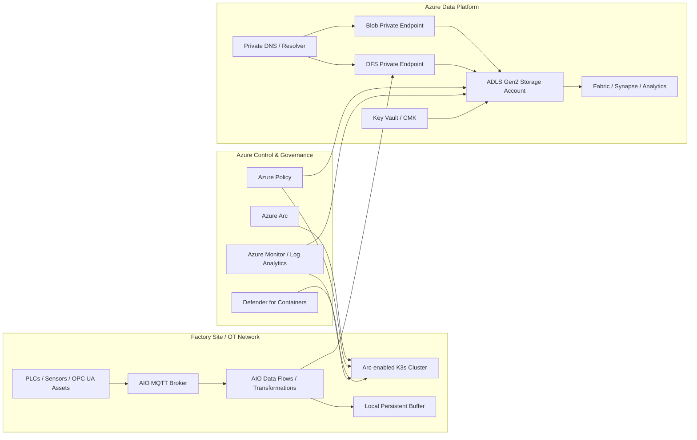
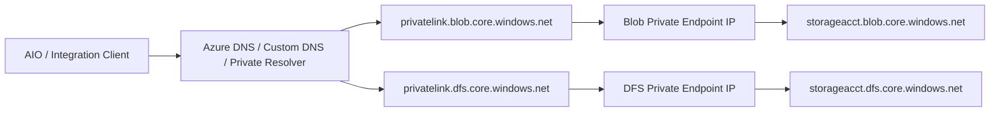
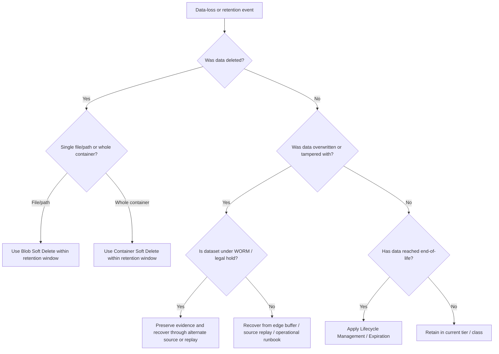

# ADLSSecurityandGovernance.md

## ADLS Security and Governance Considerations for an Azure IoT Operations (AIO) Cluster Running K3s on a Factory Production Line

## 1. Executive Summary

Azure IoT Operations (AIO) is a unified data plane for the edge that runs on Azure Arc-enabled Kubernetes, and Azure Data Lake Storage (ADLS) Gen2 is a suitable cloud landing zone for factory telemetry, contextualized events, batch records, and downstream analytics because it combines Azure Blob Storage scale with hierarchical namespace and file-system semantics. [Azure IoT Operations overview](https://learn.microsoft.com/en-us/azure/iot-operations/overview-iot-operations), [Azure Data Lake Storage introduction](https://learn.microsoft.com/en-us/azure/storage/blobs/data-lake-storage-introduction)

For a factory production line, the primary design goal is not just to store data in ADLS, but to do so in a way that preserves OT/IT separation, minimizes data-exfiltration risk, uses identity-based access rather than account keys, keeps storage access private, and enforces monitoring, retention, and recovery controls that can withstand both operator mistakes and security incidents. [Azure Storage network security overview](https://learn.microsoft.com/en-us/azure/storage/common/storage-network-security-overview), [ADLS access control model](https://learn.microsoft.com/en-us/azure/storage/blobs/data-lake-storage-access-control-model), [Diagnostic settings in Azure Monitor](https://learn.microsoft.com/en-us/azure/azure-monitor/platform/diagnostic-settings), [Immutable storage overview](https://learn.microsoft.com/en-us/azure/storage/blobs/immutable-storage-overview)

A recommended operating model is to treat the Arc-enabled K3s cluster and AIO components as the **local ingestion, transformation, and buffering tier**, and treat ADLS as the **cloud landing and retention tier**. This lets the production line continue operating locally while WAN connectivity is intermittent, while still centralizing retained data for analytics, compliance, and cross-site reporting. AIO can operate offline for up to 72 hours, so the design should explicitly account for buffering, replay, and reconciliation when connectivity returns. [Azure IoT Operations overview](https://learn.microsoft.com/en-us/azure/iot-operations/overview-iot-operations), [Azure IoT Operations production deployment guidelines](https://learn.microsoft.com/en-us/azure/iot-operations/deploy-iot-ops/concept-production-guidelines), [Azure IoT Operations data flows](https://learn.microsoft.com/en-us/azure/iot-operations/connect-to-cloud/overview-dataflow)

---

## 2. Scope and Assumptions

This document assumes that AIO is deployed to an **Azure Arc-enabled K3s cluster**, which is the supported control-plane pattern for Azure IoT Operations. [Prepare your Kubernetes cluster for Azure IoT Operations](https://learn.microsoft.com/en-us/azure/iot-operations/deploy-iot-ops/howto-prepare-cluster), [Azure Arc-enabled Kubernetes overview](https://learn.microsoft.com/en-us/azure/azure-arc/kubernetes/overview)

This document also assumes that the target storage platform is **ADLS Gen2**, meaning a general-purpose v2 storage account with hierarchical namespace enabled. Hierarchical namespace is what gives ADLS its directory semantics and analytics-oriented behavior. [Azure Data Lake Storage introduction](https://learn.microsoft.com/en-us/azure/storage/blobs/data-lake-storage-introduction)

The environment is a **factory production line**, so the guidance emphasizes private connectivity, controlled change, evidence preservation, and fast recovery from data-loss events rather than general-purpose application storage patterns. AIO production guidance specifically emphasizes security, patching, controlled upgrades, and staging practices for production deployments. [Azure IoT Operations production deployment guidelines](https://learn.microsoft.com/en-us/azure/iot-operations/deploy-iot-ops/concept-production-guidelines), [Azure IoT Operations overview](https://learn.microsoft.com/en-us/azure/iot-operations/overview-iot-operations)

---

## 3. Recommended High-Level Architecture

### 3.1 Architecture Principles

- Keep deterministic industrial control and immediate local actions at the edge; use ADLS for retained telemetry, curated line data, and analytics inputs rather than as a dependency for time-sensitive control loops. AIO is designed as an edge-native data plane, while ADLS is optimized for scalable storage and analytics. [Azure IoT Operations overview](https://learn.microsoft.com/en-us/azure/iot-operations/overview-iot-operations), [Azure Data Lake Storage introduction](https://learn.microsoft.com/en-us/azure/storage/blobs/data-lake-storage-introduction)
- Use **AIO data flows** to route and optionally transform MQTT or OPC UA-derived events before sending them to cloud destinations. Data flows are designed to ingest, process, transform, and route messages to sinks including cloud services. [Azure IoT Operations data flows](https://learn.microsoft.com/en-us/azure/iot-operations/connect-to-cloud/overview-dataflow), [Azure IoT Operations overview](https://learn.microsoft.com/en-us/azure/iot-operations/overview-iot-operations)
- Design explicitly for **intermittent WAN connectivity** by sizing local persistent storage for buffering and replay. Microsoft’s AIO production guidance calls out the need to allocate enough disk space to cache data and messages while the cluster is offline. [Azure IoT Operations production deployment guidelines](https://learn.microsoft.com/en-us/azure/iot-operations/deploy-iot-ops/concept-production-guidelines), [Azure IoT Operations overview](https://learn.microsoft.com/en-us/azure/iot-operations/overview-iot-operations)
- Structure ADLS as a governed landing zone with separate containers or path prefixes for raw, curated, and audit-grade data. Microsoft’s ADLS guidance emphasizes deliberate dataset structure, organization, and lifecycle planning. [Azure Data Lake Storage best practices](https://learn.microsoft.com/en-us/azure/storage/blobs/data-lake-storage-best-practices), [Azure Data Lake Storage introduction](https://learn.microsoft.com/en-us/azure/storage/blobs/data-lake-storage-introduction)

### 3.2 Reference Architecture Diagram

This pattern separates the factory ingestion and buffering plane from the Azure governance and storage planes, while preserving private access to ADLS through Private Link and DNS-based resolution. [Azure Arc-enabled Kubernetes overview](https://learn.microsoft.com/en-us/azure/azure-arc/kubernetes/overview), [Use private endpoints for Azure Storage](https://learn.microsoft.com/en-us/azure/storage/common/storage-private-endpoints), [Azure Private Endpoint private DNS zone values](https://learn.microsoft.com/en-us/azure/private-link/private-endpoint-dns)

---

## 4. Security Considerations

### 4.1 Cluster and Platform Security

- Use a **supported AIO production platform** and harden the cluster before enabling cloud export paths. Microsoft’s current production guidance identifies **K3s on Ubuntu 24.04** as the generally available production platform for AIO. [Azure IoT Operations production deployment guidelines](https://learn.microsoft.com/en-us/azure/iot-operations/deploy-iot-ops/concept-production-guidelines), [Prepare your Kubernetes cluster for Azure IoT Operations](https://learn.microsoft.com/en-us/azure/iot-operations/deploy-iot-ops/howto-prepare-cluster)
- Manage the K3s cluster through **Azure Arc** so inventory, tagging, policy, monitoring, extension management, and GitOps workflows can be applied consistently from Azure. [Azure Arc-enabled Kubernetes overview](https://learn.microsoft.com/en-us/azure/azure-arc/kubernetes/overview)
- Enable **Microsoft Defender for Containers** on the Arc-enabled cluster to improve posture management, vulnerability assessment, runtime threat detection, and centralized alerting across edge clusters. [Defender for Containers on Arc-enabled Kubernetes](https://learn.microsoft.com/en-us/azure/defender-for-cloud/defender-for-containers-arc-overview), [Azure Arc-enabled Kubernetes overview](https://learn.microsoft.com/en-us/azure/azure-arc/kubernetes/overview)
- Use staged promotion and maintenance windows for AIO and Arc changes. Microsoft recommends using staging clusters where possible and turning off Arc autoupgrade in production if you need tighter control over update timing. [Azure IoT Operations production deployment guidelines](https://learn.microsoft.com/en-us/azure/iot-operations/deploy-iot-ops/concept-production-guidelines)

### 4.2 Identity and Access Control

- Prefer **Microsoft Entra ID-based authorization** for data access instead of shared keys. ADLS supports Azure RBAC for coarse-grained entitlement and POSIX-like ACLs for directory- and file-level control. [ADLS access control model](https://learn.microsoft.com/en-us/azure/storage/blobs/data-lake-storage-access-control-model), [ADLS ACLs](https://learn.microsoft.com/en-us/azure/storage/blobs/data-lake-storage-access-control)
- Use **least-privilege data roles** such as `Storage Blob Data Reader`, `Storage Blob Data Contributor`, or `Storage Blob Data Owner`, and separate these from storage management roles. Microsoft explicitly notes that management roles such as `Owner` or `Storage Account Contributor` do not by themselves provide access to data. [ADLS access control model](https://learn.microsoft.com/en-us/azure/storage/blobs/data-lake-storage-access-control-model)
- Use **ACLs** to segment by site, production line, workload, or downstream consumer. ACLs are the primary mechanism for fine-grained access within ADLS paths. [ADLS ACLs](https://learn.microsoft.com/en-us/azure/storage/blobs/data-lake-storage-access-control)
- Assign permissions to **groups or managed identities**, not individual users, so access reviews and operational governance remain scalable. Microsoft recommends group-based administration when managing ADLS ACLs. [ADLS access control model](https://learn.microsoft.com/en-us/azure/storage/blobs/data-lake-storage-access-control-model)
- For cloud connections from the edge, use **managed identities / workload identity patterns** rather than embedded credentials wherever the integration pattern supports them. Microsoft’s AIO production guidance recommends user-assigned managed identities for cloud connections. [Azure IoT Operations production deployment guidelines](https://learn.microsoft.com/en-us/azure/iot-operations/deploy-iot-ops/concept-production-guidelines)

### 4.3 Network Security and Private Connectivity

- Use **Private Endpoints** for Azure Storage whenever possible so traffic from Azure-connected networks uses a private IP and the Microsoft backbone rather than the public internet. Private Endpoints also help reduce data exfiltration risk from approved VNets. [Use private endpoints for Azure Storage](https://learn.microsoft.com/en-us/azure/storage/common/storage-private-endpoints), [Azure Storage network security overview](https://learn.microsoft.com/en-us/azure/storage/common/storage-network-security-overview)
- For ADLS Gen2 specifically, create **both a Blob private endpoint and a DFS private endpoint**. Microsoft states that operations targeting the Data Lake endpoint can be redirected to Blob, and some Data Lake operations such as ACL management or directory creation require a DFS private endpoint. [Use private endpoints for Azure Storage](https://learn.microsoft.com/en-us/azure/storage/common/storage-private-endpoints)
- After private connectivity has been validated, **disable public network access** or tightly restrict the public endpoint with firewall rules. Microsoft provides built-in Azure Policy controls for storage accounts that should disable public network access. [Azure Storage network security overview](https://learn.microsoft.com/en-us/azure/storage/common/storage-network-security-overview)
- Require **secure transfer (HTTPS/TLS)** for storage access. Azure Storage network security guidance recommends secure transfer for storage accounts except for specific NFS scenarios. [Azure Storage network security overview](https://learn.microsoft.com/en-us/azure/storage/common/storage-network-security-overview)
- If a Microsoft service outside the trusted boundary must reach the storage account, enable only the **specific trusted-service exceptions** that are required. Microsoft notes that trusted services use strong authentication and that trusted-service access takes precedence over some other network restrictions. [Trusted Azure services for Azure Storage network security](https://learn.microsoft.com/en-us/azure/storage/common/storage-network-security-trusted-azure-services)

### 4.4 Private DNS Design for ADLS over Private Link

Private connectivity for ADLS is only reliable if DNS resolves the normal storage FQDNs to the private endpoint IPs from trusted networks. Microsoft states that applications should keep using the standard storage connection strings and FQDNs, while DNS resolution steers those names to private endpoint addresses from inside the network. [Use private endpoints for Azure Storage](https://learn.microsoft.com/en-us/azure/storage/common/storage-private-endpoints), [Azure Private Endpoint private DNS zone values](https://learn.microsoft.com/en-us/azure/private-link/private-endpoint-dns)

For an ADLS Gen2 storage account, the recommended private DNS zone names are:

- `privatelink.blob.core.windows.net` for the **Blob** subresource. [Use private endpoints for Azure Storage](https://learn.microsoft.com/en-us/azure/storage/common/storage-private-endpoints), [Azure Private Endpoint private DNS zone values](https://learn.microsoft.com/en-us/azure/private-link/private-endpoint-dns)
- `privatelink.dfs.core.windows.net` for the **DFS / Data Lake** subresource. [Use private endpoints for Azure Storage](https://learn.microsoft.com/en-us/azure/storage/common/storage-private-endpoints), [Azure Private Endpoint private DNS zone values](https://learn.microsoft.com/en-us/azure/private-link/private-endpoint-dns)

If the factory uses Azure-provided DNS in the VNet, Azure can create and link the required private DNS zones automatically. If the environment uses **custom DNS servers** or on-premises DNS, Microsoft states that you must either delegate the `privatelink` subdomains to the private DNS zones or create the required `A` records yourself so the storage FQDN resolves to the private endpoint IP address. [Use private endpoints for Azure Storage](https://learn.microsoft.com/en-us/azure/storage/common/storage-private-endpoints), [Azure Private Endpoint DNS integration scenarios](https://learn.microsoft.com/en-us/azure/private-link/private-endpoint-dns-integration)

If the plant reaches Azure over VPN or ExpressRoute and relies on on-premises DNS, use a **DNS forwarder** or **Azure Private Resolver** pattern so on-premises workloads can resolve the private endpoint names correctly. Microsoft documents dedicated DNS integration scenarios for virtual networks, peered VNets, and on-premises workloads, including the use of Azure Private Resolver. [Azure Private Endpoint DNS integration scenarios](https://learn.microsoft.com/en-us/azure/private-link/private-endpoint-dns-integration), [Azure Private Endpoint private DNS zone values](https://learn.microsoft.com/en-us/azure/private-link/private-endpoint-dns)

Do **not** put records for multiple Azure services into the same private DNS zone in an ad hoc way, and do **not** override public zones incorrectly. Microsoft cautions that reusing zones incorrectly can delete earlier A records and cause name-resolution failures for private endpoints. [Azure Private Endpoint private DNS zone values](https://learn.microsoft.com/en-us/azure/private-link/private-endpoint-dns), [Azure Private Endpoint DNS integration scenarios](https://learn.microsoft.com/en-us/azure/private-link/private-endpoint-dns-integration)

#### Private DNS Resolution Diagram

A good private DNS design is what allows clients to keep using the normal storage account FQDNs while still reaching ADLS privately. [Use private endpoints for Azure Storage](https://learn.microsoft.com/en-us/azure/storage/common/storage-private-endpoints), [Azure Private Endpoint private DNS zone values](https://learn.microsoft.com/en-us/azure/private-link/private-endpoint-dns)

### 4.5 Encryption and Key Management

- Azure Storage data is encrypted at rest by default with service-side encryption, and Microsoft documents that encryption applies across storage types and redundancy options. citeturn2search42
- Where stronger control of cryptographic material is required, configure **customer-managed keys (CMK)** in Azure Key Vault or Managed HSM. Microsoft documents that Azure Storage can use a managed identity to access the CMK with `get`, `wrapKey`, and `unwrapKey` permissions. [Customer-managed keys for Azure Storage encryption](https://learn.microsoft.com/en-us/azure/storage/common/customer-managed-keys-overview)
- Use **separation of duties** between storage administrators, key administrators, and data consumers so CMK adds meaningful governance instead of just additional complexity. Azure Storage CMK guidance explicitly relies on an identity-to-Key Vault permission model. [Customer-managed keys for Azure Storage encryption](https://learn.microsoft.com/en-us/azure/storage/common/customer-managed-keys-overview)
- Use **Azure Policy** to require CMK where regulatory or client policy demands it. Microsoft notes that built-in policy support exists for requiring customer-managed keys for applicable storage workloads. [Customer-managed keys for Azure Storage encryption](https://learn.microsoft.com/en-us/azure/storage/common/customer-managed-keys-overview)

### 4.6 Monitoring, Logging, and Threat Detection

- Configure **diagnostic settings** on the storage account and route logs and metrics to approved destinations such as Log Analytics. Microsoft notes that resource logs are not collected by default and must be explicitly configured. [Diagnostic settings in Azure Monitor](https://learn.microsoft.com/en-us/azure/azure-monitor/platform/diagnostic-settings)
- Use **Azure Monitor Storage insights** and service logs to watch for availability problems, request failures, abnormal write/delete activity, or denied-access patterns. Azure Monitor provides both metrics and log analysis for Azure Storage. [Monitor Azure Blob Storage](https://learn.microsoft.com/en-us/azure/storage/blobs/monitor-blob-storage), [Diagnostic settings in Azure Monitor](https://learn.microsoft.com/en-us/azure/azure-monitor/platform/diagnostic-settings)
- Correlate storage-side signals with **Arc / K3s / AIO operational data** so operators can distinguish between identity failures, WAN failures, DNS problems, data-flow failures, and true storage issues. Arc-enabled Kubernetes can be monitored centrally and Defender adds hybrid Kubernetes threat visibility. [Azure Arc-enabled Kubernetes overview](https://learn.microsoft.com/en-us/azure/azure-arc/kubernetes/overview), [Defender for Containers on Arc-enabled Kubernetes](https://learn.microsoft.com/en-us/azure/defender-for-cloud/defender-for-containers-arc-overview), [Diagnostic settings in Azure Monitor](https://learn.microsoft.com/en-us/azure/azure-monitor/platform/diagnostic-settings)

---

## 5. Governance Considerations

### 5.1 Landing Zone and Resource Organization

- Place the ADLS account in a governed **landing zone, subscription, or dedicated resource group** rather than attaching it casually to an edge project. Azure Arc-enabled resources can be grouped, tagged, and governed as ARM resources, which helps align storage with the same governance model as the cluster. [Azure Arc-enabled Kubernetes overview](https://learn.microsoft.com/en-us/azure/azure-arc/kubernetes/overview)
- Apply consistent tags for **site, plant, line, environment, data class, owner, retention class, and compliance scope** so storage, policy, monitoring, and cost data remain traceable. Arc-enabled Kubernetes resources support the same Azure resource-organization practices as other ARM resources. [Azure Arc-enabled Kubernetes overview](https://learn.microsoft.com/en-us/azure/azure-arc/kubernetes/overview)

### 5.2 Azure Policy Guardrails

Recommended Azure Policy themes include:

- Storage accounts should **disable public network access** or otherwise restrict exposure. citeturn1search46turn1search51
- Storage accounts should require **secure transfer**. Microsoft maps this control in storage compliance guidance. [Azure Storage network security overview](https://learn.microsoft.com/en-us/azure/storage/common/storage-network-security-overview)
- Storage encryption should use **customer-managed keys** where required. [Customer-managed keys for Azure Storage encryption](https://learn.microsoft.com/en-us/azure/storage/common/customer-managed-keys-overview)
- Arc-enabled Kubernetes clusters should be governed through **Azure Policy** and protected with **Defender for Containers**. [Azure Arc-enabled Kubernetes overview](https://learn.microsoft.com/en-us/azure/azure-arc/kubernetes/overview), [Defender for Containers on Arc-enabled Kubernetes](https://learn.microsoft.com/en-us/azure/defender-for-cloud/defender-for-containers-arc-overview)
- Diagnostic settings should be deployed consistently because resource logs are not on by default. [Diagnostic settings in Azure Monitor](https://learn.microsoft.com/en-us/azure/azure-monitor/platform/diagnostic-settings)

### 5.3 Data Ownership and Classification

Classify ADLS data at minimum into **raw operational telemetry**, **curated production data**, **quality / batch records**, and **security / audit evidence**, then map each class to different ACLs, lifecycle rules, and retention targets. ADLS supports the layered RBAC-plus-ACL model required for this type of path-based segmentation. [ADLS access control model](https://learn.microsoft.com/en-us/azure/storage/blobs/data-lake-storage-access-control-model), [ADLS ACLs](https://learn.microsoft.com/en-us/azure/storage/blobs/data-lake-storage-access-control)

Use named **data owners and approval paths** for each container or major prefix so that access changes, lifecycle changes, and export patterns are governed intentionally. Group-based ACL and RBAC management reduces drift and simplifies access recertification. [ADLS access control model](https://learn.microsoft.com/en-us/azure/storage/blobs/data-lake-storage-access-control-model)

---

## 6. Retention and Recovery Design (Expanded)

### 6.1 Why Retention and Recovery Need Special Treatment for ADLS Gen2

Retention and recovery for ADLS Gen2 must be designed differently from flat-namespace Blob-only patterns because hierarchical namespace changes which protection features are available and how some recovery scenarios behave. Microsoft documents that **blob versioning is not available for HNS-enabled accounts**, and that for HNS-enabled accounts **blob soft delete protects delete operations but not overwrites**. [Blob soft delete vs. versioning options](https://learn.microsoft.com/en-us/azure/storage/blobs/soft-delete-vs-versioning-options), [Known issues with Azure Data Lake Storage](https://learn.microsoft.com/en-us/azure/storage/blobs/data-lake-storage-known-issues)

That means an ADLS recovery strategy should not assume that every overwrite is recoverable through version history. For production-line data, the safer pattern is to combine **container soft delete**, **blob soft delete**, **immutability where required**, **lifecycle policies**, and upstream controls that prevent accidental overwrite or destructive modification in the first place. [Soft delete for containers](https://learn.microsoft.com/en-us/azure/storage/blobs/soft-delete-container-overview), [Soft delete for blobs](https://learn.microsoft.com/en-us/azure/storage/blobs/soft-delete-blob-overview), [Immutable storage overview](https://learn.microsoft.com/en-us/azure/storage/blobs/immutable-storage-overview)

### 6.2 Recommended Native Data Protection Controls

#### Container Soft Delete

Enable **container soft delete** on the storage account. Microsoft recommends container soft delete as part of a comprehensive data-protection configuration and notes that it can restore a deleted container and its contents for a configurable retention period of **1 to 365 days**, with a recommended minimum of **7 days**. [Soft delete for containers](https://learn.microsoft.com/en-us/azure/storage/blobs/soft-delete-container-overview)

Container soft delete is the primary safeguard against an operator or automation deleting an entire filesystem/container, which is a high-impact event in a data-lake environment. Restoring the container also restores its contained blobs and related versions/snapshots where applicable. [Soft delete for containers](https://learn.microsoft.com/en-us/azure/storage/blobs/soft-delete-container-overview)

#### Blob Soft Delete

Enable **blob soft delete** for additional protection against file deletion. Microsoft documents that blob soft delete can retain deleted objects for **1 to 365 days** and that deleted data can be restored during that period. [Soft delete for blobs](https://learn.microsoft.com/en-us/azure/storage/blobs/soft-delete-blob-overview)

For HNS-enabled accounts, blob soft delete protects **delete operations**, but Microsoft explicitly states that it does **not** provide overwrite protection in the same way as flat-namespace accounts with versioning. That limitation should be reflected in the recovery design and operator runbooks. [Blob soft delete vs. versioning options](https://learn.microsoft.com/en-us/azure/storage/blobs/soft-delete-vs-versioning-options), [Known issues with Azure Data Lake Storage](https://learn.microsoft.com/en-us/azure/storage/blobs/data-lake-storage-known-issues)

#### Lifecycle Management Policies

Use **lifecycle management** to automate retention and cost optimization across containers or prefixes. Microsoft documents that lifecycle policies can transition current blobs, previous versions, or snapshots to cooler tiers, and can delete data at the end of its lifecycle based on conditions such as creation time, last modified time, or last accessed time. [Azure Blob lifecycle management overview](https://learn.microsoft.com/en-us/azure/storage/blobs/lifecycle-management-overview)

For production-line data, lifecycle rules should normally be aligned to data class, for example:

- Keep near-term raw production telemetry in a hotter tier for a shorter analysis window. [Azure Blob lifecycle management overview](https://learn.microsoft.com/en-us/azure/storage/blobs/lifecycle-management-overview)
- Move older operational exports and historian-style files to cooler tiers after the investigation window has passed. [Azure Blob lifecycle management overview](https://learn.microsoft.com/en-us/azure/storage/blobs/lifecycle-management-overview)
- Expire non-record, non-evidence data automatically when its retention period ends. [Azure Blob lifecycle management overview](https://learn.microsoft.com/en-us/azure/storage/blobs/lifecycle-management-overview)

Lifecycle policies are not a substitute for recovery controls; they are the mechanism that enforces the planned end-of-life behavior once the recovery window has passed. Microsoft also notes that lifecycle policies are rule-based and can target the whole account or selected paths using prefixes or blob tags. [Azure Blob lifecycle management overview](https://learn.microsoft.com/en-us/azure/storage/blobs/lifecycle-management-overview)

#### Immutability / WORM for Evidence-Grade Data

Use **immutable storage (WORM)** for data that must not be changed or deleted during a mandated retention period, such as quality evidence, regulatory records, batch genealogy, or forensic exports after an incident. Microsoft documents that immutable storage supports **time-based retention policies** and **legal holds**, and that data in WORM state cannot be modified or deleted while the policy is active. [Immutable storage overview](https://learn.microsoft.com/en-us/azure/storage/blobs/immutable-storage-overview)

For ADLS Gen2 specifically, **container-level WORM is supported for hierarchical namespace accounts**. Microsoft also notes that if HNS is enabled and the blob is immutable, it cannot be renamed or moved while the policy is in effect. [Container-level WORM policies](https://learn.microsoft.com/en-us/azure/storage/blobs/immutable-container-level-worm-policies)

Because **blob versioning is not available for HNS-enabled accounts**, do not design ADLS Gen2 recovery around version-level WORM as the primary safeguard. Instead, use **container-level immutability** for the subsets of data that require tamper resistance. [Blob soft delete vs. versioning options](https://learn.microsoft.com/en-us/azure/storage/blobs/soft-delete-vs-versioning-options), [Container-level WORM policies](https://learn.microsoft.com/en-us/azure/storage/blobs/immutable-container-level-worm-policies)

### 6.3 Suggested Retention Model by Data Class

The exact retention periods should be defined by legal, compliance, manufacturing quality, and analytics requirements, but the control pattern should distinguish at least the following classes:

- **Operational telemetry / transient raw data**: protected with blob soft delete and lifecycle rules, but typically not held immutably once the troubleshooting window expires. [Soft delete for blobs](https://learn.microsoft.com/en-us/azure/storage/blobs/soft-delete-blob-overview), [Azure Blob lifecycle management overview](https://learn.microsoft.com/en-us/azure/storage/blobs/lifecycle-management-overview)
- **Curated line data / production summaries**: protected with blob soft delete and container soft delete, retained longer, and moved to cooler tiers as access declines. [Soft delete for containers](https://learn.microsoft.com/en-us/azure/storage/blobs/soft-delete-container-overview), [Azure Blob lifecycle management overview](https://learn.microsoft.com/en-us/azure/storage/blobs/lifecycle-management-overview)
- **Batch, genealogy, quality, or compliance records**: protected with soft delete and, where required, container-level WORM time-based retention or legal hold. [Immutable storage overview](https://learn.microsoft.com/en-us/azure/storage/blobs/immutable-storage-overview), [Container-level WORM policies](https://learn.microsoft.com/en-us/azure/storage/blobs/immutable-container-level-worm-policies)
- **Security and audit evidence**: protected with soft delete plus immutability where chain-of-custody and tamper-resistance matter. [Immutable storage overview](https://learn.microsoft.com/en-us/azure/storage/blobs/immutable-storage-overview)

### 6.4 Recovery Runbooks and Expected Outcomes

#### Scenario A: A file or directory was deleted accidentally

If a file is deleted, the first recovery action is to use **blob soft delete** within the configured retention window. For HNS-enabled accounts, soft delete is the key native recovery mechanism for delete events. [Soft delete for blobs](https://learn.microsoft.com/en-us/azure/storage/blobs/soft-delete-blob-overview), [Blob soft delete vs. versioning options](https://learn.microsoft.com/en-us/azure/storage/blobs/soft-delete-vs-versioning-options)

If a directory tree or the whole container/filesystem was deleted, use **container soft delete** to restore the deleted container and its contents, provided the retention window has not expired and the original container name has not been re-used. Microsoft explicitly notes that a soft-deleted container must be restored to its original name. [Soft delete for containers](https://learn.microsoft.com/en-us/azure/storage/blobs/soft-delete-container-overview)

#### Scenario B: Data was overwritten or modified incorrectly

For ADLS Gen2, do **not** assume blob versioning will save overwritten files, because Microsoft states versioning is not available for HNS-enabled accounts. Blob soft delete in HNS accounts protects deletes, not overwrite recovery in the same way as versioning-enabled flat namespace accounts. [Blob soft delete vs. versioning options](https://learn.microsoft.com/en-us/azure/storage/blobs/soft-delete-vs-versioning-options), [Known issues with Azure Data Lake Storage](https://learn.microsoft.com/en-us/azure/storage/blobs/data-lake-storage-known-issues)

The compensating controls for overwrite risk are therefore:

- Controlled write paths and least-privilege identities. [ADLS access control model](https://learn.microsoft.com/en-us/azure/storage/blobs/data-lake-storage-access-control-model), [ADLS ACLs](https://learn.microsoft.com/en-us/azure/storage/blobs/data-lake-storage-access-control)
- Append-only or write-once patterns where feasible. [Immutable storage overview](https://learn.microsoft.com/en-us/azure/storage/blobs/immutable-storage-overview), [Container-level WORM policies](https://learn.microsoft.com/en-us/azure/storage/blobs/immutable-container-level-worm-policies)
- Immutable/WORM containers for evidence-grade datasets. [Immutable storage overview](https://learn.microsoft.com/en-us/azure/storage/blobs/immutable-storage-overview), [Container-level WORM policies](https://learn.microsoft.com/en-us/azure/storage/blobs/immutable-container-level-worm-policies)
- Upstream rehydration or replay from edge buffers or source systems when the file can be reconstructed. AIO production guidance explicitly expects local disk allocation for caching messages during offline operation. [Azure IoT Operations production deployment guidelines](https://learn.microsoft.com/en-us/azure/iot-operations/deploy-iot-ops/concept-production-guidelines), [Azure IoT Operations overview](https://learn.microsoft.com/en-us/azure/iot-operations/overview-iot-operations)

#### Scenario C: Malicious delete or ransomware-style destructive behavior

The response pattern should prioritize:

1. Containing the identity or path that performed the delete. Storage logs and Azure Monitor data are required because resource logs are not enabled by default. [Diagnostic settings in Azure Monitor](https://learn.microsoft.com/en-us/azure/azure-monitor/platform/diagnostic-settings), [Monitor Azure Blob Storage](https://learn.microsoft.com/en-us/azure/storage/blobs/monitor-blob-storage)
2. Restoring deleted paths through blob soft delete or container soft delete, depending on blast radius. [Soft delete for blobs](https://learn.microsoft.com/en-us/azure/storage/blobs/soft-delete-blob-overview), [Soft delete for containers](https://learn.microsoft.com/en-us/azure/storage/blobs/soft-delete-container-overview)
3. Preserving evidence paths under **immutability / legal hold** where required so recovery does not destroy forensic integrity. [Immutable storage overview](https://learn.microsoft.com/en-us/azure/storage/blobs/immutable-storage-overview)
4. Reviewing cluster-side identities, DNS, and private endpoint usage so the same path cannot be abused again. [Use private endpoints for Azure Storage](https://learn.microsoft.com/en-us/azure/storage/common/storage-private-endpoints), [Azure Private Endpoint DNS integration scenarios](https://learn.microsoft.com/en-us/azure/private-link/private-endpoint-dns-integration), [Defender for Containers on Arc-enabled Kubernetes](https://learn.microsoft.com/en-us/azure/defender-for-cloud/defender-for-containers-arc-overview)

#### Scenario D: Data has aged out and should be removed automatically

Use lifecycle management to delete data only **after** the intended recovery window has passed. Microsoft documents that lifecycle rules can delete blobs at the end of their lifecycle and can be scoped by prefixes or tags. [Azure Blob lifecycle management overview](https://learn.microsoft.com/en-us/azure/storage/blobs/lifecycle-management-overview)

This means retention policy should be modeled as two windows:

- **Recovery window**: the time during which soft-deleted data can still be recovered. [Soft delete for blobs](https://learn.microsoft.com/en-us/azure/storage/blobs/soft-delete-blob-overview), [Soft delete for containers](https://learn.microsoft.com/en-us/azure/storage/blobs/soft-delete-container-overview)
- **Business / compliance retention window**: the period during which the data must remain available, possibly in a cooler tier or immutable state. [Immutable storage overview](https://learn.microsoft.com/en-us/azure/storage/blobs/immutable-storage-overview), [Azure Blob lifecycle management overview](https://learn.microsoft.com/en-us/azure/storage/blobs/lifecycle-management-overview)

### 6.5 Retention and Recovery Decision Flow

For ADLS Gen2, the crucial design point is that **delete recovery is native**, but **overwrite recovery must be designed procedurally and architecturally** because HNS accounts do not support blob versioning. [Blob soft delete vs. versioning options](https://learn.microsoft.com/en-us/azure/storage/blobs/soft-delete-vs-versioning-options), [Soft delete for blobs](https://learn.microsoft.com/en-us/azure/storage/blobs/soft-delete-blob-overview)

### 6.6 Prescriptive Retention and Recovery Recommendations

1. Enable **container soft delete** with at least a **7-day** baseline and extend it for mission-critical production data according to detection and investigation timelines. Microsoft recommends a minimum of 7 days. [Soft delete for containers](https://learn.microsoft.com/en-us/azure/storage/blobs/soft-delete-container-overview)
2. Enable **blob soft delete** and set the retention period high enough to cover operational detection lag, especially for night-shift or weekend incidents. Blob soft delete can be configured from 1 to 365 days. [Soft delete for blobs](https://learn.microsoft.com/en-us/azure/storage/blobs/soft-delete-blob-overview)
3. Use **lifecycle policies** so that hot-to-cool and delete actions are automated and based on data class rather than manual operator action. [Azure Blob lifecycle management overview](https://learn.microsoft.com/en-us/azure/storage/blobs/lifecycle-management-overview)
4. Use **container-level WORM** for records that must be tamper-resistant in an HNS-enabled account. [Container-level WORM policies](https://learn.microsoft.com/en-us/azure/storage/blobs/immutable-container-level-worm-policies), [Immutable storage overview](https://learn.microsoft.com/en-us/azure/storage/blobs/immutable-storage-overview)
5. Do not rely on **blob versioning** for ADLS Gen2 overwrite recovery, because HNS-enabled accounts do not support it. [Blob soft delete vs. versioning options](https://learn.microsoft.com/en-us/azure/storage/blobs/soft-delete-vs-versioning-options)
6. Document a **replay / reconstruction runbook** from AIO edge buffers or source systems for overwrite or corruption scenarios. AIO production guidance explicitly calls for local cache sizing for offline operation. [Azure IoT Operations production deployment guidelines](https://learn.microsoft.com/en-us/azure/iot-operations/deploy-iot-ops/concept-production-guidelines), [Azure IoT Operations overview](https://learn.microsoft.com/en-us/azure/iot-operations/overview-iot-operations)
7. Test deletion and recovery paths quarterly so soft delete, private DNS, private endpoints, and IAM are all validated before a real incident. DNS is critical for private endpoint connectivity, and storage recovery depends on both connectivity and authorization. [Use private endpoints for Azure Storage](https://learn.microsoft.com/en-us/azure/storage/common/storage-private-endpoints), [Azure Private Endpoint DNS integration scenarios](https://learn.microsoft.com/en-us/azure/private-link/private-endpoint-dns-integration), [ADLS access control model](https://learn.microsoft.com/en-us/azure/storage/blobs/data-lake-storage-access-control-model)

---

## 7. Implementation Checklist

### Platform
- [ ] Arc-enable the K3s cluster and validate supported AIO production prerequisites. [Prepare your Kubernetes cluster for Azure IoT Operations](https://learn.microsoft.com/en-us/azure/iot-operations/deploy-iot-ops/howto-prepare-cluster), [Azure IoT Operations production deployment guidelines](https://learn.microsoft.com/en-us/azure/iot-operations/deploy-iot-ops/concept-production-guidelines)
- [ ] Enable Azure Policy and Defender for Containers on the Arc-enabled cluster. [Azure Arc-enabled Kubernetes overview](https://learn.microsoft.com/en-us/azure/azure-arc/kubernetes/overview), [Defender for Containers on Arc-enabled Kubernetes](https://learn.microsoft.com/en-us/azure/defender-for-cloud/defender-for-containers-arc-overview)

### Storage
- [ ] Create a general-purpose v2 storage account with hierarchical namespace enabled. [Azure Data Lake Storage introduction](https://learn.microsoft.com/en-us/azure/storage/blobs/data-lake-storage-introduction)
- [ ] Define the container/path model by site, line, and data class. [Azure Data Lake Storage best practices](https://learn.microsoft.com/en-us/azure/storage/blobs/data-lake-storage-best-practices), [ADLS ACLs](https://learn.microsoft.com/en-us/azure/storage/blobs/data-lake-storage-access-control)
- [ ] Require secure transfer, deploy **both Blob and DFS private endpoints**, and validate private-only access. [Use private endpoints for Azure Storage](https://learn.microsoft.com/en-us/azure/storage/common/storage-private-endpoints), [Azure Storage network security overview](https://learn.microsoft.com/en-us/azure/storage/common/storage-network-security-overview)
- [ ] Disable public network access or restrict it with policy and firewall controls. [Azure Storage network security overview](https://learn.microsoft.com/en-us/azure/storage/common/storage-network-security-overview)
- [ ] Configure CMK with Key Vault if required. [Customer-managed keys for Azure Storage encryption](https://learn.microsoft.com/en-us/azure/storage/common/customer-managed-keys-overview)

### DNS
- [ ] Create and link `privatelink.blob.core.windows.net` and `privatelink.dfs.core.windows.net` zones, or delegate them from custom/on-premises DNS. [Use private endpoints for Azure Storage](https://learn.microsoft.com/en-us/azure/storage/common/storage-private-endpoints), [Azure Private Endpoint private DNS zone values](https://learn.microsoft.com/en-us/azure/private-link/private-endpoint-dns)
- [ ] If the site uses on-premises DNS, implement DNS forwarding or Azure Private Resolver for private endpoint resolution. [Azure Private Endpoint DNS integration scenarios](https://learn.microsoft.com/en-us/azure/private-link/private-endpoint-dns-integration), [Azure Private Endpoint private DNS zone values](https://learn.microsoft.com/en-us/azure/private-link/private-endpoint-dns)

### Identity
- [ ] Assign RBAC only to groups or managed identities. [ADLS access control model](https://learn.microsoft.com/en-us/azure/storage/blobs/data-lake-storage-access-control-model)
- [ ] Apply ACLs recursively for directory-level segmentation where needed. [ADLS ACLs](https://learn.microsoft.com/en-us/azure/storage/blobs/data-lake-storage-access-control)

### Retention / Recovery
- [ ] Enable container soft delete. [Soft delete for containers](https://learn.microsoft.com/en-us/azure/storage/blobs/soft-delete-container-overview)
- [ ] Enable blob soft delete. [Soft delete for blobs](https://learn.microsoft.com/en-us/azure/storage/blobs/soft-delete-blob-overview)
- [ ] Define lifecycle policies by data class. [Azure Blob lifecycle management overview](https://learn.microsoft.com/en-us/azure/storage/blobs/lifecycle-management-overview)
- [ ] Apply container-level WORM where required for evidence-grade or compliance data. [Container-level WORM policies](https://learn.microsoft.com/en-us/azure/storage/blobs/immutable-container-level-worm-policies), [Immutable storage overview](https://learn.microsoft.com/en-us/azure/storage/blobs/immutable-storage-overview)
- [ ] Document overwrite-recovery / replay procedures because HNS accounts do not support blob versioning. [Blob soft delete vs. versioning options](https://learn.microsoft.com/en-us/azure/storage/blobs/soft-delete-vs-versioning-options), [Azure IoT Operations production deployment guidelines](https://learn.microsoft.com/en-us/azure/iot-operations/deploy-iot-ops/concept-production-guidelines)

### Monitoring / Governance
- [ ] Enable diagnostic settings and send logs/metrics to Log Analytics or approved destinations. [Diagnostic settings in Azure Monitor](https://learn.microsoft.com/en-us/azure/azure-monitor/platform/diagnostic-settings)
- [ ] Define alerting for denied access, request failures, abnormal deletes, and edge-to-cloud export failures. [Monitor Azure Blob Storage](https://learn.microsoft.com/en-us/azure/storage/blobs/monitor-blob-storage), [Defender for Containers on Arc-enabled Kubernetes](https://learn.microsoft.com/en-us/azure/defender-for-cloud/defender-for-containers-arc-overview)
- [ ] Assign Azure Policy guardrails for storage network access, secure transfer, and encryption. citeturn1search46turn1search51

---

## 8. References

- Azure IoT Operations overview: https://learn.microsoft.com/en-us/azure/iot-operations/overview-iot-operations
- Prepare your Kubernetes cluster for Azure IoT Operations: https://learn.microsoft.com/en-us/azure/iot-operations/deploy-iot-ops/howto-prepare-cluster
- Azure IoT Operations production deployment guidelines: https://learn.microsoft.com/en-us/azure/iot-operations/deploy-iot-ops/concept-production-guidelines
- Azure IoT Operations data flows: https://learn.microsoft.com/en-us/azure/iot-operations/connect-to-cloud/overview-dataflow
- Azure Arc-enabled Kubernetes overview: https://learn.microsoft.com/en-us/azure/azure-arc/kubernetes/overview
- Defender for Containers on Arc-enabled Kubernetes: https://learn.microsoft.com/en-us/azure/defender-for-cloud/defender-for-containers-arc-overview
- Azure Data Lake Storage introduction: https://learn.microsoft.com/en-us/azure/storage/blobs/data-lake-storage-introduction
- Azure Data Lake Storage best practices: https://learn.microsoft.com/en-us/azure/storage/blobs/data-lake-storage-best-practices
- ADLS access control model: https://learn.microsoft.com/en-us/azure/storage/blobs/data-lake-storage-access-control-model
- ADLS ACLs: https://learn.microsoft.com/en-us/azure/storage/blobs/data-lake-storage-access-control
- Use private endpoints for Azure Storage: https://learn.microsoft.com/en-us/azure/storage/common/storage-private-endpoints
- Azure Private Endpoint private DNS zone values: https://learn.microsoft.com/en-us/azure/private-link/private-endpoint-dns
- Azure Private Endpoint DNS integration scenarios: https://learn.microsoft.com/en-us/azure/private-link/private-endpoint-dns-integration
- Azure Storage network security overview: https://learn.microsoft.com/en-us/azure/storage/common/storage-network-security-overview
- Trusted Azure services for Azure Storage network security: https://learn.microsoft.com/en-us/azure/storage/common/storage-network-security-trusted-azure-services
- Customer-managed keys for Azure Storage encryption: https://learn.microsoft.com/en-us/azure/storage/common/customer-managed-keys-overview
- Diagnostic settings in Azure Monitor: https://learn.microsoft.com/en-us/azure/azure-monitor/platform/diagnostic-settings
- Monitor Azure Blob Storage: https://learn.microsoft.com/en-us/azure/storage/blobs/monitor-blob-storage
- Soft delete for blobs: https://learn.microsoft.com/en-us/azure/storage/blobs/soft-delete-blob-overview
- Soft delete for containers: https://learn.microsoft.com/en-us/azure/storage/blobs/soft-delete-container-overview
- Blob soft delete vs. versioning options: https://learn.microsoft.com/en-us/azure/storage/blobs/soft-delete-vs-versioning-options
- Azure Blob lifecycle management overview: https://learn.microsoft.com/en-us/azure/storage/blobs/lifecycle-management-overview
- Immutable storage overview: https://learn.microsoft.com/en-us/azure/storage/blobs/immutable-storage-overview
- Container-level WORM policies: https://learn.microsoft.com/en-us/azure/storage/blobs/immutable-container-level-worm-policies
- Known issues with Azure Data Lake Storage: https://learn.microsoft.com/en-us/azure/storage/blobs/data-lake-storage-known-issues
