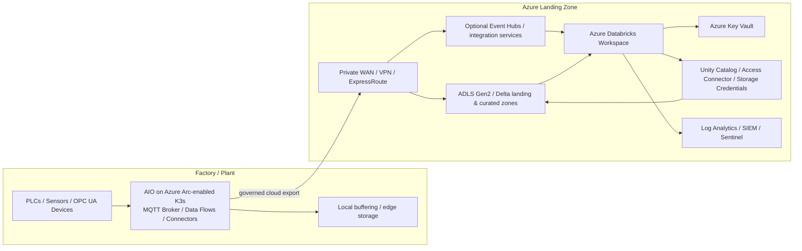
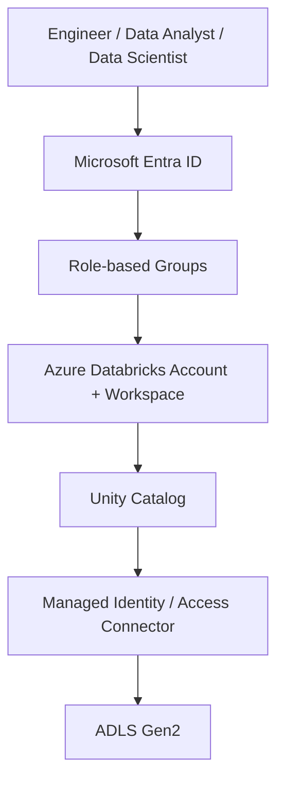
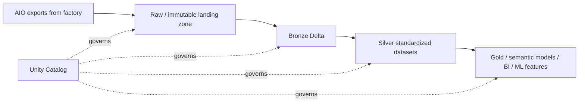
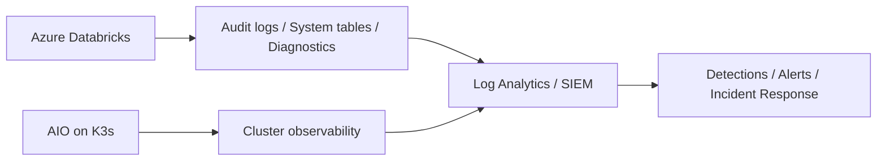

# Azure Databricks Security and Governance for Azure IoT Operations (AIO) on K3s in a Factory Production Line

## Executive summary

Azure Databricks should be treated as the **cloud analytics and AI plane** for factory telemetry, quality, and operational data, while Azure IoT Operations (AIO) on an Azure Arc-enabled K3s cluster remains the **edge data acquisition and local operations plane**. A production design should therefore: (1) keep OT/plant traffic segmented from analytics traffic, (2) use private connectivity and identity-based access wherever possible, (3) centralize data governance in Unity Catalog, (4) favor managed identities over secrets, (5) enforce standardized compute configurations with compute policies, and (6) forward audit and diagnostic telemetry to a central SIEM/monitoring platform. Relevant Microsoft guidance includes [Deploy Azure IoT Operations to a production cluster](https://learn.microsoft.com/en-us/azure/iot-operations/deploy-iot-ops/howto-deploy-iot-operations), [Production deployment guidelines - Azure IoT Operations](https://learn.microsoft.com/en-us/azure/iot-operations/deploy-iot-ops/concept-production-guidelines), [Security and compliance - Azure Databricks](https://learn.microsoft.com/en-us/azure/databricks/security/), and [Data governance with Azure Databricks](https://learn.microsoft.com/en-us/azure/databricks/data-governance/).

For most factory scenarios, the recommended pattern is:

- **AIO on K3s** handles OT protocol ingestion, local buffering, data transformation, and resiliency at the edge, using Azure Arc, workload identity, and production-safe deployment settings. See [Prepare your Azure Arc-enabled Kubernetes cluster](https://learn.microsoft.com/en-us/azure/iot-operations/deploy-iot-ops/howto-prepare-cluster), [Deploy Azure IoT Operations to a production cluster](https://learn.microsoft.com/en-us/azure/iot-operations/deploy-iot-ops/howto-deploy-iot-operations), and [Production deployment guidelines - Azure IoT Operations](https://learn.microsoft.com/en-us/azure/iot-operations/deploy-iot-ops/concept-production-guidelines).
- **Azure Databricks** lands, governs, enriches, and analyzes cloud-side datasets (typically in ADLS Gen2 / Delta) using Unity Catalog, private networking, managed identities, and auditable compute. See [What is Azure Databricks?](https://learn.microsoft.com/en-us/azure/databricks/introduction/), [Security and compliance - Azure Databricks](https://learn.microsoft.com/en-us/azure/databricks/security/), and [Data governance with Azure Databricks](https://learn.microsoft.com/en-us/azure/databricks/data-governance/).
- **Cloud connectivity** between plant and Azure should be explicit, monitored, and minimized, with AIO using supported cloud connection patterns and Databricks accessing only approved storage/services through private endpoints, Private Link, or service endpoint policies as appropriate. See [Prepare your Azure Arc-enabled Kubernetes cluster](https://learn.microsoft.com/en-us/azure/iot-operations/deploy-iot-ops/howto-prepare-cluster), [Azure Private Link concepts - Azure Databricks](https://learn.microsoft.com/en-us/azure/databricks/security/network/concepts/private-link), [Configure private connectivity to Azure resources](https://learn.microsoft.com/en-us/azure/databricks/security/network/serverless-network-security/serverless-private-link), and [Configure Azure virtual network service endpoint policies for storage access from classic compute](https://learn.microsoft.com/en-us/azure/databricks/security/network/classic/service-endpoints).

---

## 1. Scope and assumptions

This guidance assumes the following reference scenario:

- A factory production line runs **Azure IoT Operations on a production-supported K3s cluster** that is **Azure Arc-enabled** and configured with the required platform features such as custom locations and workload identity. See [Prepare your Azure Arc-enabled Kubernetes cluster](https://learn.microsoft.com/en-us/azure/iot-operations/deploy-iot-ops/howto-prepare-cluster) and [Deploy Azure IoT Operations to a production cluster](https://learn.microsoft.com/en-us/azure/iot-operations/deploy-iot-ops/howto-deploy-iot-operations).
- Databricks is used for **historical analytics, quality analytics, data engineering, reporting support, and AI/ML use cases** rather than deterministic plant control. See [What is Azure Databricks?](https://learn.microsoft.com/en-us/azure/databricks/introduction/).
- Factory data is persisted in **Azure Storage / ADLS Gen2** and governed through **Unity Catalog**, using managed identities and storage credentials instead of embedded secrets wherever possible. See [Use Azure managed identities in Unity Catalog to access storage](https://learn.microsoft.com/en-us/azure/databricks/connect/unity-catalog/cloud-storage/azure-managed-identities), [Configure data access for ingestion](https://learn.microsoft.com/en-us/azure/databricks/ingestion/cloud-object-storage/copy-into/configure-data-access), and [Data governance with Azure Databricks](https://learn.microsoft.com/en-us/azure/databricks/data-governance/).
- The environment is subject to enterprise governance for identity, networking, logging, retention, encryption, and change control. See [Secure your operations in Azure Arc-enabled Kubernetes](https://learn.microsoft.com/en-us/azure/azure-arc/kubernetes/conceptual-secure-your-operations), [Security and compliance - Azure Databricks](https://learn.microsoft.com/en-us/azure/databricks/security/), and [Diagnostic log reference - Azure Databricks](https://learn.microsoft.com/en-us/azure/databricks/admin/account-settings/audit-logs).

---

## 2. Recommended high-level architecture

### 2.1 Reference design goals

1. **Keep plant/OT operations resilient and bounded** even during intermittent WAN or cloud disruptions by allowing AIO to handle local collection and buffering. Microsoft documents offline operation considerations and production deployment safeguards for AIO, including guidance to size storage for offline periods and control update timing. See [Production deployment guidelines - Azure IoT Operations](https://learn.microsoft.com/en-us/azure/iot-operations/deploy-iot-ops/concept-production-guidelines).
2. **Keep Databricks in the governed cloud analytics tier**, not as a direct dependency for low-latency control decisions on the line. See [What is Azure Databricks?](https://learn.microsoft.com/en-us/azure/databricks/introduction/) and [Azure IoT Operations](https://learn.microsoft.com/en-us/azure/iot-operations/).
3. **Implement a private, identity-aware, auditable path** from users and workloads to Databricks and from Databricks to governed data stores. See [Azure Private Link concepts - Azure Databricks](https://learn.microsoft.com/en-us/azure/databricks/security/network/concepts/private-link), [Users to Azure Databricks networking](https://learn.microsoft.com/en-us/azure/databricks/security/network/front-end/), and [Context-based network policies - Azure Databricks](https://learn.microsoft.com/en-us/azure/databricks/security/network/context-based-policies).

### 2.2 Reference architecture diagram

**Design note:** AIO should export only the data needed for cloud analytics, with clear schemas, sensitivity labels, and retention expectations. Databricks should then read from governed landing/curated storage through Unity Catalog volumes, external locations, or managed storage rather than reaching arbitrarily into plant systems. See [Configure data access for ingestion](https://learn.microsoft.com/en-us/azure/databricks/ingestion/cloud-object-storage/copy-into/configure-data-access), [Data governance with Azure Databricks](https://learn.microsoft.com/en-us/azure/databricks/data-governance/), and [Use Azure managed identities in Unity Catalog to access storage](https://learn.microsoft.com/en-us/azure/databricks/connect/unity-catalog/cloud-storage/azure-managed-identities).

---

## 3. Security and governance considerations by domain

## 3.1 Platform placement, landing zone, and segmentation

### Recommendations

- Place the Databricks workspace, storage accounts, Key Vault, private endpoints, and monitoring resources in a **dedicated analytics subscription or spoke** aligned to your landing zone model, with centralized connectivity and monitoring inherited from the platform. This simplifies RBAC, policy assignment, logging, and cost ownership. See [Networking - Azure Databricks](https://learn.microsoft.com/en-us/azure/databricks/security/network/) and [Secure your operations in Azure Arc-enabled Kubernetes](https://learn.microsoft.com/en-us/azure/azure-arc/kubernetes/conceptual-secure-your-operations).
- Separate **plant-edge resources** (Arc-enabled K3s/AIO) from **cloud analytics resources** (Databricks/ADLS/Key Vault) at least logically and preferably by subscription/resource group/network boundary. AIO production guidance emphasizes secure cluster setup, controlled upgrades, observability, and user-assigned managed identities for cloud connections. See [Production deployment guidelines - Azure IoT Operations](https://learn.microsoft.com/en-us/azure/iot-operations/deploy-iot-ops/concept-production-guidelines) and [Deploy Azure IoT Operations to a production cluster](https://learn.microsoft.com/en-us/azure/iot-operations/deploy-iot-ops/howto-deploy-iot-operations).
- Treat Databricks as a **consumer of sanctioned plant data products** rather than a direct OT integration endpoint. This reduces lateral movement paths from analytics users into plant networks and keeps OT protocols and credentials isolated to the edge tier. See [Azure IoT Operations](https://learn.microsoft.com/en-us/azure/iot-operations/) and [Data governance with Azure Databricks](https://learn.microsoft.com/en-us/azure/databricks/data-governance/).

### Governance checks

- Require resource tags for **site**, **line**, **environment**, **data owner**, **business criticality**, and **retention class**.
- Apply management-group or subscription-level governance for allowed regions, private endpoint usage, Key Vault purge protection, storage firewalling, and diagnostic settings on supporting Azure resources.
- Use IaC (Terraform) for reproducible deployment of Databricks workspaces, access connectors, storage, Key Vault, private DNS, diagnostic settings, and Azure Monitor resources.

---

## 3.2 Identity, authentication, and authorization

### Key principles

- Use **Microsoft Entra ID** as the identity authority for Databricks users, groups, and automation, and prefer **managed identities** for machine access to Azure resources and Databricks automation. Databricks supports managed identity authentication for automation and recommends managed identities for Unity Catalog and service credentials because they remove secret rotation overhead. See [Use Azure managed identities with Azure Databricks](https://learn.microsoft.com/en-us/azure/databricks/dev-tools/auth/azure-mi-auth), [Authenticate with Azure managed identities](https://learn.microsoft.com/en-us/azure/databricks/dev-tools/auth/azure-mi), [Use Azure managed identities in Unity Catalog to access storage](https://learn.microsoft.com/en-us/azure/databricks/connect/unity-catalog/cloud-storage/azure-managed-identities), and [Create service credentials](https://learn.microsoft.com/en-us/azure/databricks/connect/unity-catalog/cloud-services/service-credentials).
- AIO production deployments require **workload identity** and recommend **user-assigned managed identities for cloud connections**. Align this with Databricks so edge-to-cloud publishing and Databricks-to-storage access both rely on identity-first patterns. See [Deploy Azure IoT Operations to a production cluster](https://learn.microsoft.com/en-us/azure/iot-operations/deploy-iot-ops/howto-deploy-iot-operations) and [Production deployment guidelines - Azure IoT Operations](https://learn.microsoft.com/en-us/azure/iot-operations/deploy-iot-ops/concept-production-guidelines).
- Use **group-based access** for workspace entitlements, Unity Catalog privileges, cluster policy use, SQL access, and admin roles. Avoid direct user grants except for break-glass accounts. See [Security and compliance - Azure Databricks](https://learn.microsoft.com/en-us/azure/databricks/security/) and [Default workspace permissions - Azure Databricks](https://learn.microsoft.com/en-us/azure/databricks/security/auth/default-permissions).

### Specific controls

- Limit **workspace admin** and **account admin** assignments to a very small operations/security group.
- Restrict automation to named service principals or managed identities with scoped privileges.
- Prefer **Unity Catalog** privileges for data access instead of ad hoc filesystem-level entitlements. See [Data governance with Azure Databricks](https://learn.microsoft.com/en-us/azure/databricks/data-governance/).
- If personal access tokens (PATs) are unavoidable, monitor and govern them because Databricks documents token security monitoring as part of its authentication and access control surface. See [Security and compliance - Azure Databricks](https://learn.microsoft.com/en-us/azure/databricks/security/).

### Identity and access diagram

**Recommended pattern:** authorize humans through Entra groups and authorize data-plane access through Unity Catalog objects backed by managed identities and storage credentials, not embedded account keys or long-lived secrets. See [Use Azure managed identities in Unity Catalog to access storage](https://learn.microsoft.com/en-us/azure/databricks/connect/unity-catalog/cloud-storage/azure-managed-identities), [Create service credentials](https://learn.microsoft.com/en-us/azure/databricks/connect/unity-catalog/cloud-services/service-credentials), and [Data governance with Azure Databricks](https://learn.microsoft.com/en-us/azure/databricks/data-governance/).

---

## 3.3 Network isolation and data exfiltration prevention

### Inbound access to Databricks

- Use **Azure Private Link** to secure user/workspace access and, where required, classic compute connectivity to the control plane. Databricks documents inbound (front-end), outbound (serverless), and classic compute plane (back-end) Private Link options, including a mode that rejects public network connections for comprehensive isolation. See [Azure Private Link concepts - Azure Databricks](https://learn.microsoft.com/en-us/azure/databricks/security/network/concepts/private-link) and [Configure Inbound Private Link](https://learn.microsoft.com/en-us/azure/databricks/security/network/front-end/front-end-private-connect).
- Use **context-based ingress control** for identity-aware access policies across workspaces, with IP access lists as an additional restriction if needed. Note that context-based ingress is documented as Public Preview, so production adoption should be risk-assessed and version-tracked. See [Context-based ingress control - Azure Databricks](https://learn.microsoft.com/en-us/azure/databricks/security/network/front-end/context-based-ingress), [Manage context-based ingress policies](https://learn.microsoft.com/en-us/azure/databricks/security/network/front-end/manage-ingress-policies), and [Manage IP access lists](https://learn.microsoft.com/en-us/azure/databricks/security/network/front-end/ip-access-list).

### Outbound access from Databricks to data/services

- For **serverless compute**, use **network connectivity configurations (NCCs)** and Private Link/private endpoint rules to reach approved Azure resources privately. Databricks documents that these private endpoints are dedicated to the Databricks account and can be attached to authorized workspaces. See [Configure private connectivity to Azure resources](https://learn.microsoft.com/en-us/azure/databricks/security/network/serverless-network-security/serverless-private-link) and [Configure private connectivity to resources in your VNet](https://learn.microsoft.com/en-us/azure/databricks/security/network/serverless-network-security/pl-to-internal-network).
- For **classic compute**, deploy the workspace with **VNet injection** and **secure cluster connectivity (No Public IP / NPIP)**, and use back-end Private Link and/or storage service endpoint policies to restrict egress. Databricks documents NPIP as removing public IPs from classic compute resources and requiring the cluster to initiate control-plane communication over HTTPS. See [Enable secure cluster connectivity - Azure Databricks](https://learn.microsoft.com/en-us/azure/databricks/security/network/classic/secure-cluster-connectivity), [Networking - Azure Databricks](https://learn.microsoft.com/en-us/azure/databricks/security/network/), and [Configure Azure virtual network service endpoint policies for storage access from classic compute](https://learn.microsoft.com/en-us/azure/databricks/security/network/classic/service-endpoints).
- If the factory requires strict exfiltration boundaries, allow Databricks to reach only: (1) sanctioned storage accounts, (2) approved messaging endpoints, (3) key management, and (4) monitoring destinations. Do not allow arbitrary outbound access from compute.

### Network decision guidance

| Requirement                                              | Recommended approach                                                      |
| -------------------------------------------------------- | ------------------------------------------------------------------------- |
| Private user access to workspace UI/APIs                 | Front-end Private Link, optionally with public access disabled            |
| Private access from serverless compute to data stores    | NCC + private endpoints / Private Link                                    |
| Classic compute without public IPs                       | VNet injection + Secure Cluster Connectivity (NPIP)                       |
| Strong storage exfiltration controls for classic compute | Service endpoint policies and/or private endpoints to approved storage    |
| Identity-aware workspace access                          | Context-based ingress control (preview), plus IP access lists if required |

---

## 3.4 Data governance with Unity Catalog

### Why Unity Catalog matters here

Unity Catalog is the control point for **catalog/schema/table/volume/model governance**, discoverability, auditing, and fine-grained permissions across structured and unstructured data in Azure Databricks. For factory production data—often a mix of telemetry, quality, maintenance, genealogy, and event data—this becomes the core governance plane for who can see which datasets and how they are used. See [Data governance with Azure Databricks](https://learn.microsoft.com/en-us/azure/databricks/data-governance/) and [Data guides - Azure Databricks](https://learn.microsoft.com/en-us/azure/databricks/guides/).

### Recommendations

- Use **one metastore per compliance/security boundary**, not one per workspace unless there is a strong tenant/regulatory reason.
- Map catalogs and schemas to enterprise and plant responsibilities, for example:
  - `manufacturing_raw` for immutable landed OT exports
  - `manufacturing_curated` for standardized Delta tables
  - `quality` for product/inspection datasets
  - `maintenance` for asset condition and work-order datasets
  - `sandbox` with reduced data or de-identified data only
- Use **external locations, volumes, and storage credentials** for governed access to ADLS instead of raw storage mounts or unmanaged credentials. See [Configure data access for ingestion](https://learn.microsoft.com/en-us/azure/databricks/ingestion/cloud-object-storage/copy-into/configure-data-access) and [Use Azure managed identities in Unity Catalog to access storage](https://learn.microsoft.com/en-us/azure/databricks/connect/unity-catalog/cloud-storage/azure-managed-identities).
- Back storage credentials with an **Access Connector for Azure Databricks** and managed identity so access can work with storage firewalls and without secret rotation. See [Use Azure managed identities in Unity Catalog to access storage](https://learn.microsoft.com/en-us/azure/databricks/connect/unity-catalog/cloud-storage/azure-managed-identities).
- Use lineage/auditing features in Unity Catalog to trace data origin and downstream usage for compliance and troubleshooting. See [Data governance with Azure Databricks](https://learn.microsoft.com/en-us/azure/databricks/data-governance/).

### Data zoning pattern

**Governance rule:** only a controlled data engineering path should promote data between zones, with owners, quality checks, and retention rules defined per zone. See [Data governance with Azure Databricks](https://learn.microsoft.com/en-us/azure/databricks/data-governance/) and [What is Azure Databricks?](https://learn.microsoft.com/en-us/azure/databricks/introduction/).

---

## 3.5 Encryption, key management, and secret handling

### Encryption at rest and in transit

Azure Databricks provides multiple customer-managed key (CMK) options for different data locations: **managed disks**, **managed services**, and **DBFS root**. These options are Premium-plan features and can use Azure Key Vault or Managed HSM depending on the scenario. See [Customer-managed keys for encryption - Azure Databricks](https://learn.microsoft.com/en-us/azure/databricks/security/keys/customer-managed-keys) and [Data security and encryption - Azure Databricks](https://learn.microsoft.com/en-us/azure/databricks/security/keys/).

### Recommendations

- Use **Azure Key Vault with purge protection** for all Databricks CMKs and sensitive secrets.
- Evaluate enabling the following CMKs where regulatory or customer requirements justify them:
  - **Managed services CMK** for control-plane data such as notebook source, SQL query history, PAT/Git credentials, and secrets stored by secret manager APIs. See [Enable customer-managed keys for managed services](https://learn.microsoft.com/en-us/azure/databricks/security/keys/cmk-managed-services-azure/customer-managed-key-managed-services-azure).
  - **Managed disks CMK** for classic compute temporary data on Azure managed disks. See [Configure customer-managed keys for Azure managed disks](https://learn.microsoft.com/en-us/azure/databricks/security/keys/cmk-managed-disks-azure/cmk-managed-disks-azure).
  - **DBFS root CMK** where DBFS-root-resident content is still used and must be customer-controlled. See [Customer-managed keys for encryption - Azure Databricks](https://learn.microsoft.com/en-us/azure/databricks/security/keys/customer-managed-keys).
- Prefer **managed identities** and **Unity Catalog storage credentials/service credentials** over storing secrets in notebooks or cluster configs. See [Use Azure managed identities in Unity Catalog to access storage](https://learn.microsoft.com/en-us/azure/databricks/connect/unity-catalog/cloud-storage/azure-managed-identities) and [Create service credentials](https://learn.microsoft.com/en-us/azure/databricks/connect/unity-catalog/cloud-services/service-credentials).
- If secrets are used, keep them in **Databricks secret scopes** only when there is no better identity-native option, and restrict scope access carefully. See [Security and compliance - Azure Databricks](https://learn.microsoft.com/en-us/azure/databricks/security/).

### Governance checks

- Define key rotation windows and operational ownership.
- Validate the impact of key revocation on workloads and support processes.
- Ensure backup/recovery planning includes Key Vault dependencies and access model documentation.

---

## 3.6 Compute governance and workload hardening

### Recommendations

- Use **compute policies** as the default control mechanism for cluster creation. Databricks documents compute policies as a Premium feature that can limit settings, cluster counts, max DBUs per hour, and install required libraries. See [Create and manage compute policies](https://learn.microsoft.com/en-us/azure/databricks/admin/clusters/policies) and [Compute policy reference](https://learn.microsoft.com/en-us/azure/databricks/admin/clusters/policy-definition).
- Start from **policy families/default policies** rather than granting unrestricted cluster creation. See [Default policies and policy families - Azure Databricks](https://learn.microsoft.com/en-us/azure/databricks/admin/clusters/policy-families).
- Standardize the following in policy where possible:
  - approved runtime versions (prefer LTS)
  - autotermination
  - max worker counts / DBU ceilings
  - approved VM SKUs
  - Photon enablement if performance/cost validated
  - required custom tags
  - restrictions on instance pools, SSH keys, external libraries, or container services unless justified
- Prefer **serverless compute** where the workload is supported and the security model is acceptable, because Databricks positions serverless as the simplest and most reliable compute option and it integrates with governed networking for private connectivity. See [Compute configuration recommendations - Azure Databricks](https://learn.microsoft.com/en-us/azure/databricks/compute/cluster-config-best-practices) and [Configure private connectivity to Azure resources](https://learn.microsoft.com/en-us/azure/databricks/security/network/serverless-network-security/serverless-private-link).
- For Unity Catalog-enabled workspaces, prefer **standard access mode** unless a documented workload limitation requires dedicated compute. See [Compute configuration recommendations - Azure Databricks](https://learn.microsoft.com/en-us/azure/databricks/compute/cluster-config-best-practices).

### Factory-specific workload considerations

- Separate **production ETL/jobs compute** from **interactive engineering notebooks** using different policies, cost limits, and tags.
- Do not permit broad internet package installation from compute unless routed through an approved repository/proxy and validated by security.
- Keep cluster libraries pinned and change-controlled for regulated manufacturing use cases.

---

## 3.7 Logging, monitoring, and incident response

### What to collect

- Enable **diagnostic log delivery** for Azure Databricks to Log Analytics, Event Hubs, or Storage, depending on your monitoring architecture. Databricks notes that diagnostic logs require Premium and recommends the audit log system table for the broadest audit coverage. See [Configure diagnostic log delivery - Azure Databricks](https://learn.microsoft.com/en-us/azure/databricks/admin/account-settings/audit-log-delivery) and [Diagnostic log reference - Azure Databricks](https://learn.microsoft.com/en-us/azure/databricks/admin/account-settings/audit-logs).
- Collect **workspace audit events**, **accounts events**, **cluster/job/policy changes**, **token changes**, and **network policy denials** where applicable. See [Diagnostic log reference - Azure Databricks](https://learn.microsoft.com/en-us/azure/databricks/admin/account-settings/audit-logs), [Supported log categories - Microsoft.Databricks/workspaces](https://learn.microsoft.com/en-us/azure/azure-monitor/reference/supported-logs/microsoft-databricks-workspaces-logs), and [Azure Monitor tables for microsoft.databricks/workspaces](https://learn.microsoft.com/en-us/azure/azure-monitor/reference/tables/microsoft-databricks_workspaces).
- For AIO/K3s, follow Microsoft’s production recommendation to predeploy observability resources and alerting before go-live. See [Production deployment guidelines - Azure IoT Operations](https://learn.microsoft.com/en-us/azure/iot-operations/deploy-iot-ops/concept-production-guidelines).

### Monitoring pattern

### Detection ideas

- Alert on new admin assignments, cluster policy changes, workspace configuration changes, new external locations, and unusual token activity.
- Alert on denied network access events and attempts to access non-approved storage destinations.
- Correlate Databricks access with site/line maintenance windows, CAB approvals, and AIO deployment changes.

---

## 3.8 Compliance, privacy, retention, and records governance

### Recommendations

- Classify factory datasets by sensitivity (for example: operational telemetry, quality records, genealogy/traceability, maintenance, intellectual property, personal data if operator-linked) and apply corresponding access/retention controls in Unity Catalog and storage.
- Minimize ingestion of OT/IT identifiers that are not needed for analytics.
- Define dataset retention separately for:
  - landed raw edge exports
  - curated Delta tables
  - audit/diagnostic logs
  - notebook/job artifacts
  - ML artifacts and feature tables
- Keep workspace and data object naming, tags, and ownership aligned to audit/compliance reporting.
- Ensure legal/compliance teams understand what is stored in the control plane versus your Azure subscription and how CMKs alter operational responsibilities. See [Customer-managed keys for encryption - Azure Databricks](https://learn.microsoft.com/en-us/azure/databricks/security/keys/customer-managed-keys) and [Enable customer-managed keys for managed services](https://learn.microsoft.com/en-us/azure/databricks/security/keys/cmk-managed-services-azure/customer-managed-key-managed-services-azure).

### Governance artifacts to maintain

- Data inventory and catalog ownership matrix
- Privileged access review schedule
- Key management and rotation procedure
- Network exceptions register
- Logging and retention matrix
- Break-glass and incident response runbook
- Disaster recovery / rebuild procedure

---

## 3.9 Change control, DevSecOps, and operational governance

### Recommendations

- Manage Databricks workspace provisioning, private networking, access connectors, storage, and monitor settings through **IaC and CI/CD** with peer review and approvals.
- Keep notebooks, jobs, pipelines, cluster policy JSON, and monitoring queries in source control.
- Use separate promotion paths for **dev**, **test**, and **prod**, with synthetic or reduced-risk data in non-production where possible.
- Before enabling stricter ingress controls or storage restrictions, use test environments and dry-run/validation modes where the product supports them. Context-based network policies document dry-run support for safer rollout. See [Context-based network policies - Azure Databricks](https://learn.microsoft.com/en-us/azure/databricks/security/network/context-based-policies).
- Keep AIO clusters under controlled upgrade windows; Microsoft specifically recommends turning off Arc autoupgrade in production to control when changes are applied. See [Production deployment guidelines - Azure IoT Operations](https://learn.microsoft.com/en-us/azure/iot-operations/deploy-iot-ops/concept-production-guidelines).

### Minimum operational runbook topics

1. Provision new workspace and storage with private connectivity.
2. Create/update Unity Catalog metastore, access connector, storage credentials, and external locations.
3. Apply compute policies and entitlements.
4. Configure diagnostic settings and SIEM onboarding.
5. Rotate keys / validate managed identity permissions.
6. Approve and deploy notebook/job changes.
7. Review audit logs and access recertification.
8. Handle incident isolation, including disabling tokens, revoking group access, or detaching network policy access.

---

## 4. Prescriptive baseline controls

The following is a practical baseline for a manufacturing deployment.

### 4.1 Strongly recommended baseline

- Azure Databricks **Premium** workspace. See [Security and compliance - Azure Databricks](https://learn.microsoft.com/en-us/azure/databricks/security/).
- **Unity Catalog** enabled from day one for all governed data access. See [Data governance with Azure Databricks](https://learn.microsoft.com/en-us/azure/databricks/data-governance/).
- **Managed identity / Access Connector** for all storage credentials and service credentials where supported. See [Use Azure managed identities in Unity Catalog to access storage](https://learn.microsoft.com/en-us/azure/databricks/connect/unity-catalog/cloud-storage/azure-managed-identities) and [Create service credentials](https://learn.microsoft.com/en-us/azure/databricks/connect/unity-catalog/cloud-services/service-credentials).
- **Private connectivity** for users and for data-plane access to storage/services. See [Azure Private Link concepts - Azure Databricks](https://learn.microsoft.com/en-us/azure/databricks/security/network/concepts/private-link) and [Configure private connectivity to Azure resources](https://learn.microsoft.com/en-us/azure/databricks/security/network/serverless-network-security/serverless-private-link).
- **Compute policies** for all interactive and job compute. See [Create and manage compute policies](https://learn.microsoft.com/en-us/azure/databricks/admin/clusters/policies).
- **Diagnostic logs** to Log Analytics/SIEM and operational dashboards for both AIO and Databricks. See [Configure diagnostic log delivery - Azure Databricks](https://learn.microsoft.com/en-us/azure/databricks/admin/account-settings/audit-log-delivery), [Diagnostic log reference - Azure Databricks](https://learn.microsoft.com/en-us/azure/databricks/admin/account-settings/audit-logs), and [Production deployment guidelines - Azure IoT Operations](https://learn.microsoft.com/en-us/azure/iot-operations/deploy-iot-ops/concept-production-guidelines).

### 4.2 Recommended where regulation or customer standards require more control

- Front-end Private Link with public access disabled.
- NPIP / Secure Cluster Connectivity for classic compute.
- CMKs for managed services and managed disks.
- Service endpoint policies or private endpoints restricting storage access.
- Context-based ingress controls (after preview risk review and testing).

---

## 5. Common anti-patterns to avoid

- Allowing unrestricted cluster creation with no compute policies.
- Accessing ADLS with account keys, SAS tokens, or notebook-embedded secrets when managed identity is available.
- Letting Databricks connect broadly to non-sanctioned storage or internet endpoints.
- Mixing OT-edge operational identities and analytics identities without clear separation.
- Treating the workspace as the governance boundary instead of Unity Catalog/data product boundaries.
- Delaying logging/SIEM integration until after production cutover.
- Using a production factory cluster as the test bed for major network or security policy changes.

---

## 6. Implementation checklist

### Phase 1 – Foundation

- [ ] Confirm AIO production cluster readiness, Arc features, workload identity, and observability baseline. See [Prepare your Azure Arc-enabled Kubernetes cluster](https://learn.microsoft.com/en-us/azure/iot-operations/deploy-iot-ops/howto-prepare-cluster) and [Production deployment guidelines - Azure IoT Operations](https://learn.microsoft.com/en-us/azure/iot-operations/deploy-iot-ops/concept-production-guidelines).
- [ ] Build analytics landing zone resources: Databricks, ADLS, Key Vault, monitoring, private DNS, private endpoints.
- [ ] Define RBAC model and Entra groups.
- [ ] Define data domains, owners, retention, and sensitivity classes.

### Phase 2 – Secure data access

- [ ] Create Access Connector / managed identity.
- [ ] Configure Unity Catalog metastore and storage credentials.
- [ ] Create catalogs/schemas/external locations/volumes.
- [ ] Restrict storage firewall/private endpoint access to sanctioned paths only.

### Phase 3 – Harden workspace and compute

- [ ] Enable private user access pattern (Private Link / ingress model).
- [ ] Decide serverless vs classic compute patterns.
- [ ] Apply compute policies, DBU guardrails, autotermination, tags, runtime standards.
- [ ] Configure CMKs if required.

### Phase 4 – Operate and govern

- [ ] Enable diagnostic settings and audit log ingestion.
- [ ] Create SIEM rules and admin-change alerts.
- [ ] Test incident response, token revocation, and access recertification.
- [ ] Document DR/rebuild steps and key rotation process.

---

## 7. Conclusion

A secure Azure Databricks implementation for an AIO/K3s-based factory should **separate edge operations from cloud analytics**, **use identity-first access with managed identities**, **govern all cloud-side data through Unity Catalog**, **enforce network isolation and exfiltration controls**, and **standardize compute through policies and observability**. Microsoft’s current guidance across Azure IoT Operations, Azure Arc-enabled Kubernetes, Unity Catalog, Databricks networking, and Databricks audit logging supports this approach. See [Deploy Azure IoT Operations to a production cluster](https://learn.microsoft.com/en-us/azure/iot-operations/deploy-iot-ops/howto-deploy-iot-operations), [Production deployment guidelines - Azure IoT Operations](https://learn.microsoft.com/en-us/azure/iot-operations/deploy-iot-ops/concept-production-guidelines), [Security and compliance - Azure Databricks](https://learn.microsoft.com/en-us/azure/databricks/security/), [Data governance with Azure Databricks](https://learn.microsoft.com/en-us/azure/databricks/data-governance/), and [Azure Private Link concepts - Azure Databricks](https://learn.microsoft.com/en-us/azure/databricks/security/network/concepts/private-link).

---

## References

| Title                                                                                             | URL                                                                                                                                     | Why it matters                                                                  |
| ------------------------------------------------------------------------------------------------- | --------------------------------------------------------------------------------------------------------------------------------------- | ------------------------------------------------------------------------------- |
| Azure IoT Operations                                                                              | https://learn.microsoft.com/en-us/azure/iot-operations/                                                                                 | Product overview for AIO and its role at the edge                               |
| Prepare your Azure Arc-enabled Kubernetes cluster                                                 | https://learn.microsoft.com/en-us/azure/iot-operations/deploy-iot-ops/howto-prepare-cluster                                             | Prerequisites and platform preparation for AIO on Arc-enabled K3s               |
| Deploy Azure IoT Operations to a production cluster                                               | https://learn.microsoft.com/en-us/azure/iot-operations/deploy-iot-ops/howto-deploy-iot-operations                                       | Production deployment requirements including workload identity                  |
| Production deployment guidelines - Azure IoT Operations                                           | https://learn.microsoft.com/en-us/azure/iot-operations/deploy-iot-ops/concept-production-guidelines                                     | Security, networking, observability, and operations guidance for AIO production |
| Secure your operations in Azure Arc-enabled Kubernetes                                            | https://learn.microsoft.com/en-us/azure/azure-arc/kubernetes/conceptual-secure-your-operations                                          | RBAC, policy, and operational security practices for Arc-enabled clusters       |
| What is Azure Databricks?                                                                         | https://learn.microsoft.com/en-us/azure/databricks/introduction/                                                                        | Databricks platform overview and cloud analytics role                           |
| Security and compliance - Azure Databricks                                                        | https://learn.microsoft.com/en-us/azure/databricks/security/                                                                            | Central security feature index for Databricks                                   |
| Networking - Azure Databricks                                                                     | https://learn.microsoft.com/en-us/azure/databricks/security/network/                                                                    | Databricks networking model and options                                         |
| Azure Private Link concepts - Azure Databricks                                                    | https://learn.microsoft.com/en-us/azure/databricks/security/network/concepts/private-link                                               | Private access models for Databricks workspaces and compute                     |
| Configure Inbound Private Link                                                                    | https://learn.microsoft.com/en-us/azure/databricks/security/network/front-end/front-end-private-connect                                 | Private user/workspace connectivity                                             |
| Enable secure cluster connectivity - Azure Databricks                                             | https://learn.microsoft.com/en-us/azure/databricks/security/network/classic/secure-cluster-connectivity                                 | No-public-IP classic compute guidance                                           |
| Context-based ingress control - Azure Databricks                                                  | https://learn.microsoft.com/en-us/azure/databricks/security/network/front-end/context-based-ingress                                     | Identity-aware ingress controls                                                 |
| Manage context-based ingress policies                                                             | https://learn.microsoft.com/en-us/azure/databricks/security/network/front-end/manage-ingress-policies                                   | Operational steps for ingress network policies                                  |
| Manage IP access lists                                                                            | https://learn.microsoft.com/en-us/azure/databricks/security/network/front-end/ip-access-list                                            | Workspace/account IP restrictions                                               |
| Users to Azure Databricks networking                                                              | https://learn.microsoft.com/en-us/azure/databricks/security/network/front-end/                                                          | Overview of user-to-workspace network security options                          |
| Context-based network policies - Azure Databricks                                                 | https://learn.microsoft.com/en-us/azure/databricks/security/network/context-based-policies                                              | Ingress/egress policy model and dry-run support                                 |
| Configure private connectivity to Azure resources                                                 | https://learn.microsoft.com/en-us/azure/databricks/security/network/serverless-network-security/serverless-private-link                 | Private access from serverless compute to customer resources                    |
| Configure private connectivity to resources in your VNet                                          | https://learn.microsoft.com/en-us/azure/databricks/security/network/serverless-network-security/pl-to-internal-network                  | Private connectivity from serverless compute into customer VNets                |
| Configure Azure virtual network service endpoint policies for storage access from classic compute | https://learn.microsoft.com/en-us/azure/databricks/security/network/classic/service-endpoints                                           | Restrict classic compute access to approved storage accounts                    |
| Data governance with Azure Databricks                                                             | https://learn.microsoft.com/en-us/azure/databricks/data-governance/                                                                     | Unity Catalog governance model, lineage, discoverability, and access control    |
| Data guides - Azure Databricks                                                                    | https://learn.microsoft.com/en-us/azure/databricks/guides/                                                                              | Guidance for finding, accessing, and governing data assets                      |
| Use Azure managed identities in Unity Catalog to access storage                                   | https://learn.microsoft.com/en-us/azure/databricks/connect/unity-catalog/cloud-storage/azure-managed-identities                         | Managed identity and Access Connector pattern for ADLS/Unity Catalog            |
| Configure data access for ingestion                                                               | https://learn.microsoft.com/en-us/azure/databricks/ingestion/cloud-object-storage/copy-into/configure-data-access                       | Recommended ways to govern storage access for ingestion                         |
| Use Azure managed identities with Azure Databricks                                                | https://learn.microsoft.com/en-us/azure/databricks/dev-tools/auth/azure-mi-auth                                                         | Managed identity setup for Databricks automation                                |
| Authenticate with Azure managed identities                                                        | https://learn.microsoft.com/en-us/azure/databricks/dev-tools/auth/azure-mi                                                              | Managed identity authentication reference                                       |
| Create service credentials                                                                        | https://learn.microsoft.com/en-us/azure/databricks/connect/unity-catalog/cloud-services/service-credentials                             | Managed identity-backed credentials for external cloud services                 |
| Default workspace permissions - Azure Databricks                                                  | https://learn.microsoft.com/en-us/azure/databricks/security/auth/default-permissions                                                    | Baseline workspace permission model                                             |
| Customer-managed keys for encryption - Azure Databricks                                           | https://learn.microsoft.com/en-us/azure/databricks/security/keys/customer-managed-keys                                                  | CMK overview across data locations                                              |
| Data security and encryption - Azure Databricks                                                   | https://learn.microsoft.com/en-us/azure/databricks/security/keys/                                                                       | Encryption feature summary                                                      |
| Configure customer-managed keys for Azure managed disks                                           | https://learn.microsoft.com/en-us/azure/databricks/security/keys/cmk-managed-disks-azure/cmk-managed-disks-azure                        | CMK implementation for classic compute managed disks                            |
| Enable customer-managed keys for managed services                                                 | https://learn.microsoft.com/en-us/azure/databricks/security/keys/cmk-managed-services-azure/customer-managed-key-managed-services-azure | CMK implementation for control-plane managed services data                      |
| Create and manage compute policies                                                                | https://learn.microsoft.com/en-us/azure/databricks/admin/clusters/policies                                                              | Primary governance control for cluster creation                                 |
| Compute policy reference                                                                          | https://learn.microsoft.com/en-us/azure/databricks/admin/clusters/policy-definition                                                     | JSON policy rules and supported attributes                                      |
| Default policies and policy families - Azure Databricks                                           | https://learn.microsoft.com/en-us/azure/databricks/admin/clusters/policy-families                                                       | Default policy families for safer standardization                               |
| Compute configuration recommendations - Azure Databricks                                          | https://learn.microsoft.com/en-us/azure/databricks/compute/cluster-config-best-practices                                                | Serverless, access mode, and compute hardening considerations                   |
| Diagnostic log reference - Azure Databricks                                                       | https://learn.microsoft.com/en-us/azure/databricks/admin/account-settings/audit-logs                                                    | Audit log events and services                                                   |
| Configure diagnostic log delivery - Azure Databricks                                              | https://learn.microsoft.com/en-us/azure/databricks/admin/account-settings/audit-log-delivery                                            | Send logs to Storage, Event Hubs, or Log Analytics                              |
| Supported log categories - Microsoft.Databricks/workspaces                                        | https://learn.microsoft.com/en-us/azure/azure-monitor/reference/supported-logs/microsoft-databricks-workspaces-logs                     | Azure Monitor categories for Databricks diagnostics                             |
| Azure Monitor tables for microsoft.databricks/workspaces                                          | https://learn.microsoft.com/en-us/azure/azure-monitor/reference/tables/microsoft-databricks_workspaces                                  | Log Analytics table mapping for Databricks diagnostics                          |
