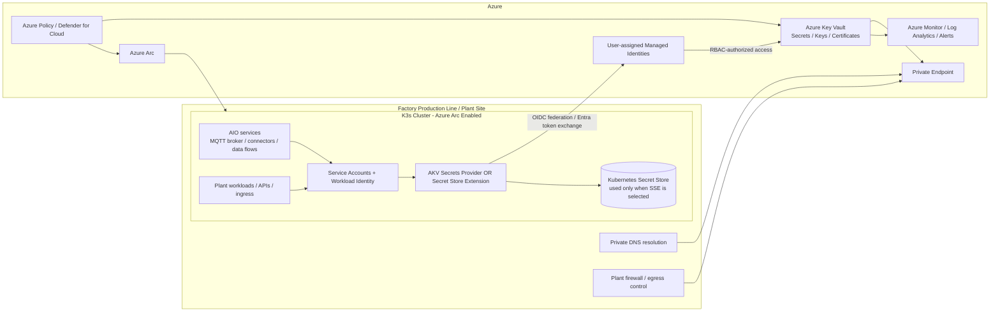
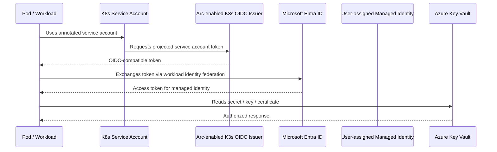
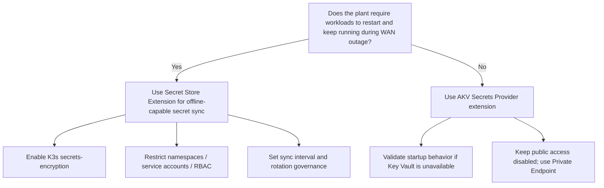
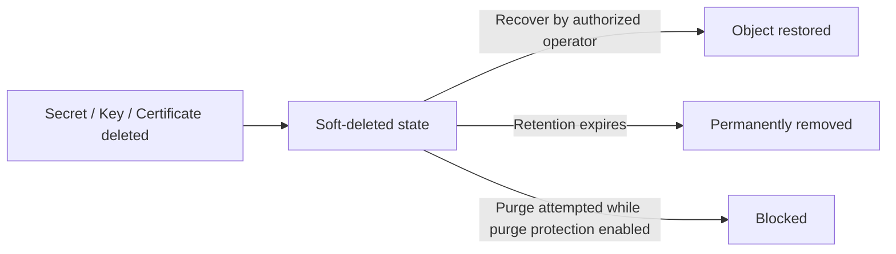

# Azure Key Vault Security and Governance for Azure IoT Operations (AIO) on K3s

## Purpose
This document outlines the **security and governance considerations** for implementing **Azure Key Vault** to support an **Azure IoT Operations (AIO)** deployment running on **K3s** for a **factory production line**. The design assumes an **Azure Arc-enabled Kubernetes** cluster at the edge, a production OT/IT environment, and a requirement to balance **security, resiliency, offline tolerance, and operational manageability**.

AIO is a unified data plane for the edge that runs modular services on Azure Arc-enabled Kubernetes clusters and includes built-in capabilities such as secrets management, certificate management, and secure settings. AIO can also operate offline for up to 72 hours, which is an important architectural factor when choosing how secrets are delivered to workloads.  
**Inline references:** [What is Azure IoT Operations?](https://learn.microsoft.com/en-us/azure/iot-operations/overview-iot-operations), [Prepare your Azure Arc-enabled Kubernetes cluster](https://learn.microsoft.com/en-us/azure/iot-operations/deploy-iot-ops/howto-prepare-cluster)

---

## Executive Summary
For a factory production line, Azure Key Vault should be treated as the **authoritative secret, key, and certificate control plane** for the plant-level AIO environment, not as a general-purpose application configuration store. The recommended model is to use **separate vaults by environment and region**, enforce **Azure RBAC** for the data plane, isolate the vault behind **Private Link**, and use **Microsoft Entra workload identity federation** so K3s workloads authenticate without long-lived credentials.  
**Inline references:** [Secure your Azure Key Vault](https://learn.microsoft.com/en-us/azure/key-vault/general/secure-key-vault), [Provide access to Key Vault keys, certificates, and secrets with Azure role-based access control](https://learn.microsoft.com/en-us/azure/key-vault/general/rbac-guide)

For **reliably connected clusters**, the preferred pattern is the **Azure Key Vault Secrets Provider extension** so secrets are mounted directly into pods without persisting copies in the Kubernetes secret store. For **semi-disconnected or intermittently connected clusters**, the preferred pattern is the **Azure Key Vault Secret Store extension (SSE)**, which synchronizes selected secrets from Azure Key Vault into the cluster secret store for offline access. If SSE is used, **K3s secret encryption at rest must be enabled** and namespace/RBAC boundaries must be treated as compensating controls because the cluster becomes a secondary secret-holding boundary.  
**Inline references:** [Use the Azure Key Vault Secrets Provider extension to fetch secrets into Azure Arc-enabled Kubernetes clusters](https://learn.microsoft.com/en-us/azure/azure-arc/kubernetes/tutorial-akv-secrets-provider), [Use the Secret Store extension to fetch secrets for offline access in Azure Arc-enabled Kubernetes clusters](https://learn.microsoft.com/en-us/azure/azure-arc/kubernetes/secret-store-extension), [CIS Hardening Guide - K3s](https://docs.k3s.io/security/hardening-guide)

The production design should also include **soft delete**, **purge protection**, **diagnostic settings**, **Key Vault Insights / Azure Monitor**, alerting on failures and expirations, and Azure Policy-based enforcement for networking, RBAC model selection, and secret lifecycle settings.  
**Inline references:** [Azure Key Vault recovery overview](https://learn.microsoft.com/en-us/azure/key-vault/general/key-vault-recovery), [Diagnostic settings in Azure Monitor](https://learn.microsoft.com/en-us/azure/azure-monitor/platform/diagnostic-settings), [Monitor Azure Key Vault](https://learn.microsoft.com/en-us/azure/key-vault/general/monitor-key-vault), [Keyvault security recommendations - Microsoft Defender for Cloud](https://learn.microsoft.com/en-us/azure/defender-for-cloud/recommendations-reference-keyvault)

---

## Scope and Assumptions
- **Platform:** Azure IoT Operations deployed to a **K3s** cluster that is **Azure Arc-enabled**.
- **Environment:** Factory production line / manufacturing edge with OT devices, local processing, and cloud-connected management.
- **Security objective:** Centralize secrets, keys, and certificates in Azure Key Vault while minimizing blast radius, eliminating static credentials where possible, and supporting plant resiliency requirements.
- **Connectivity assumption:** Some sites may be always connected; others may be partially disconnected or tolerate temporary WAN loss.

**Inline references:** [Azure Arc-enabled Kubernetes overview](https://learn.microsoft.com/en-us/azure/azure-arc/kubernetes/overview), [What is Azure IoT Operations?](https://learn.microsoft.com/en-us/azure/iot-operations/overview-iot-operations), [Azure Well-Architected Framework](https://learn.microsoft.com/en-us/azure/well-architected/)

---

## Recommended Reference Design

### High-level recommendations
1. Use **one Key Vault per application / region / environment** at minimum; for a factory, prefer a **dedicated production plant vault** rather than sharing a broad enterprise vault.  
   **Inline references:** [Secure your Azure Key Vault](https://learn.microsoft.com/en-us/azure/key-vault/general/secure-key-vault)
2. Use **Azure RBAC** for Key Vault authorization instead of legacy access policies.  
   **Inline references:** [Provide access to Key Vault keys, certificates, and secrets with Azure role-based access control](https://learn.microsoft.com/en-us/azure/key-vault/general/rbac-guide), [Keyvault security recommendations - Microsoft Defender for Cloud](https://learn.microsoft.com/en-us/azure/defender-for-cloud/recommendations-reference-keyvault)
3. Publish Key Vault through **Private Endpoint / Private Link** and disable public network access unless there is a documented exception.  
   **Inline references:** [Integrate Key Vault with Azure Private Link](https://learn.microsoft.com/en-us/azure/key-vault/general/private-link-service), [Configure network security for Azure Key Vault](https://learn.microsoft.com/en-us/azure/key-vault/general/network-security)
4. Use **workload identity federation** for pods that access Key Vault, mapped to tightly scoped **user-assigned managed identities**.  
   **Inline references:** [Deploy and configure workload identity federation in Azure Arc-enabled Kubernetes](https://learn.microsoft.com/en-us/azure/azure-arc/kubernetes/workload-identity)
5. Choose **one** secret delivery pattern per cluster/application domain:
   - **Online-only**: Azure Key Vault Secrets Provider extension (no persistent Kubernetes secret copy by default).
   - **Offline-capable**: Azure Key Vault Secret Store extension (synchronized Kubernetes secrets for semi-disconnected operation).  
   **Inline references:** [Use the Azure Key Vault Secrets Provider extension to fetch secrets into Azure Arc-enabled Kubernetes clusters](https://learn.microsoft.com/en-us/azure/azure-arc/kubernetes/tutorial-akv-secrets-provider), [Use the Secret Store extension to fetch secrets for offline access in Azure Arc-enabled Kubernetes clusters](https://learn.microsoft.com/en-us/azure/azure-arc/kubernetes/secret-store-extension)
6. Enable **soft delete**, **purge protection**, logging, monitoring, and alerting from day one.  
   **Inline references:** [Azure Key Vault recovery overview](https://learn.microsoft.com/en-us/azure/key-vault/general/key-vault-recovery), [Enable Key Vault logging](https://learn.microsoft.com/en-us/azure/key-vault/general/howto-logging)

### Reference architecture diagram

**Architecture interpretation:** Key Vault remains the source of truth, Azure Arc provides governance and extension lifecycle management, and workload identity removes the need for embedded secrets. If the site is intermittently connected, SSE can provide local secret availability, but it also expands the trust boundary to the cluster secret store and therefore requires stronger cluster hardening.  
**Inline references:** [What is Azure IoT Operations?](https://learn.microsoft.com/en-us/azure/iot-operations/overview-iot-operations), [Azure Arc-enabled Kubernetes overview](https://learn.microsoft.com/en-us/azure/azure-arc/kubernetes/overview), [Use the Secret Store extension to fetch secrets for offline access in Azure Arc-enabled Kubernetes clusters](https://learn.microsoft.com/en-us/azure/azure-arc/kubernetes/secret-store-extension)

---

## Security Considerations

### 1) Secret boundary and vault segmentation
Azure Key Vault should define a **clear administrative and blast-radius boundary**. Microsoft recommends separating vaults by application, region, and environment to reduce the impact of compromise. For a factory, that typically means:
- A **production plant vault** for plant runtime secrets/certs.
- A **non-production plant vault** for testing/staging.
- Optional separate vaults for **shared platform components** versus **workload/application secrets**.

Do **not** use Key Vault as a general application configuration database. Use it for secrets, keys, and certificates that need centralized control, lifecycle, and access auditing.  
**Inline references:** [Secure your Azure Key Vault](https://learn.microsoft.com/en-us/azure/key-vault/general/secure-key-vault)

### 2) Identity and access control
Use **Microsoft Entra ID** for authentication and **Azure RBAC** for authorization across both control plane and data plane. Azure RBAC provides centralized permission management and is the recommended authorization model for Key Vault. Use the **least privilege** principle and assign permissions at the narrowest feasible scope.  
**Inline references:** [Provide access to Key Vault keys, certificates, and secrets with Azure role-based access control](https://learn.microsoft.com/en-us/azure/key-vault/general/rbac-guide), [Secure your Azure Key Vault](https://learn.microsoft.com/en-us/azure/key-vault/general/secure-key-vault)

**Recommended RBAC model for a factory AIO deployment**
- **Platform team:** control plane roles for vault lifecycle, network, diagnostics, and policy remediation.
- **Workload identity per namespace/app:** data plane read access only to the required secrets, certificates, or keys.
- **Break-glass administrators:** tightly controlled, PIM-governed, auditable elevated access.
- **Separation of duties:** recovery/purge permissions should be restricted to a smaller trusted set than day-to-day secret read roles.

**Governance considerations**
- Use **group-based role assignments** where possible rather than direct user assignments.
- Treat **per-object role assignments** with caution; they are powerful but can become difficult to govern at scale.
- Periodically review **who can read**, **who can rotate**, **who can purge**, and **who can change networking**.

**Inline references:** [Provide access to Key Vault keys, certificates, and secrets with Azure role-based access control](https://learn.microsoft.com/en-us/azure/key-vault/general/rbac-guide), [Azure Key Vault recovery overview](https://learn.microsoft.com/en-us/azure/key-vault/general/key-vault-recovery)

### 3) Workload identity federation for K3s workloads
Avoid static client secrets, certificates, or long-lived credentials inside plant workloads. Instead, use **workload identity federation** on the Arc-enabled K3s cluster so a Kubernetes service account can federate to a **user-assigned managed identity** in Entra ID. This reduces secret sprawl and the risk of expiration-related outages.  
**Inline references:** [Deploy and configure workload identity federation in Azure Arc-enabled Kubernetes](https://learn.microsoft.com/en-us/azure/azure-arc/kubernetes/workload-identity)

**Design guidance**
- Create a **dedicated user-assigned managed identity** per workload or per trust boundary.
- Bind that identity to a **Kubernetes service account** in the relevant namespace.
- Grant only the **specific Key Vault data plane roles** required.
- Document the OIDC issuer dependency and certificate path used by the Arc-enabled cluster.

#### Identity flow diagram

**Inline references:** [Deploy and configure workload identity federation in Azure Arc-enabled Kubernetes](https://learn.microsoft.com/en-us/azure/azure-arc/kubernetes/workload-identity)

### 4) Network isolation and data path protection
Key Vault is a public Azure service by default, but for a factory deployment it should normally be **privately reachable only**.

**Recommended controls**
- Deploy a **Private Endpoint** for each production vault.
- Link the required VNets to the appropriate **private DNS** design so the vault FQDN resolves to the private IP.
- Disable **public network access** unless there is a temporary exception with compensating controls.
- Document outbound dependencies from the plant network to Azure services and ensure firewall rules are explicit.
- Validate name resolution from the nodes that actually consume the vault (for example, K3s servers, application pods, extension pods, and jump hosts).

**Governance considerations**
- Private endpoint placement, DNS ownership, and route ownership often span separate teams; ownership must be explicitly defined.
- A failed or incomplete DNS design is one of the most common causes of “secure but broken” Key Vault deployments.

**Inline references:** [Integrate Key Vault with Azure Private Link](https://learn.microsoft.com/en-us/azure/key-vault/general/private-link-service), [Configure network security for Azure Key Vault](https://learn.microsoft.com/en-us/azure/key-vault/general/network-security), [Azure Private Endpoint private DNS zone values](https://docs.azure.cn/en-us/private-link/private-endpoint-dns)

### 5) Secret delivery pattern: online-only vs offline-capable
This is the most important architectural decision for an AIO factory cluster.

#### Option A — Azure Key Vault Secrets Provider extension (online-only preferred)
This extension mounts secrets, keys, and certificates into pods by using the Secrets Store CSI driver. By default, it **does not persist secrets in the Kubernetes secret store**, which reduces the local secret footprint. However, connectivity to Azure Key Vault is required when a secret-consuming pod starts or restarts. This makes it appropriate for sites with reliable connectivity and for workloads where avoiding local copies is a priority.  
**Inline references:** [Use the Azure Key Vault Secrets Provider extension to fetch secrets into Azure Arc-enabled Kubernetes clusters](https://learn.microsoft.com/en-us/azure/azure-arc/kubernetes/tutorial-akv-secrets-provider)

#### Option B — Azure Key Vault Secret Store extension (offline-capable preferred)
SSE synchronizes selected secrets from Azure Key Vault into the Kubernetes secret store for offline access. Microsoft specifically positions it for clusters outside Azure where connectivity to Key Vault may not be perfect. This is often the better fit for a factory line that must continue operating during WAN interruptions. The tradeoff is that the cluster now stores copies of secrets locally, so namespace isolation, RBAC, node security, and Kubernetes secret encryption become mandatory compensating controls. It is **not recommended** to run the online-only provider and SSE side by side in the same cluster.  
**Inline references:** [Use the Secret Store extension to fetch secrets for offline access in Azure Arc-enabled Kubernetes clusters](https://learn.microsoft.com/en-us/azure/azure-arc/kubernetes/secret-store-extension), [Azure Key Vault Secret Store extension configuration reference](https://learn.microsoft.com/en-us/azure/azure-arc/kubernetes/secret-store-extension-reference)

#### Decision diagram

**Inline references:** [Use the Azure Key Vault Secrets Provider extension to fetch secrets into Azure Arc-enabled Kubernetes clusters](https://learn.microsoft.com/en-us/azure/azure-arc/kubernetes/tutorial-akv-secrets-provider), [Use the Secret Store extension to fetch secrets for offline access in Azure Arc-enabled Kubernetes clusters](https://learn.microsoft.com/en-us/azure/azure-arc/kubernetes/secret-store-extension), [What is Azure IoT Operations?](https://learn.microsoft.com/en-us/azure/iot-operations/overview-iot-operations)

### 6) K3s hardening when local secret copies exist
If secrets are ever synchronized into the cluster (for example, with SSE), the K3s cluster becomes a regulated secret-handling environment.

**Minimum hardening expectations**
- Enable **`secrets-encryption: true`** in K3s.
- Enable the K3s/CIS-aligned controls such as **protect-kernel-defaults**, audit logging, and appropriate admission controls.
- Enforce **namespace isolation**, **RBAC**, and **pod security standards**.
- Restrict host access to cluster nodes and protect the node OS, filesystem, and etcd/data directories.
- Ensure backup/restore procedures do not unintentionally proliferate unprotected copies of secrets.

**Inline references:** [CIS Hardening Guide - K3s](https://docs.k3s.io/security/hardening-guide), [Security - K3s](https://docs.k3s.io/security)

### 7) Certificate and key lifecycle governance
AIO environments often require TLS materials for MQTT brokers, ingress, APIs, OPC UA integrations, or internal service trust. Key Vault can store and govern certificates and keys, but lifecycle ownership must be defined.

**Governance questions to answer**
- Which certificates are **platform-owned** versus **application-owned**?
- Which certificates may be **auto-rotated** versus manually approved?
- How are **subject names**, **issuers**, **key sizes**, and **lifetime thresholds** standardized?
- Which workloads can tolerate live rotation, and which require a planned maintenance window or pod restart?

**Recommended controls**
- Set **expiration dates** on secrets and keys.
- Use **near-expiry alerting** and rotation playbooks.
- Prefer storing service certificates as **Key Vault certificates** rather than hiding them as generic secrets.

**Inline references:** [Secure your Azure Key Vault](https://learn.microsoft.com/en-us/azure/key-vault/general/secure-key-vault), [Keyvault security recommendations - Microsoft Defender for Cloud](https://learn.microsoft.com/en-us/azure/defender-for-cloud/recommendations-reference-keyvault), [Enable Key Vault logging](https://learn.microsoft.com/en-us/azure/key-vault/general/howto-logging)

### 8) Recovery, retention, and ransomware resilience
Soft delete and purge protection are mandatory for production. Soft delete provides a recovery window (default 90 days if not otherwise configured), and purge protection prevents permanent deletion during the retention period. Recovery and purge operations should be tightly controlled and audited.  
**Inline references:** [Azure Key Vault recovery overview](https://learn.microsoft.com/en-us/azure/key-vault/general/key-vault-recovery), [Azure Key Vault: soft-delete overview](https://learn.microsoft.com/en-us/azure/key-vault/general/soft-delete-overview)

Manual backup/restore exists for individual secrets, keys, and certificates, but Microsoft notes that Key Vault already provides redundancy and soft delete; backup should be used only for specific business or regulatory needs, not as a substitute for a poor operational design.  
**Inline references:** [Azure Key Vault backup and restore](https://learn.microsoft.com/en-us/azure/key-vault/general/backup)

#### Recovery control flow

### 9) Logging, monitoring, alerting, and forensic readiness
Enable **diagnostic settings** for every production vault and send logs/metrics to **Log Analytics** (and optionally Storage / Event Hub where retention or downstream integration requires it). Key Vault logs include authenticated REST API requests, failed requests, operations on the vault, operations on keys/secrets/certificates, and specific Event Grid notification events such as **expired** and **near expiration**.  
**Inline references:** [Diagnostic settings in Azure Monitor](https://learn.microsoft.com/en-us/azure/azure-monitor/platform/diagnostic-settings), [Enable Key Vault logging](https://learn.microsoft.com/en-us/azure/key-vault/general/howto-logging), [Azure Key Vault logging](https://learn.microsoft.com/en-us/azure/key-vault/general/logging)

**Recommended alerts**
- Secret read failures / authorization failures.
- Latency spikes or throttling symptoms.
- Public network access drift.
- Deletion or purge-related operations.
- Approaching expiration for secrets, keys, and certificates.
- Extension sync failures (if SSE is used).

Use **Key Vault Insights** and Azure Monitor workbooks to baseline request volume, latency, failures, and saturation.  
**Inline references:** [Monitor Azure Key Vault](https://learn.microsoft.com/en-us/azure/key-vault/general/monitor-key-vault), [Monitor Key Vault with Key Vault insights](https://learn.microsoft.com/en-us/azure/key-vault/key-vault-insights-overview)

### 10) Azure Policy, compliance, and drift control
Use **Azure Policy** and **Defender for Cloud** recommendations to enforce baseline controls and detect drift.

**Recommended policy/compliance checks**
- Key Vault should use **RBAC** permission model.
- **Soft delete** should be enabled.
- **Purge protection** should be enabled.
- **Secrets and keys should have expiration dates**.
- **Public access** should be restricted per design.
- Diagnostic settings should be deployed or audited by policy where possible.

For Arc-enabled Kubernetes and the AIO platform, also use Azure governance capabilities such as resource organization, tagging, policy, and Defender for Containers / Azure Policy where applicable to maintain consistent governance across plant clusters.  
**Inline references:** [Keyvault security recommendations - Microsoft Defender for Cloud](https://learn.microsoft.com/en-us/azure/defender-for-cloud/recommendations-reference-keyvault), [Azure security baseline for Key Vault](https://learn.microsoft.com/en-us/security/benchmark/azure/baselines/key-vault-security-baseline), [Azure Arc overview](https://learn.microsoft.com/en-us/azure/azure-arc/overview), [Azure Arc-enabled Kubernetes overview](https://learn.microsoft.com/en-us/azure/azure-arc/kubernetes/overview)

### 11) Operational excellence and change management
The operational model must define how Key Vault changes move through **development**, **validation**, and **production**, because a secret update can become a production event in a factory line.

**Operational expectations**
- Manage Key Vault objects and extension configuration through **GitOps / IaC** where feasible.
- Version secrets and certificates with a documented naming/versioning convention.
- Define which rotations are **transparent**, which require **pod restart**, and which require a **change window**.
- Test failover and offline-start behavior for the chosen secret delivery pattern.
- Ensure plant support teams have documented **break-glass procedures** if Key Vault connectivity, identity federation, or secret synchronization fails.

**Inline references:** [Azure Well-Architected Framework](https://learn.microsoft.com/en-us/azure/well-architected/), [Microsoft Azure Well-Architected Framework - Operational Excellence](https://learn.microsoft.com/en-us/training/modules/azure-well-architected-operational-excellence/), [Azure Arc-enabled Kubernetes overview](https://learn.microsoft.com/en-us/azure/azure-arc/kubernetes/overview)

---

## Prescriptive Design Guidance for a Factory Production Line

### Preferred pattern by connectivity profile
| Site profile | Recommended Key Vault integration pattern | Rationale |
|---|---|---|
| Always connected or highly reliable WAN | Azure Key Vault Secrets Provider extension | Minimizes local secret copies and keeps Key Vault as the direct runtime source. |
| Semi-disconnected / intermittent WAN / must survive edge restarts during outage | Azure Key Vault Secret Store extension (SSE) | Allows offline access to synchronized secrets during WAN interruption. |
| Safety-critical workloads with strict restart tolerances | SSE plus strong cluster hardening and controlled sync scope | Protects runtime continuity but requires compensating controls because secrets exist locally. |

**Inline references:** [Use the Azure Key Vault Secrets Provider extension to fetch secrets into Azure Arc-enabled Kubernetes clusters](https://learn.microsoft.com/en-us/azure/azure-arc/kubernetes/tutorial-akv-secrets-provider), [Use the Secret Store extension to fetch secrets for offline access in Azure Arc-enabled Kubernetes clusters](https://learn.microsoft.com/en-us/azure/azure-arc/kubernetes/secret-store-extension), [What is Azure IoT Operations?](https://learn.microsoft.com/en-us/azure/iot-operations/overview-iot-operations)

### Recommended baseline controls
| Control area | Recommended baseline |
|---|---|
| Vault structure | Separate production and non-production vaults; consider dedicated plant vault per site or per critical workload boundary. |
| Authorization | Azure RBAC only; least privilege; PIM for admin paths; group-based assignments. |
| Network | Private Endpoint, private DNS, public access disabled by default. |
| Identity | Workload identity federation with user-assigned managed identities. |
| Secret delivery | CSI provider for connected sites; SSE for semi-disconnected sites. |
| Cluster hardening | K3s `secrets-encryption`, RBAC, Pod Security Standards, audit logging, node OS hardening. |
| Recovery | Soft delete + purge protection enabled; recovery role separated from normal operators. |
| Monitoring | Diagnostic settings to Log Analytics; alerting on failures, deletion, expiration, drift. |
| Governance | Azure Policy + Defender for Cloud recommendations; documented ownership for DNS, network, RBAC, and lifecycle. |

---

## Risks and Anti-Patterns to Avoid
- **Using one shared enterprise vault for every workload and environment**: creates excessive blast radius and difficult permission scoping.  
  **Inline references:** [Secure your Azure Key Vault](https://learn.microsoft.com/en-us/azure/key-vault/general/secure-key-vault)
- **Embedding static client secrets in pods or config maps** instead of using workload identity.  
  **Inline references:** [Deploy and configure workload identity federation in Azure Arc-enabled Kubernetes](https://learn.microsoft.com/en-us/azure/azure-arc/kubernetes/workload-identity)
- **Enabling SSE without hardening K3s secret storage**.  
  **Inline references:** [Use the Secret Store extension to fetch secrets for offline access in Azure Arc-enabled Kubernetes clusters](https://learn.microsoft.com/en-us/azure/azure-arc/kubernetes/secret-store-extension), [CIS Hardening Guide - K3s](https://docs.k3s.io/security/hardening-guide)
- **Leaving public network access enabled** “just for troubleshooting” without a time-bounded exception process.  
  **Inline references:** [Configure network security for Azure Key Vault](https://learn.microsoft.com/en-us/azure/key-vault/general/network-security), [Integrate Key Vault with Azure Private Link](https://learn.microsoft.com/en-us/azure/key-vault/general/private-link-service)
- **Failing to test pod restart behavior during Key Vault or WAN outage**.  
  **Inline references:** [Use the Azure Key Vault Secrets Provider extension to fetch secrets into Azure Arc-enabled Kubernetes clusters](https://learn.microsoft.com/en-us/azure/azure-arc/kubernetes/tutorial-akv-secrets-provider), [Use the Secret Store extension to fetch secrets for offline access in Azure Arc-enabled Kubernetes clusters](https://learn.microsoft.com/en-us/azure/azure-arc/kubernetes/secret-store-extension)
- **Not enabling soft delete / purge protection / expiration governance**.  
  **Inline references:** [Azure Key Vault recovery overview](https://learn.microsoft.com/en-us/azure/key-vault/general/key-vault-recovery), [Keyvault security recommendations - Microsoft Defender for Cloud](https://learn.microsoft.com/en-us/azure/defender-for-cloud/recommendations-reference-keyvault)

---

## Implementation Checklist

### Platform / Azure
- [ ] Create separate Key Vault instances for prod and non-prod; define plant/workload boundaries.
- [ ] Enable Azure RBAC permission model.
- [ ] Create Private Endpoint(s) and validate private DNS resolution.
- [ ] Disable public network access unless exception-approved.
- [ ] Enable soft delete and purge protection.
- [ ] Configure diagnostic settings to Log Analytics.
- [ ] Create alerts for expiration, deletion, auth failures, and network drift.
- [ ] Apply Azure Policy / Defender for Cloud recommendations.

### Arc / K3s / AIO
- [ ] Arc-enable the K3s cluster and confirm supported versions.
- [ ] Enable OIDC issuer and workload identity on the cluster.
- [ ] Create user-assigned managed identities per trust boundary.
- [ ] Map Kubernetes service accounts to federated identities.
- [ ] Choose **CSI provider** or **SSE** based on connectivity requirements.
- [ ] If using SSE, enable K3s `secrets-encryption: true` and restrict namespace/RBAC access.
- [ ] Validate application startup/restart behavior during WAN outage.
- [ ] Document secret rotation impact on workloads and whether restarts are required.

### Operations / Governance
- [ ] Define ownership for vault lifecycle, networking, DNS, RBAC, rotation, and recovery.
- [ ] Run periodic access reviews for Key Vault roles.
- [ ] Test recovery of deleted objects and validate purge controls.
- [ ] Review logs and alert thresholds after production stabilization.
- [ ] Maintain a break-glass runbook for connectivity, OIDC federation, and sync failures.

---

## References
| Title | URL | Relevance |
|---|---|---|
| What is Azure IoT Operations? | https://learn.microsoft.com/en-us/azure/iot-operations/overview-iot-operations | AIO capabilities, security features, offline tolerance, and edge architecture context. |
| Prepare your Azure Arc-enabled Kubernetes cluster | https://learn.microsoft.com/en-us/azure/iot-operations/deploy-iot-ops/howto-prepare-cluster | K3s/AIO preparation and Arc-enabled cluster prerequisites. |
| Azure Arc-enabled Kubernetes overview | https://learn.microsoft.com/en-us/azure/azure-arc/kubernetes/overview | Centralized governance and management model for Arc-enabled clusters. |
| Azure Arc overview | https://learn.microsoft.com/en-us/azure/azure-arc/overview | Governance and management capabilities across hybrid and edge estates. |
| Secure your Azure Key Vault | https://learn.microsoft.com/en-us/azure/key-vault/general/secure-key-vault | Core security guidance, vault boundary recommendations, and Zero Trust-aligned practices. |
| Provide access to Key Vault keys, certificates, and secrets with Azure role-based access control | https://learn.microsoft.com/en-us/azure/key-vault/general/rbac-guide | Key Vault access model and RBAC guidance for data plane authorization. |
| Integrate Key Vault with Azure Private Link | https://learn.microsoft.com/en-us/azure/key-vault/general/private-link-service | Private endpoint design guidance for Key Vault. |
| Configure network security for Azure Key Vault | https://learn.microsoft.com/en-us/azure/key-vault/general/network-security | Firewall, public access, trusted services, and network restriction options. |
| Azure Private Endpoint private DNS zone values | https://docs.azure.cn/en-us/private-link/private-endpoint-dns | Private DNS design considerations for private endpoint resolution. |
| Deploy and configure workload identity federation in Azure Arc-enabled Kubernetes | https://learn.microsoft.com/en-us/azure/azure-arc/kubernetes/workload-identity | Secretless authentication model for K3s workloads accessing Azure resources. |
| Use the Azure Key Vault Secrets Provider extension to fetch secrets into Azure Arc-enabled Kubernetes clusters | https://learn.microsoft.com/en-us/azure/azure-arc/kubernetes/tutorial-akv-secrets-provider | Online-only secret access pattern using CSI and Azure Key Vault provider. |
| Use the Secret Store extension to fetch secrets for offline access in Azure Arc-enabled Kubernetes clusters | https://learn.microsoft.com/en-us/azure/azure-arc/kubernetes/secret-store-extension | Offline-capable secret synchronization pattern for intermittently connected edge clusters. |
| Azure Key Vault Secret Store extension configuration reference | https://learn.microsoft.com/en-us/azure/azure-arc/kubernetes/secret-store-extension-reference | SSE sync interval, jitter, and extension behavior reference. |
| CIS Hardening Guide - K3s | https://docs.k3s.io/security/hardening-guide | Prescriptive K3s hardening guidance including secrets encryption. |
| Security - K3s | https://docs.k3s.io/security | K3s security and benchmark references. |
| Azure Key Vault recovery overview | https://learn.microsoft.com/en-us/azure/key-vault/general/key-vault-recovery | Soft delete, purge protection, and recovery governance. |
| Azure Key Vault: soft-delete overview | https://learn.microsoft.com/en-us/azure/key-vault/general/soft-delete-overview | Soft-delete behavior and recovery semantics. |
| Azure Key Vault backup and restore | https://learn.microsoft.com/en-us/azure/key-vault/general/backup | Backup/restore limitations and considerations. |
| Diagnostic settings in Azure Monitor | https://learn.microsoft.com/en-us/azure/azure-monitor/platform/diagnostic-settings | Diagnostic pipeline design for logs and metrics. |
| Enable Key Vault logging | https://learn.microsoft.com/en-us/azure/key-vault/general/howto-logging | Steps and event coverage for Key Vault logging. |
| Azure Key Vault logging | https://learn.microsoft.com/en-us/azure/key-vault/general/logging | Log content, schema, and event interpretation. |
| Monitor Azure Key Vault | https://learn.microsoft.com/en-us/azure/key-vault/general/monitor-key-vault | Monitoring data and operational views for Key Vault. |
| Monitor Key Vault with Key Vault insights | https://learn.microsoft.com/en-us/azure/key-vault/key-vault-insights-overview | Workbook-based monitoring and operational dashboards. |
| Azure security baseline for Key Vault | https://learn.microsoft.com/en-us/security/benchmark/azure/baselines/key-vault-security-baseline | Security benchmark alignment and baseline controls. |
| Keyvault security recommendations - Microsoft Defender for Cloud | https://learn.microsoft.com/en-us/azure/defender-for-cloud/recommendations-reference-keyvault | Defender recommendations for RBAC, expiration, soft delete, and related controls. |
| Azure Well-Architected Framework | https://learn.microsoft.com/en-us/azure/well-architected/ | Cross-cutting architecture guidance across security, reliability, and operations. |
| Microsoft Azure Well-Architected Framework - Operational Excellence | https://learn.microsoft.com/en-us/training/modules/azure-well-architected-operational-excellence/ | Operational excellence guidance for production governance and change control. |
