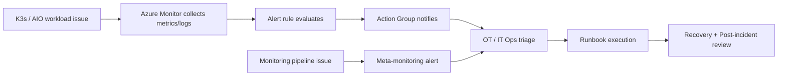

# Azure Monitor and Log Analytics for an AIO Cluster Running K3s – Security and Governance Considerations

**File name:** `AzureMonitorandLogAnalyticsSecurityandGovernance.md`  
**Scope:** Azure IoT Operations (AIO) running on an **Azure Arc-enabled K3s** cluster for a **factory production line**.  
**Audience:** Platform engineering, security, OT/IT operations, cloud governance, and architecture teams.

---

## 1. Executive summary

For a factory production line, Azure Monitor and Log Analytics should be implemented as a **controlled observability platform**, not merely as a log sink. In an AIO/K3s environment, the design should separate **metrics**, **logs**, **access**, **network paths**, **retention**, and **operational ownership** so that monitoring improves reliability without creating unnecessary cost, security exposure, or operational fragility.

A production-grade implementation should:

- Use **Azure Monitor managed service for Prometheus** for cluster and workload metrics, paired with **Azure Managed Grafana** for visualization.
- Use **Container Insights / Log Analytics** for Kubernetes logs, events, and operational investigation.
- Treat observability resources as **shared platform services** governed by Azure landing zone controls rather than project-by-project exceptions.
- Prefer **private connectivity**, least privilege RBAC, controlled data collection, and explicit retention/cost policies.
- Align monitoring with the realities of manufacturing: intermittent connectivity, OT/IT segmentation, change control, incident response, and forensic retention.

Microsoft’s current Azure IoT Operations guidance recommends deploying observability resources **before** production deployment and using Azure Monitor / Grafana for curated dashboards and Prometheus alerting. See the references section for the source set used for this design.

---

## 2. Context and assumptions

This document assumes the following:

- The factory platform runs **Azure IoT Operations** on an **Azure Arc-enabled Kubernetes** cluster.
- The Kubernetes distribution is **K3s**, which is a supported production platform for AIO.
- The factory may have **intermittent connectivity**, constrained outbound routes, or segmented OT networks.
- Azure Monitor is used for:
  - **Prometheus metrics** in an **Azure Monitor workspace**
  - **Container Insights / logs** in a **Log Analytics workspace**
  - **Alerting and visualization** via Azure Monitor alerts and Azure Managed Grafana
- Governance is expected to follow enterprise landing zone practices for identity, networking, policy, and monitoring standards.

---

## 3. Target architecture principles

1. **Security by design** – monitoring data is sensitive operational telemetry and should be protected accordingly.
2. **Private-first connectivity** – avoid unnecessary public ingress/egress for monitoring paths where feasible.
3. **Least privilege** – restrict who can onboard clusters, modify workspaces, view logs, and manage alert rules.
4. **Operational resilience** – monitoring must continue to provide value during degraded connectivity and after recovery.
5. **Cost-aware telemetry** – collect what is actionable; avoid indiscriminate ingestion.
6. **Separation of duties** – distinguish platform owners, application owners, OT operators, and security responders.
7. **Traceability** – monitoring configuration should be policy-governed, versioned, and auditable.

---

## 4. Reference architecture overview

### 4.1 Logical architecture

```mermaid
flowchart LR
    subgraph Factory[Factory Site / OT Network]
        K3s[K3s Cluster\nAzure Arc-enabled]
        AIO[AIO Services\nMQTT broker, connectors, data flows]
        OTel[OpenTelemetry Collector\n(optional / recommended for AIO exports)]
        AMA[Azure Monitor Extensions\nMetrics + Container Insights]
        K3s --> AIO
        AIO --> OTel
        K3s --> AMA
        OTel --> AMA
    end

    subgraph Azure[Azure Platform]
        AMW[Azure Monitor Workspace\nPrometheus metrics]
        LAW[Log Analytics Workspace\nLogs / events / investigations]
        AMG[Azure Managed Grafana]
        Alerts[Azure Monitor Alerts\nAction Groups]
        Policy[Azure Policy / Arc Policy\nGovernance]
        RBAC[Azure RBAC / PIM]
    end

    AMA --> AMW
    AMA --> LAW
    AMW --> AMG
    AMW --> Alerts
    LAW --> Alerts
    Policy --> K3s
    RBAC --> AMW
    RBAC --> LAW
    RBAC --> AMG
```

### 4.2 Network security view

```mermaid
flowchart TB
    subgraph Site[Factory / Plant Network]
        Nodes[K3s Nodes]
        Proxy[Optional outbound proxy / firewall]
    end

    subgraph Hub[Hub / Private Connectivity]
        PE[Private Endpoint]
        AMPLS[Azure Monitor Private Link Scope]
        DNS[Private DNS]
    end

    subgraph Monitor[Azure Monitor Resources]
        LAW[Log Analytics Workspace]
        AMW[Azure Monitor Workspace]
        DCE[Data Collection Endpoint(s) if used]
    end

    Nodes --> Proxy --> PE --> AMPLS
    DNS --> Nodes
    AMPLS --> LAW
    AMPLS --> AMW
    AMPLS --> DCE
```

---

## 5. Core security considerations

## 5.1 Resource organization and landing zone placement

Observability resources for AIO/K3s should be placed deliberately in the enterprise landing zone rather than created ad hoc from the cluster onboarding workflow.

### Recommendations

- Place the **Arc-enabled cluster**, **Azure Monitor workspace**, **Log Analytics workspace**, **Managed Grafana**, and **alerting resources** in subscriptions/resource groups that align to your landing zone model.
- Use a **central platform monitoring subscription** if your organization operates shared observability services across multiple factories or edge clusters.
- If site autonomy or data residency requirements are strict, use **per-site** workspaces with centralized query/reporting patterns rather than one global workspace for everything.
- Use **resource tags** to track plant/site, production line, environment, data classification, owner, cost center, and retention tier.
- Avoid the anti-pattern where default workspaces are created silently during onboarding and later become unmanaged technical debt.

### Why it matters

Arc onboarding and Azure Monitor onboarding can create default resources if you do not specify them. In a production manufacturing environment, that creates governance drift, unclear ownership, and inconsistent retention, RBAC, and cost settings.

---

## 5.2 Identity and access control

Observability platforms often contain sensitive operational data: node names, namespace names, pod logs, service identities, certificate errors, failed auth attempts, industrial connector health, and outage telemetry. Access must be tightly controlled.

### Recommendations

- Use **Azure RBAC** to control access to:
  - Arc-enabled Kubernetes resources
  - Azure Monitor workspace(s)
  - Log Analytics workspace(s)
  - Managed Grafana
  - Alert rules and action groups
- Grant onboarding permissions only to the **platform team**. Microsoft’s onboarding guidance calls out at least **Contributor** access for enabling monitoring and **Monitoring Reader/Contributor** to view data afterward.
- Separate roles for:
  - **Platform administrators** – enable extensions, manage workspaces, tune collection
  - **Security operations** – investigate logs, alerts, incidents
  - **Application/platform SRE** – create dashboards and service-level alerts
  - **OT operators** – read-only dashboards and approved queries only
- Use **Privileged Identity Management (PIM)** for high-impact roles where available.
- Prefer **group-based** role assignment over direct user assignment.
- Limit who can create or modify **action groups**, because alerting paths can expose sensitive operational signals or create notification fatigue.
- Restrict access to **shared workspaces** carefully; broad workspace access can create cross-site visibility that may violate least-privilege principles.

### Governance note

Use role assignment reviews and change control for any modification that can affect:

- ingestion destinations
- DCR / data collection settings
- log retention
- alert suppression
- private link / access mode changes

> **Important:** The user executing Azure Monitor onboarding for Arc-enabled Kubernetes requires appropriate permissions, and additional access is needed when linking Azure Monitor workspaces to Managed Grafana.

---

## 5.3 Network isolation and private connectivity

Monitoring traffic from a factory should be treated as regulated enterprise telemetry. Where business and network architecture permit, use private connectivity to reduce exposure and simplify egress governance.

### Recommendations

- Use **Azure Monitor Private Link Scope (AMPLS)** for private access to Azure Monitor resources such as Log Analytics workspaces, Azure Monitor workspaces, and data collection endpoints.
- Prefer a **hub-and-spoke** or similar centrally managed private connectivity pattern for multiple plants or spoke VNets.
- Use **private DNS** and validate name resolution for all Azure Monitor endpoints used by your connectivity model.
- For highly segmented plants, route monitoring traffic through an approved **outbound proxy** or firewall path and explicitly allow only the required Azure endpoints.
- Document whether ingestion and query access are:
  - public
  - private-only
  - mixed (temporary transition state)
- Avoid opening public network access broadly “just to get telemetry working.”

### Why it matters

Microsoft documents Azure Monitor private link through **AMPLS**, enabling private connectivity for Log Analytics and Azure Monitor resources and allowing you to control ingestion and query access modes. In a factory context, this supports OT/IT segmentation and reduces unnecessary internet exposure.

---

## 5.4 Data protection and data classification

Logs and metrics can contain operationally sensitive content, including endpoint names, namespace labels, image names, IP information, event details, and potentially application-level payload fragments if logging is uncontrolled.

### Recommendations

- Classify monitoring data at least as **Confidential – Operational** (or your equivalent policy tier) unless proven otherwise.
- Review application and connector logging so that **secrets, credentials, certificate private material, connection strings, and sensitive payload data are never written to stdout/stderr**.
- Limit collection of verbose debug logs in normal operations; enable them only through change control or incident procedures.
- Consider data minimization and table-level controls for nonessential high-volume data.
- If your compliance regime requires it, evaluate **customer-managed key (CMK)** and workspace encryption options as part of the broader monitoring security design.
- Document who may export logs, where exports may be sent, and how exported data is protected.

### Factory-specific concern

Manufacturing telemetry may reveal production rates, downtime patterns, equipment identifiers, and process dependencies. Even if it is not regulated personal data, it can be highly sensitive business data.

---

## 5.5 Kubernetes and Arc governance integration

Monitoring should be governed together with the Arc-enabled cluster rather than treated as an isolated add-on.

### Recommendations

- Use **Azure Policy** for Arc-enabled Kubernetes to audit/deploy required extensions and security add-ons where appropriate.
- Use built-in policies to detect whether required protections or extensions are missing.
- Align the monitoring baseline with the **Azure Arc-enabled Kubernetes security baseline** and your enterprise benchmark controls.
- Govern extension lifecycle, upgrade cadence, and approved versions under change control.
- For AIO production environments, turn off uncontrolled auto-upgrade behavior where it conflicts with plant change windows and use a tested upgrade motion instead.

### What to govern

- Azure Monitor extension presence
- approved workspace targets
- required tags
- allowed regions
- private connectivity posture
- diagnostic / alerting baseline
- Defender / policy integrations where required by security policy

---

## 6. Log collection and telemetry design considerations

## 6.1 Separate metrics from logs

A clean production design should explicitly separate **metrics** and **logs**:

- **Azure Monitor workspace** → Prometheus metrics
- **Log Analytics workspace** → Container logs, Kubernetes events, and related investigations

This separation follows Microsoft’s current Arc-enabled Kubernetes and AIO observability model and helps with RBAC, cost management, and operational clarity.

### Recommendation

Do not rely on a single “monitoring workspace” concept operationally; define ownership and controls separately for metrics and logs.

---

## 6.2 Decide what to collect

More data is not always better. Production-line clusters can generate large volumes of repetitive container logs, Kubernetes events, and noisy metrics.

### Recommended collection baseline

Collect:

- Node and cluster health metrics
- Kubernetes object state relevant to reliability
- Namespace/pod/container logs for AIO platform components and approved workloads
- Critical events and restart patterns
- Ingress / broker / connector health metrics
- Control-plane-related telemetry where supported and operationally relevant

Collect conditionally:

- Verbose application logs
- Short-lived troubleshooting traces
- per-message diagnostic payloads
- large-volume debug streams

Avoid by default:

- Any telemetry containing secrets or sensitive production payloads
- High-cardinality labels with little operational value
- Duplicate metrics already represented elsewhere

### AIO-specific note

The current AIO observability guidance uses Azure Monitor managed Prometheus, Container Insights, and optional OpenTelemetry Collector-based export paths for observability configuration. That should be your baseline starting point unless you have a deliberate exception.

---

## 6.3 Data collection configuration and change control

Data collection settings should be treated as controlled configuration artifacts.

### Recommendations

- Manage collection settings through **infrastructure as code** or controlled automation where possible.
- Version the following artifacts:
  - extension deployment commands / templates
  - Prometheus scrape configuration
  - OpenTelemetry Collector configuration
  - alert definitions
  - Grafana dashboards
  - action groups and notification routing
- Require approval for changes that materially affect:
  - data volume
  - retention
  - visibility gaps
  - alert fidelity
  - egress/network posture

### Operational pattern

Use a **staging cluster** or non-production factory test environment to validate collection changes before applying them to the primary production line.

---

## 6.4 High-cardinality and cost management

Kubernetes observability costs can rise quickly due to label cardinality, repeated log lines, short scrape intervals, and excessive retention.

### Recommendations

- Keep scrape intervals aligned to operational need; do not oversample edge workloads without a reason.
- Avoid ingesting every metric from every exporter by default.
- Review namespace- and workload-level logging volume regularly.
- Tune collection to reduce low-value logs and noisy events.
- Use separate retention/tiering decisions for:
  - active troubleshooting data
  - security investigation data
  - long-term audit/forensic exports
- Define budget thresholds and monitor ingestion volume per site/cluster.

### Governance controls

- Cost ownership must be assigned to a platform owner or factory owner.
- Tag resources for cost allocation.
- Review ingestion, alert volume, and dashboard sprawl quarterly.

---

## 6.5 Retention, recovery, and forensic readiness

Retention policy should reflect both operational and investigative needs.

### Recommendations

- Define a standard retention policy for operational logs and a longer policy for security or incident-response data when required.
- Do not keep all tables at the same retention setting without justification.
- For business-critical or forensic scenarios, define whether logs should also be **exported** or otherwise preserved outside the active workspace retention window.
- Document recovery expectations for the monitoring platform itself:
  - how workspaces are recreated if needed
  - how dashboards and alerts are restored
  - how data access continues after networking changes or subscription recovery
- Preserve observability configuration as code so the monitoring stack can be rebuilt predictably.

### Factory-specific concern

When a production event occurs, operators often need to correlate:

- node degradation
- connector faults
- message backlog
- broker health
- external dependency issues
- certificate / auth failures

Retention should support root-cause analysis across realistic investigation windows, not just short operational dashboards.

---

## 7. Alerting and incident response considerations

Alerting in a production-line environment must be precise, actionable, and resilient to noise.

## 7.1 Alert design

### Recommended alert categories

- Cluster/node availability degradation
- pod restart storms / crash loops
- connector health failures
- MQTT broker or data-flow degradation
- log ingestion or metrics ingestion failure
- certificate expiry / auth failures where surfaced in telemetry
- storage pressure / memory pressure / CPU saturation
- site connectivity degradation affecting cloud management

### Recommendations

- Build a layered alert model:
  - **platform alerts** for cluster health
  - **AIO service alerts** for broker/connectors/data flows
  - **security alerts** for suspicious events / failed auth / policy drift
  - **cost/telemetry health alerts** for ingestion failures or abnormal volume spikes
- Route alerts through approved **action groups** with documented escalation paths.
- Use severity mapping aligned to plant operations and incident management.
- Suppress or aggregate known-noisy signals after validation; do not suppress by habit.
- Test alerts during commissioning and after any major change.

---

## 7.2 Monitor the monitoring platform

If observability fails silently, outages become harder to diagnose.

### Recommendations

Create checks for:

- extension health
- workspace connectivity
- sudden drop in expected metric series
- sudden reduction in log ingestion
- failed scrape targets
- dashboard data-source failures
- stale alerts or disabled action groups



---

## 8. Compliance and governance considerations

## 8.1 Policy and standard alignment

Your monitoring implementation should map back to enterprise control domains, for example:

- identity and access management
- network security / segmentation
- logging and monitoring
- incident response
- change management
- data retention and protection
- backup / recovery of configuration artifacts

### Recommendations

- Create a documented **monitoring standard** for Arc-enabled K3s / AIO sites.
- Enforce required configuration through **Azure Policy**, templates, and deployment pipelines.
- Maintain evidence of:
  - workspace configuration
  - RBAC assignments
  - private link topology
  - retention settings
  - alert rules and action groups
  - periodic access reviews
  - extension versions / upgrade history

---

## 8.2 Auditability and change history

### Recommendations

- Log administrative changes to monitoring resources.
- Use source control for dashboards, rules, and collector configuration.
- Document emergency-change procedures for telemetry tuning during production incidents.
- Keep a formal runbook for onboarding new clusters and new factory sites.

---

## 9. Recommended prescriptive implementation pattern

Below is a practical implementation pattern for most factory production deployments.

## 9.1 Baseline pattern

1. **Prepare the Arc-enabled K3s cluster** for AIO using supported production guidance.
2. **Deploy observability resources before production cutover**.
3. Create and govern separately:
   - **Azure Monitor workspace** for Prometheus metrics
   - **Log Analytics workspace** for logs
   - **Managed Grafana** for dashboards
4. Enable the Azure Monitor extensions for:
   - metrics (`Microsoft.AzureMonitor.Containers.Metrics`)
   - container/log collection (`Microsoft.AzureMonitor.Containers`)
5. If using AIO observability enhancements, deploy and govern the **OpenTelemetry Collector** configuration.
6. Use **private link / AMPLS** where network architecture permits.
7. Apply **Azure Policy** for Arc governance and extension compliance.
8. Create a standard alert pack and dashboard pack.
9. Validate telemetry during commissioning and with plant failover / outage tests.
10. Transition to steady-state operations with cost, retention, and access reviews.

---

## 9.2 Preferred resource ownership model

- **Platform team**
  - workspaces
  - alerting baseline
  - AMPLS / private endpoints
  - Grafana platform
  - extension lifecycle
- **Factory / application operations**
  - site dashboards
  - approved service alerts
  - first-line operational triage
- **Security team**
  - log access for investigation
  - policy/compliance review
  - incident response integration

---

## 10. Implementation checklist

### 10.1 Architecture and landing zone

- [ ] Decide central vs per-site workspace strategy
- [ ] Choose resource group / subscription placement
- [ ] Define tagging standard
- [ ] Define naming standard
- [ ] Define region / residency requirements

### 10.2 Security

- [ ] Define RBAC model for Arc, Azure Monitor, Log Analytics, and Grafana
- [ ] Use group-based assignments
- [ ] Review privileged roles / PIM
- [ ] Confirm private connectivity posture
- [ ] Validate firewall / proxy allow lists
- [ ] Confirm monitoring data classification

### 10.3 Telemetry design

- [ ] Define metrics baseline
- [ ] Define log collection scope
- [ ] Review high-cardinality metrics
- [ ] Review verbose logging sources
- [ ] Create retention plan by data type
- [ ] Define export / preservation requirements for forensic scenarios

### 10.4 Operations

- [ ] Build standard alert rules
- [ ] Build action groups and escalation paths
- [ ] Test alert routing
- [ ] Monitor the monitoring pipeline
- [ ] Version configurations as code
- [ ] Define upgrade and rollback runbooks

### 10.5 Governance

- [ ] Apply Azure Policy / Arc governance controls
- [ ] Document approved exceptions
- [ ] Maintain access reviews
- [ ] Review costs monthly
- [ ] Review telemetry value/noise quarterly

---

## 11. Key design decisions to document explicitly

Before production approval, capture the following decisions:

1. **Workspace strategy** – central, regional, or per-site?
2. **Private connectivity** – AMPLS/private-only or controlled public access?
3. **Retention model** – operational vs security/investigative duration?
4. **Access model** – who can view site telemetry, edit queries, and export data?
5. **Collection scope** – which namespaces/workloads are in scope?
6. **Alert ownership** – who responds to which class of alert?
7. **Upgrade policy** – how are Arc / monitoring extensions tested and rolled out?
8. **Incident support** – what logs/metrics must exist to support RCA for production outages?

---

## 12. Opinionated recommendations for most factory AIO/K3s deployments

If you need a concise “default good pattern,” use the following:

- **Deploy observability before AIO production go-live**.
- Use **Azure Monitor workspace + Log Analytics workspace + Managed Grafana** as separate, governed resources.
- Put them under a **platform-owned landing zone** with explicit tags, retention, and RBAC.
- Use **AMPLS/private connectivity** when possible.
- Keep **metrics and logs separate** operationally and administratively.
- Collect only what is needed for reliability, security, and RCA.
- Use **Azure Policy** and version-controlled configuration to avoid drift.
- Test monitoring during failover, maintenance, and disconnected/reconnected site scenarios.
- Review **ingestion cost and noisy telemetry** regularly.
- Treat monitoring as a production dependency with its own health checks and runbooks.

---

## 13. References

The following Microsoft documentation informed this design:

1. **Deploy observability resources and set up logs – Azure IoT Operations**  
   https://learn.microsoft.com/en-us/azure/iot-operations/configure-observability-monitoring/howto-configure-observability

2. **Production deployment guidelines – Azure IoT Operations**  
   https://learn.microsoft.com/en-us/azure/iot-operations/deploy-iot-ops/concept-production-guidelines

3. **Deployment overview – Azure IoT Operations**  
   https://learn.microsoft.com/en-us/azure/iot-operations/deploy-iot-ops/overview-deploy

4. **Prepare your Azure Arc-enabled Kubernetes cluster – Azure IoT Operations**  
   https://learn.microsoft.com/en-us/azure/iot-operations/deploy-iot-ops/howto-prepare-cluster

5. **Enable monitoring for Arc-enabled Kubernetes clusters – Azure Monitor**  
   https://learn.microsoft.com/en-us/azure/azure-monitor/containers/kubernetes-monitoring-enable-arc

6. **Kubernetes monitoring in Azure Monitor**  
   https://docs.azure.cn/en-us/azure-monitor/containers/kubernetes-monitoring-overview

7. **Use Azure Private Link to connect networks to Azure Monitor**  
   https://learn.microsoft.com/en-us/azure/azure-monitor/fundamentals/private-link-security

8. **Configure private link for Azure Monitor**  
   https://learn.microsoft.com/en-us/azure/azure-monitor/fundamentals/private-link-configure

9. **Query container logs in Azure Monitor**  
   https://learn.microsoft.com/en-us/azure/azure-monitor/containers/container-insights-log-query

10. **Management and monitoring for Azure Arc-enabled Kubernetes – Cloud Adoption Framework**  
    https://learn.microsoft.com/en-us/azure/cloud-adoption-framework/scenarios/hybrid/arc-enabled-kubernetes/eslz-arc-kubernetes-management-disciplines

11. **Azure Policy built-in definitions for Azure Arc-enabled Kubernetes**  
    https://learn.microsoft.com/en-us/azure/azure-arc/kubernetes/policy-reference

12. **Azure security baseline for Azure Arc-enabled Kubernetes**  
    https://learn.microsoft.com/en-us/security/benchmark/azure/baselines/azure-arc-enabled-kubernetes-security-baseline

---

## 14. Closing note

For this scenario, the most important governance decision is **not** which dashboard to build first; it is whether observability is being treated as a governed enterprise platform service. In factory environments, good monitoring design directly affects uptime, change safety, and mean-time-to-recover.
