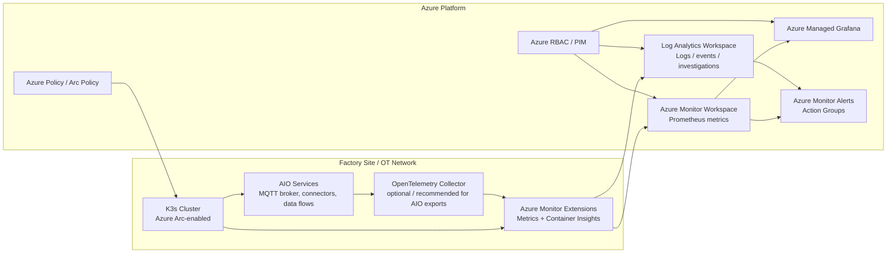
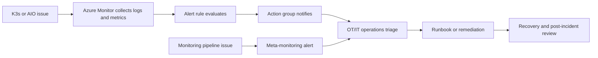

# Azure Monitor and Log Analytics Security and Governance for an AIO Cluster Running K3s

**File name:** `AzureMonitorandLogAnalyticsSecurityandGovernance.md`  
**Scope:** Azure IoT Operations (AIO) on an **Azure Arc-enabled K3s** cluster for a **factory production line**.  
**Audience:** Cloud/platform architects, OT/IT operations, security engineering, governance teams, and SRE/platform operations.

---

## 1. Executive summary

For a factory production line, Azure Monitor and Log Analytics should be implemented as a **governed observability platform**, not just a telemetry sink. Microsoft’s current AIO guidance recommends deploying observability resources **before** production cutover, and it uses **Azure Monitor managed service for Prometheus**, **Container Insights / Log Analytics**, and **Azure Managed Grafana** as the baseline observability stack for Arc-enabled Kubernetes in AIO scenarios. See [Production deployment guidelines](https://learn.microsoft.com/en-us/azure/iot-operations/deploy-iot-ops/concept-production-guidelines) and [Deploy observability resources and set up logs](https://learn.microsoft.com/en-us/azure/iot-operations/configure-observability-monitoring/howto-configure-observability).

In practice, that means your design should:

- Separate **metrics**, **logs**, **network access**, **retention**, and **ownership**.
- Use **Azure Monitor workspaces** for Prometheus metrics and **Log Analytics workspaces** for logs.
- Apply **least privilege** access to Arc, Azure Monitor, Log Analytics, and Grafana.
- Prefer **private connectivity** using Azure Monitor Private Link Scope (AMPLS) where feasible.
- Treat telemetry configuration as **governed platform configuration** subject to change control, versioning, and policy enforcement.
- Align with AIO production realities such as **intermittent connectivity**, **OT/IT segmentation**, and **root-cause analysis after production incidents**.

---

## 2. Context and assumptions

This document assumes the following:

- Azure IoT Operations runs on an **Azure Arc-enabled Kubernetes** cluster and K3s is the Kubernetes distribution in scope, consistent with [Production deployment guidelines](https://learn.microsoft.com/en-us/azure/iot-operations/deploy-iot-ops/concept-production-guidelines) and [Enable monitoring for Arc-enabled Kubernetes clusters](https://learn.microsoft.com/en-us/azure/azure-monitor/containers/kubernetes-monitoring-enable-arc).
- The factory environment may be **bandwidth-constrained**, **segmented**, or **partially disconnected** for limited periods, consistent with [What is Azure IoT Operations?](https://learn.microsoft.com/en-us/azure/iot-operations/overview-iot-operations) and [Production deployment guidelines](https://learn.microsoft.com/en-us/azure/iot-operations/deploy-iot-ops/concept-production-guidelines).
- Monitoring is implemented using:
  - **Azure Monitor workspace** for Prometheus metrics per [Deploy observability resources and set up logs](https://learn.microsoft.com/en-us/azure/iot-operations/configure-observability-monitoring/howto-configure-observability) and [Enable monitoring for Arc-enabled Kubernetes clusters](https://learn.microsoft.com/en-us/azure/azure-monitor/containers/kubernetes-monitoring-enable-arc)
  - **Log Analytics workspace** for container logs and investigations per [Deploy observability resources and set up logs](https://learn.microsoft.com/en-us/azure/iot-operations/configure-observability-monitoring/howto-configure-observability) and [Log Analytics workspace overview](https://learn.microsoft.com/en-us/azure/azure-monitor/logs/log-analytics-workspace-overview)
  - **Azure Managed Grafana** for dashboards per [Deploy observability resources and set up logs](https://learn.microsoft.com/en-us/azure/iot-operations/configure-observability-monitoring/howto-configure-observability)

---

## 3. Security and governance objectives

A secure monitoring implementation for a production-line cluster should satisfy the following objectives:

1. **Protect sensitive operational telemetry** such as node health, broker failures, connector errors, image references, certificate failures, and outage patterns, consistent with workspace access guidance in [Manage access to Log Analytics workspaces](https://learn.microsoft.com/en-us/azure/azure-monitor/logs/manage-access) and [Manage access to Azure Monitor workspaces](https://learn.microsoft.com/en-us/azure/azure-monitor/metrics/azure-monitor-workspace-manage-access).
2. **Minimize exposure of monitoring traffic** through private connectivity patterns described in [Use Azure Private Link to connect networks to Azure Monitor](https://learn.microsoft.com/en-us/azure/azure-monitor/fundamentals/private-link-security) and [Design Azure Monitor private link configuration](https://learn.microsoft.com/en-us/azure/azure-monitor/fundamentals/private-link-design).
3. **Reduce governance drift** by pre-creating and governing workspaces instead of relying on defaults created during onboarding, per [Enable monitoring for Arc-enabled Kubernetes clusters](https://learn.microsoft.com/en-us/azure/azure-monitor/containers/kubernetes-monitoring-enable-arc) and [Design a Log Analytics workspace architecture](https://learn.microsoft.com/en-us/azure/azure-monitor/logs/workspace-design).
4. **Control cost and telemetry noise** through selective collection, retention planning, and workspace/table design, as recommended by [Best practices for monitoring Kubernetes with Azure Monitor](https://learn.microsoft.com/en-us/azure/azure-monitor/containers/best-practices-containers) and [Best practices for Azure Monitor Logs](https://learn.microsoft.com/en-us/azure/azure-monitor/logs/best-practices-logs).
5. **Support RCA and incident response** with enough retained, queryable telemetry to correlate cluster, application, and connectivity failures, using retention and access guidance in [Manage data retention in a Log Analytics workspace](https://learn.microsoft.com/en-us/azure/azure-monitor/logs/data-retention-configure) and [Log Analytics workspace overview](https://learn.microsoft.com/en-us/azure/azure-monitor/logs/log-analytics-workspace-overview).

---

## 4. Reference architecture overview

### 4.1 Logical architecture



This model follows Microsoft’s AIO observability pattern in [Deploy observability resources and set up logs](https://learn.microsoft.com/en-us/azure/iot-operations/configure-observability-monitoring/howto-configure-observability), while aligning with the broader hybrid management guidance in [Management and monitoring for Azure Arc-enabled Kubernetes](https://learn.microsoft.com/en-us/azure/cloud-adoption-framework/scenarios/hybrid/arc-enabled-kubernetes/eslz-arc-kubernetes-management-disciplines).

### 4.2 Private connectivity pattern

```mermaid
flowchart TB
    subgraph Site[Factory / Plant Network]
        Nodes[K3s Nodes]
        Proxy[Optional outbound proxy / firewall]
    end

    subgraph Hub[Hub / Private Connectivity]
        PE[Private Endpoint]
        AMPLS[Azure Monitor Private Link Scope]
        DNS[Private DNS]
    end

    subgraph Monitor[Azure Monitor Resources]
        LAW[Log Analytics Workspace]
        AMW[Azure Monitor Workspace]
        DCE[Data Collection Endpoint(s) if used)]
    end

    Nodes --> Proxy --> PE --> AMPLS
    DNS --> Nodes
    AMPLS --> LAW
    AMPLS --> AMW
    AMPLS --> DCE
```

This pattern is based on [Use Azure Private Link to connect networks to Azure Monitor](https://learn.microsoft.com/en-us/azure/azure-monitor/fundamentals/private-link-security), [Configure private link for Azure Monitor](https://learn.microsoft.com/en-us/azure/azure-monitor/fundamentals/private-link-configure), and [Design Azure Monitor private link configuration](https://learn.microsoft.com/en-us/azure/azure-monitor/fundamentals/private-link-design).

---

## 5. Resource organization and landing zone placement

Monitoring resources should be **intentionally placed** within your landing zone model rather than created ad hoc from portal defaults or first-run scripts. Microsoft’s Arc and workspace guidance explicitly recommends planning workspace architecture and resource organization rather than proliferating unmanaged default resources; see [Design a Log Analytics workspace architecture](https://learn.microsoft.com/en-us/azure/azure-monitor/logs/workspace-design), [Enable monitoring for Arc-enabled Kubernetes clusters](https://learn.microsoft.com/en-us/azure/azure-monitor/containers/kubernetes-monitoring-enable-arc), and [Management and monitoring for Azure Arc-enabled Kubernetes](https://learn.microsoft.com/en-us/azure/cloud-adoption-framework/scenarios/hybrid/arc-enabled-kubernetes/eslz-arc-kubernetes-management-disciplines).

### Recommendations

- Place the **Arc-connected K3s cluster**, **Azure Monitor workspace**, **Log Analytics workspace**, **Managed Grafana**, and **alerting resources** in subscriptions/resource groups aligned to your enterprise platform model, per [Management and monitoring for Azure Arc-enabled Kubernetes](https://learn.microsoft.com/en-us/azure/cloud-adoption-framework/scenarios/hybrid/arc-enabled-kubernetes/eslz-arc-kubernetes-management-disciplines).
- Start with the **fewest number of workspaces** that satisfy business, security, tenant, regional, and operational requirements, consistent with [Design a Log Analytics workspace architecture](https://learn.microsoft.com/en-us/azure/azure-monitor/logs/workspace-design).
- Consider **per-site or per-region workspaces** only when required for data residency, autonomy, access boundary, or cost-allocation reasons, again following [Design a Log Analytics workspace architecture](https://learn.microsoft.com/en-us/azure/azure-monitor/logs/workspace-design).
- Apply tags for **site**, **production line**, **environment**, **data classification**, **owner**, **cost center**, and **retention tier**, leveraging the Azure resource organization model described in [Overview of Azure Arc-enabled Kubernetes](https://learn.microsoft.com/en-us/azure/azure-arc/kubernetes/overview).
- Avoid allowing onboarding workflows to create opaque default workspaces unless that is a conscious exception with documented ownership, because [Enable monitoring for Arc-enabled Kubernetes clusters](https://learn.microsoft.com/en-us/azure/azure-monitor/containers/kubernetes-monitoring-enable-arc) notes that default workspaces can be created automatically if you do not specify them.

### Governance decision points

Document the following before production:

- Central platform-managed workspace versus site-specific workspace model.
- Shared monitoring subscription versus application subscription placement.
- Data residency constraints.
- Separation of operational and security data if Microsoft Sentinel or other security tooling will also use the workspace, per [Design a Log Analytics workspace architecture](https://learn.microsoft.com/en-us/azure/azure-monitor/logs/workspace-design).

---

## 6. Identity, RBAC, and access governance

Azure Monitor and Log Analytics frequently contain sensitive data about the environment, and Microsoft documents distinct access models for **Azure Monitor workspaces** and **Log Analytics workspaces**. See [Manage access to Azure Monitor workspaces](https://learn.microsoft.com/en-us/azure/azure-monitor/metrics/azure-monitor-workspace-manage-access) and [Manage access to Log Analytics workspaces](https://learn.microsoft.com/en-us/azure/azure-monitor/logs/manage-access).

### Recommendations

- Use **Azure RBAC** and preferably **group-based assignments** for Arc, Azure Monitor, Log Analytics, Grafana, and alert resources, consistent with [Manage access to Log Analytics workspaces](https://learn.microsoft.com/en-us/azure/azure-monitor/logs/manage-access) and [Overview of Azure Arc-enabled Kubernetes](https://learn.microsoft.com/en-us/azure/azure-arc/kubernetes/overview).
- Restrict onboarding of monitoring to the **platform team** because [Enable monitoring for Arc-enabled Kubernetes clusters](https://learn.microsoft.com/en-us/azure/azure-monitor/containers/kubernetes-monitoring-enable-arc) documents that Contributor-level permissions are needed to onboard and Monitoring Reader/Monitoring Contributor permissions are needed to view data.
- Separate roles for:
  - **Platform administrators** – manage extensions, workspaces, ingestion paths, and alert baselines.
  - **Security operations** – investigate logs and incidents.
  - **SRE / platform operations** – manage dashboards, queries, and service alerts.
  - **OT operators** – read-only dashboards and constrained access where possible.
- Prefer **resource-context access** where appropriate for operational users and tightly control **workspace-context access**, based on the access models described in [Manage access to Log Analytics workspaces](https://learn.microsoft.com/en-us/azure/azure-monitor/logs/manage-access) and [Manage access to Azure Monitor workspaces](https://learn.microsoft.com/en-us/azure/azure-monitor/metrics/azure-monitor-workspace-manage-access).
- Use **table-level or granular RBAC** only where there is a clear governance requirement, because Microsoft notes these are advanced controls and should be used deliberately in [Manage access to Log Analytics workspaces](https://learn.microsoft.com/en-us/azure/azure-monitor/logs/manage-access).
- Use **PIM** or equivalent privileged elevation processes for highly privileged monitoring roles if your enterprise identity platform supports it, aligning to the privilege governance objectives in [Azure security baseline for Azure Arc-enabled Kubernetes](https://learn.microsoft.com/en-us/security/benchmark/azure/baselines/azure-arc-enabled-kubernetes-security-baseline) and the broader recommendations in [Security book for Azure Arc-enabled Kubernetes and AKS enabled by Azure Arc](https://learn.microsoft.com/en-us/azure/azure-arc/kubernetes/conceptual-security-book).

### Access governance checklist

- [ ] Workspace access mode documented.
- [ ] Resource-context versus workspace-context access policy defined.
- [ ] Group-based RBAC implemented.
- [ ] Privileged roles reviewed periodically.
- [ ] Export permissions defined and monitored.
- [ ] Shared workspace access reviews scheduled.

---

## 7. Network isolation and private connectivity

For a factory production line, monitoring traffic should be treated as enterprise-sensitive telemetry. Microsoft recommends using **Azure Monitor Private Link Scope (AMPLS)** when private connectivity is required for Azure Monitor resources. See [Use Azure Private Link to connect networks to Azure Monitor](https://learn.microsoft.com/en-us/azure/azure-monitor/fundamentals/private-link-security) and [Configure private link for Azure Monitor](https://learn.microsoft.com/en-us/azure/azure-monitor/fundamentals/private-link-configure).

### Recommendations

- Prefer **AMPLS + private endpoint** for plant-to-Azure Monitor access where your network topology permits it, per [Use Azure Private Link to connect networks to Azure Monitor](https://learn.microsoft.com/en-us/azure/azure-monitor/fundamentals/private-link-security).
- Design private link according to your topology—**hub-and-spoke**, **peered VNets**, or **isolated site networks**—using the constraints in [Design Azure Monitor private link configuration](https://learn.microsoft.com/en-us/azure/azure-monitor/fundamentals/private-link-design).
- Be careful with **DNS design**; Microsoft explicitly warns about DNS overrides when multiple AMPLS instances are used across networks that share DNS, per [Design Azure Monitor private link configuration](https://learn.microsoft.com/en-us/azure/azure-monitor/fundamentals/private-link-design).
- Explicitly choose **ingestion** and **query** access modes (for example, PrivateOnly for ingestion and controlled query access) based on [Configure private link for Azure Monitor](https://learn.microsoft.com/en-us/azure/azure-monitor/fundamentals/private-link-configure).
- If the factory uses proxies or outbound firewalls, include required endpoints in the allow list as recommended by [Production deployment guidelines](https://learn.microsoft.com/en-us/azure/iot-operations/deploy-iot-ops/concept-production-guidelines) and [Management and monitoring for Azure Arc-enabled Kubernetes](https://learn.microsoft.com/en-us/azure/cloud-adoption-framework/scenarios/hybrid/arc-enabled-kubernetes/eslz-arc-kubernetes-management-disciplines).

### Governance considerations

- Document whether the site uses **public**, **private-only**, or **mixed/transitional** monitoring connectivity.
- Treat AMPLS, private endpoints, private DNS zones, and DCE/DCR dependencies as **platform-owned network assets**.
- Review any temporary public access exception during commissioning and remove it after validation.

---

## 8. Data protection, encryption, and data classification

Monitoring data often includes infrastructure details and operationally sensitive failure information. Microsoft documents encryption-at-rest defaults, workspace controls, and customer-managed key options for specific scenarios. See [Azure Monitor customer-managed keys](https://learn.microsoft.com/en-us/azure/azure-monitor/logs/customer-managed-keys), [Log Analytics workspace overview](https://learn.microsoft.com/en-us/azure/azure-monitor/logs/log-analytics-workspace-overview), and [Azure Monitor Logs overview](https://learn.microsoft.com/en-us/azure/azure-monitor/logs/data-platform-logs).

### Recommendations

- Classify monitoring data at least as **confidential operational telemetry** unless your internal classification model defines a different tier.
- Ensure workloads and connectors do **not log secrets**, credential material, or sensitive payload contents to stdout/stderr; this aligns with the need to control data collection and transformations described in [Azure Monitor Logs overview](https://learn.microsoft.com/en-us/azure/azure-monitor/logs/data-platform-logs) and with the operational security focus in [Security book for Azure Arc-enabled Kubernetes and AKS enabled by Azure Arc](https://learn.microsoft.com/en-us/azure/azure-arc/kubernetes/conceptual-security-book).
- Consider **CMK** only when there is a clear compliance or key-lifecycle requirement, noting that Microsoft’s CMK guidance applies to **dedicated clusters** and has commitment-tier implications described in [Azure Monitor customer-managed keys](https://learn.microsoft.com/en-us/azure/azure-monitor/logs/customer-managed-keys).
- If you have specialized ingestion scenarios involving private links and customer-managed storage, validate the current platform requirements in [Use customer-managed storage accounts in Azure Monitor Logs](https://learn.microsoft.com/en-us/azure/azure-monitor/logs/private-storage).
- Define and govern who can **export** log data and what downstream stores are approved.

### Factory-specific considerations

In a manufacturing environment, telemetry can reveal:

- site topology
- equipment identifiers
- production downtime patterns
- certificate/authentication failures
- message flow degradation
- plant connectivity issues

Treat this as sensitive business telemetry even when it is not regulated personal data.

---

## 9. Workspace strategy, data collection scope, and telemetry minimization

Microsoft recommends using the fewest workspaces that meet your requirements and carefully scoping telemetry collection to avoid cost and operational noise. See [Design a Log Analytics workspace architecture](https://learn.microsoft.com/en-us/azure/azure-monitor/logs/workspace-design), [Best practices for monitoring Kubernetes with Azure Monitor](https://learn.microsoft.com/en-us/azure/azure-monitor/containers/best-practices-containers), and [Best practices for Azure Monitor Logs](https://learn.microsoft.com/en-us/azure/azure-monitor/logs/best-practices-logs).

### 9.1 Separate metrics from logs

For AIO on Arc-enabled K3s, the recommended model is:

- **Azure Monitor workspace** for Prometheus metrics, consistent with [Deploy observability resources and set up logs](https://learn.microsoft.com/en-us/azure/iot-operations/configure-observability-monitoring/howto-configure-observability).
- **Log Analytics workspace** for container logs, events, and operational investigations, consistent with [Deploy observability resources and set up logs](https://learn.microsoft.com/en-us/azure/iot-operations/configure-observability-monitoring/howto-configure-observability) and [Log Analytics workspace overview](https://learn.microsoft.com/en-us/azure/azure-monitor/logs/log-analytics-workspace-overview).

### 9.2 Collect only actionable data

Collect by default:

- cluster and node health metrics
- pod/container lifecycle and restart indicators
- Kubernetes events with operational value
- logs for AIO platform components and approved workloads
- Prometheus alerts and ingestion-health signals

Collect conditionally:

- verbose debug logs
- ad hoc troubleshooting traces
- high-frequency custom metrics
- payload-adjacent diagnostics that may increase sensitivity or cost

Avoid by default:

- secrets or payload data in logs
- overly broad namespace collection without an operational need
- unnecessary high-cardinality labels
- duplicate telemetry sources that answer the same question

These recommendations align with [Best practices for monitoring Kubernetes with Azure Monitor](https://learn.microsoft.com/en-us/azure/azure-monitor/containers/best-practices-containers), [Azure Monitor Logs overview](https://learn.microsoft.com/en-us/azure/azure-monitor/logs/data-platform-logs), and [Query container logs in Azure Monitor](https://learn.microsoft.com/en-us/azure/azure-monitor/containers/container-insights-log-query).

### 9.3 Treat telemetry configuration as controlled code

Version and govern:

- Arc extension deployment commands/templates
- DCR/DCE configuration where used
- Prometheus scrape config
- OpenTelemetry Collector configuration
- alert rules and action groups
- Grafana dashboards

That operational model aligns with the staged rollout and controlled upgrade guidance in [Production deployment guidelines](https://learn.microsoft.com/en-us/azure/iot-operations/deploy-iot-ops/concept-production-guidelines) and the hybrid management model in [Management and monitoring for Azure Arc-enabled Kubernetes](https://learn.microsoft.com/en-us/azure/cloud-adoption-framework/scenarios/hybrid/arc-enabled-kubernetes/eslz-arc-kubernetes-management-disciplines).

---

## 10. Cost management, retention, and forensic readiness

Microsoft provides explicit guidance for retention design and cost control in Azure Monitor Logs and Azure Monitor for Kubernetes. See [Manage data retention in a Log Analytics workspace](https://learn.microsoft.com/en-us/azure/azure-monitor/logs/data-retention-configure), [Log Analytics workspace overview](https://learn.microsoft.com/en-us/azure/azure-monitor/logs/log-analytics-workspace-overview), [Best practices for monitoring Kubernetes with Azure Monitor](https://learn.microsoft.com/en-us/azure/azure-monitor/containers/best-practices-containers), and [Best practices for Azure Monitor Logs](https://learn.microsoft.com/en-us/azure/azure-monitor/logs/best-practices-logs).

### Recommendations

- Define separate retention expectations for **operational analytics**, **security investigations**, and **long-term audit/forensic** needs, using the analytics and long-term retention model in [Manage data retention in a Log Analytics workspace](https://learn.microsoft.com/en-us/azure/azure-monitor/logs/data-retention-configure).
- Do not assume every table needs the same retention; Microsoft supports table-level retention design per [Log Analytics workspace overview](https://learn.microsoft.com/en-us/azure/azure-monitor/logs/log-analytics-workspace-overview) and [Manage data retention in a Log Analytics workspace](https://learn.microsoft.com/en-us/azure/azure-monitor/logs/data-retention-configure).
- Review high-ingestion tables and noisy data sources regularly, in line with [Best practices for Azure Monitor Logs](https://learn.microsoft.com/en-us/azure/azure-monitor/logs/best-practices-logs).
- Use commitment tiers or workspace architecture only after evaluating actual usage patterns, per [Design a Log Analytics workspace architecture](https://learn.microsoft.com/en-us/azure/azure-monitor/logs/workspace-design).
- Preserve observability **configuration artifacts** even if you do not keep all telemetry indefinitely, so the monitoring platform can be rebuilt consistently.

### Factory-specific retention questions

Document:

- How long operators need interactive telemetry for common outages.
- How long security/compliance teams need telemetry for investigations.
- Whether post-incident RCA requires older data to be retrieved from long-term retention.
- Whether exported evidence is needed for legal, safety, or quality investigations.

---

## 11. Alerting, incident response, and monitoring of the monitoring platform

Microsoft recommends enabling Prometheus metrics, Container Insights, and alert rules to improve reliability of Kubernetes monitoring. See [Best practices for monitoring Kubernetes with Azure Monitor](https://learn.microsoft.com/en-us/azure/azure-monitor/containers/best-practices-containers) and [Deploy observability resources and set up logs](https://learn.microsoft.com/en-us/azure/iot-operations/configure-observability-monitoring/howto-configure-observability).

### Recommended alert categories

- cluster and node availability degradation
- pod restart storms / crash loops
- connector or broker health failures
- low disk / memory pressure / CPU saturation
- telemetry ingestion failure
- private connectivity failures to monitoring services
- certificate or authentication-related failures surfaced in logs/metrics
- abnormal ingestion spikes that suggest noisy telemetry or incident conditions

### Recommendations

- Build alert layers for **platform health**, **AIO service health**, **security-relevant failures**, and **telemetry pipeline health**, aligning to [Best practices for monitoring Kubernetes with Azure Monitor](https://learn.microsoft.com/en-us/azure/azure-monitor/containers/best-practices-containers).
- Route alerts through governed **action groups** with documented ownership and escalation paths.
- Validate alert thresholds during commissioning, maintenance windows, and simulated plant/network failure scenarios, consistent with the staging and controlled rollout guidance in [Production deployment guidelines](https://learn.microsoft.com/en-us/azure/iot-operations/deploy-iot-ops/concept-production-guidelines).
- Monitor the monitoring platform itself—loss of scrape targets, sudden drop in log volume, disabled rules, or broken dashboards—because silent telemetry failure undermines RCA.



---

## 12. Azure Policy, Defender, and platform governance integration

Monitoring should be part of the broader Arc governance baseline rather than a stand-alone add-on. Microsoft provides Arc policy references, security baseline guidance, and management recommendations for hybrid Kubernetes. See [Azure Policy built-in definitions for Azure Arc-enabled Kubernetes](https://learn.microsoft.com/en-us/azure/azure-arc/kubernetes/policy-reference), [Azure security baseline for Azure Arc-enabled Kubernetes](https://learn.microsoft.com/en-us/security/benchmark/azure/baselines/azure-arc-enabled-kubernetes-security-baseline), and [Management and monitoring for Azure Arc-enabled Kubernetes](https://learn.microsoft.com/en-us/azure/cloud-adoption-framework/scenarios/hybrid/arc-enabled-kubernetes/eslz-arc-kubernetes-management-disciplines).

### Recommendations

- Use **Azure Policy** to audit or deploy required cluster extensions and governance components where appropriate, based on [Azure Policy built-in definitions for Azure Arc-enabled Kubernetes](https://learn.microsoft.com/en-us/azure/azure-arc/kubernetes/policy-reference).
- Align observability controls with the **Azure Arc-enabled Kubernetes security baseline**, including identity, privileged access, and operational governance in [Azure security baseline for Azure Arc-enabled Kubernetes](https://learn.microsoft.com/en-us/security/benchmark/azure/baselines/azure-arc-enabled-kubernetes-security-baseline).
- Decide whether monitoring data and security data are shared or separated if other services like Defender for Cloud or Sentinel are part of the environment, using the separation criteria in [Design a Log Analytics workspace architecture](https://learn.microsoft.com/en-us/azure/azure-monitor/logs/workspace-design).
- Control upgrade cadence for Arc agents/extensions to fit plant change windows, per [Production deployment guidelines](https://learn.microsoft.com/en-us/azure/iot-operations/deploy-iot-ops/concept-production-guidelines) and [Management and monitoring for Azure Arc-enabled Kubernetes](https://learn.microsoft.com/en-us/azure/cloud-adoption-framework/scenarios/hybrid/arc-enabled-kubernetes/eslz-arc-kubernetes-management-disciplines).

---

## 13. Prescriptive implementation pattern

A practical implementation pattern for most factory AIO/K3s deployments is:

1. **Prepare and Arc-enable the K3s cluster** in accordance with [Production deployment guidelines](https://learn.microsoft.com/en-us/azure/iot-operations/deploy-iot-ops/concept-production-guidelines) and [Overview of Azure Arc-enabled Kubernetes](https://learn.microsoft.com/en-us/azure/azure-arc/kubernetes/overview).
2. **Pre-create and govern** the Azure Monitor workspace, Log Analytics workspace, Grafana instance, and alerting resources instead of relying on first-run defaults, per [Enable monitoring for Arc-enabled Kubernetes clusters](https://learn.microsoft.com/en-us/azure/azure-monitor/containers/kubernetes-monitoring-enable-arc) and [Design a Log Analytics workspace architecture](https://learn.microsoft.com/en-us/azure/azure-monitor/logs/workspace-design).
3. **Deploy observability resources before AIO go-live**, as recommended by [Production deployment guidelines](https://learn.microsoft.com/en-us/azure/iot-operations/deploy-iot-ops/concept-production-guidelines).
4. **Enable Azure Monitor metrics and container insights extensions** using the pattern in [Deploy observability resources and set up logs](https://learn.microsoft.com/en-us/azure/iot-operations/configure-observability-monitoring/howto-configure-observability).
5. **Implement AMPLS/private connectivity** where feasible, using [Use Azure Private Link to connect networks to Azure Monitor](https://learn.microsoft.com/en-us/azure/azure-monitor/fundamentals/private-link-security) and [Design Azure Monitor private link configuration](https://learn.microsoft.com/en-us/azure/azure-monitor/fundamentals/private-link-design).
6. **Apply RBAC and policy** before granting broad user access, using [Manage access to Log Analytics workspaces](https://learn.microsoft.com/en-us/azure/azure-monitor/logs/manage-access), [Manage access to Azure Monitor workspaces](https://learn.microsoft.com/en-us/azure/azure-monitor/metrics/azure-monitor-workspace-manage-access), and [Azure Policy built-in definitions for Azure Arc-enabled Kubernetes](https://learn.microsoft.com/en-us/azure/azure-arc/kubernetes/policy-reference).
7. **Commission alerts, dashboards, and runbooks** before plant handoff.
8. **Test telemetry during disconnected, degraded, and restored network conditions**, aligning to the AIO operational model in [What is Azure IoT Operations?](https://learn.microsoft.com/en-us/azure/iot-operations/overview-iot-operations) and [Production deployment guidelines](https://learn.microsoft.com/en-us/azure/iot-operations/deploy-iot-ops/concept-production-guidelines).

---

## 14. Implementation checklist

### 14.1 Architecture

- [ ] Workspace topology chosen and documented.
- [ ] Subscription/resource-group placement approved.
- [ ] Tags and naming standards applied.
- [ ] Site, region, and data residency requirements documented.

### 14.2 Security and access

- [ ] Azure RBAC model defined for Arc, Monitor, Log Analytics, and Grafana.
- [ ] Shared workspace access reviewed.
- [ ] Workspace access mode documented.
- [ ] Export permissions and data handling defined.

### 14.3 Network

- [ ] Public vs private connectivity decision approved.
- [ ] AMPLS/private endpoint design completed if applicable.
- [ ] DNS model validated.
- [ ] Firewall/proxy allow lists approved.

### 14.4 Telemetry and cost

- [ ] Metrics baseline defined.
- [ ] Log collection scope defined.
- [ ] Noisy data sources identified.
- [ ] Retention by table/class of data documented.
- [ ] Cost ownership assigned.

### 14.5 Operations and governance

- [ ] Alert rules and action groups implemented.
- [ ] Runbooks created for telemetry failure and platform issues.
- [ ] Monitoring configuration version-controlled.
- [ ] Azure Policy assignments reviewed.
- [ ] Upgrade/change control process defined.

---

## 15. Reference links (table)

| Title                                                                       | Link                                                                                                                                                | Why it matters                                                                                                                         |
| --------------------------------------------------------------------------- | --------------------------------------------------------------------------------------------------------------------------------------------------- | -------------------------------------------------------------------------------------------------------------------------------------- |
| Deploy observability resources and set up logs                              | https://learn.microsoft.com/en-us/azure/iot-operations/configure-observability-monitoring/howto-configure-observability                             | Primary Microsoft guidance for AIO observability using Azure Monitor workspace, Log Analytics workspace, and Grafana.                  |
| Production deployment guidelines                                            | https://learn.microsoft.com/en-us/azure/iot-operations/deploy-iot-ops/concept-production-guidelines                                                 | Recommends deploying observability resources before production and highlights K3s production guidance, networking, and staged rollout. |
| What is Azure IoT Operations?                                               | https://learn.microsoft.com/en-us/azure/iot-operations/overview-iot-operations                                                                      | Describes AIO architecture, edge capabilities, and offline operation characteristics relevant to factories.                            |
| Enable monitoring for Arc-enabled Kubernetes clusters                       | https://learn.microsoft.com/en-us/azure/azure-monitor/containers/kubernetes-monitoring-enable-arc                                                   | Official Azure Monitor onboarding guidance for Arc-enabled Kubernetes, including K3s support and workspace requirements.               |
| Best practices for monitoring Kubernetes with Azure Monitor                 | https://learn.microsoft.com/en-us/azure/azure-monitor/containers/best-practices-containers                                                          | Reliability, security, cost, and operational excellence guidance for Kubernetes monitoring.                                            |
| Design a Log Analytics workspace architecture                               | https://learn.microsoft.com/en-us/azure/azure-monitor/logs/workspace-design                                                                         | Helps determine workspace count, placement, and separation strategy.                                                                   |
| Log Analytics workspace overview                                            | https://learn.microsoft.com/en-us/azure/azure-monitor/logs/log-analytics-workspace-overview                                                         | Summarizes workspace concepts, table access, and retention model.                                                                      |
| Azure Monitor Logs overview                                                 | https://learn.microsoft.com/en-us/azure/azure-monitor/logs/data-platform-logs                                                                       | Covers data collection, transformation, table plans, and cost-management concepts.                                                     |
| Manage access to Log Analytics workspaces                                   | https://learn.microsoft.com/en-us/azure/azure-monitor/logs/manage-access                                                                            | Defines workspace-context/resource-context access and RBAC model for logs.                                                             |
| Manage access to Azure Monitor workspaces                                   | https://learn.microsoft.com/en-us/azure/azure-monitor/metrics/azure-monitor-workspace-manage-access                                                 | Defines access model for Azure Monitor workspaces used for metrics.                                                                    |
| Manage data retention in a Log Analytics workspace                          | https://learn.microsoft.com/en-us/azure/azure-monitor/logs/data-retention-configure                                                                 | Explains analytics and long-term retention options and implications.                                                                   |
| Use Azure Private Link to connect networks to Azure Monitor                 | https://learn.microsoft.com/en-us/azure/azure-monitor/fundamentals/private-link-security                                                            | Describes AMPLS, private endpoints, and monitoring traffic isolation.                                                                  |
| Configure private link for Azure Monitor                                    | https://learn.microsoft.com/en-us/azure/azure-monitor/fundamentals/private-link-configure                                                           | Implementation guidance for AMPLS and private endpoints.                                                                               |
| Design Azure Monitor private link configuration                             | https://learn.microsoft.com/en-us/azure/azure-monitor/fundamentals/private-link-design                                                              | Topology and DNS planning guidance for AMPLS.                                                                                          |
| Azure Monitor customer-managed keys                                         | https://learn.microsoft.com/en-us/azure/azure-monitor/logs/customer-managed-keys                                                                    | Explains CMK options and constraints for Azure Monitor logs.                                                                           |
| Use customer-managed storage accounts in Azure Monitor Logs                 | https://learn.microsoft.com/en-us/azure/azure-monitor/logs/private-storage                                                                          | Relevant for special ingestion and private-link storage scenarios.                                                                     |
| Management and monitoring for Azure Arc-enabled Kubernetes                  | https://learn.microsoft.com/en-us/azure/cloud-adoption-framework/scenarios/hybrid/arc-enabled-kubernetes/eslz-arc-kubernetes-management-disciplines | Hybrid/cloud adoption guidance for Arc governance, network, and management.                                                            |
| Overview of Azure Arc-enabled Kubernetes                                    | https://learn.microsoft.com/en-us/azure/azure-arc/kubernetes/overview                                                                               | Foundational Arc capabilities including tagging, policy, and monitoring integration.                                                   |
| Azure Policy built-in definitions for Azure Arc-enabled Kubernetes          | https://learn.microsoft.com/en-us/azure/azure-arc/kubernetes/policy-reference                                                                       | Reference point for policy-based governance of Arc-enabled Kubernetes.                                                                 |
| Azure security baseline for Azure Arc-enabled Kubernetes                    | https://learn.microsoft.com/en-us/security/benchmark/azure/baselines/azure-arc-enabled-kubernetes-security-baseline                                 | Security benchmark alignment for Arc-enabled Kubernetes environments.                                                                  |
| Security book for Azure Arc-enabled Kubernetes and AKS enabled by Azure Arc | https://learn.microsoft.com/en-us/azure/azure-arc/kubernetes/conceptual-security-book                                                               | Broader security recommendations for hybrid/edge Kubernetes.                                                                           |
| Query container logs in Azure Monitor                                       | https://learn.microsoft.com/en-us/azure/azure-monitor/containers/container-insights-log-query                                                       | Useful for operational querying and understanding collected data types.                                                                |
| Best practices for Azure Monitor Logs                                       | https://learn.microsoft.com/en-us/azure/azure-monitor/logs/best-practices-logs                                                                      | Additional guidance on Azure Monitor Logs design, performance, and cost optimization.                                                  |

---

## 16. Closing note

For this scenario, the most important decision is not which dashboard to build first. It is whether observability is being treated as a **governed production platform service**. In factory environments, that decision directly affects uptime, operational safety, and mean-time-to-recover, as reflected across [Production deployment guidelines](https://learn.microsoft.com/en-us/azure/iot-operations/deploy-iot-ops/concept-production-guidelines), [Best practices for monitoring Kubernetes with Azure Monitor](https://learn.microsoft.com/en-us/azure/azure-monitor/containers/best-practices-containers), and [Management and monitoring for Azure Arc-enabled Kubernetes](https://learn.microsoft.com/en-us/azure/cloud-adoption-framework/scenarios/hybrid/arc-enabled-kubernetes/eslz-arc-kubernetes-management-disciplines).
