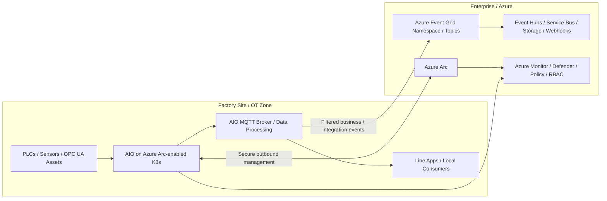
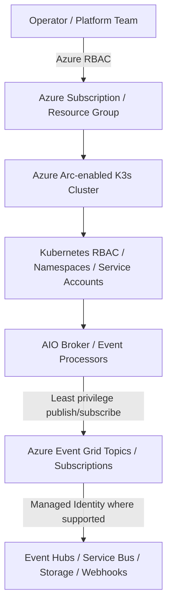
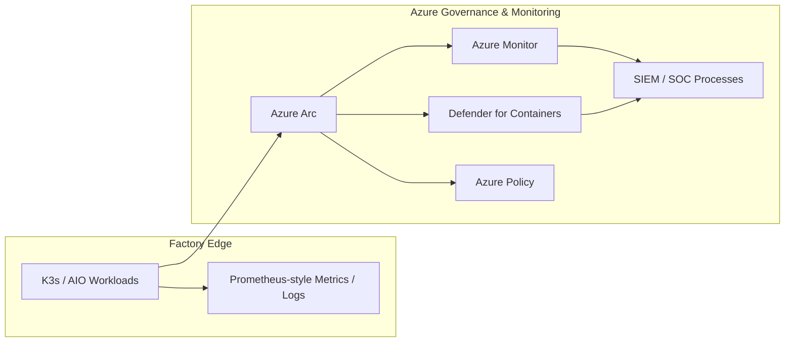

# EventGridSecurityAndGovernance.md

## 1. Executive Summary

Azure IoT Operations (AIO) is an edge-native data plane that runs on Azure Arc-enabled Kubernetes clusters, includes an industrial-grade MQTT broker, supports layered networks, and can integrate with Azure Event Hubs and the MQTT broker capability in Azure Event Grid. For factory production lines, this makes AIO a strong local eventing foundation for OT-to-IT integration. [What is Azure IoT Operations?](#), [What is Azure Event Grid?](#)

For a **production** AIO deployment running on **K3s**, the safest reference position is to treat **Azure Event Grid in the cloud** as the enterprise eventing tier and keep **AIO’s local broker and processing** as the line-side eventing tier. This is because Microsoft documents **Event Grid on Kubernetes with Azure Arc** as **public preview**, **not recommended for production workloads**, and currently supported on **AKS-supported Kubernetes distributions** and **Red Hat OpenShift**—not K3s. AIO documentation, by contrast, explicitly includes K3s for test and multi-node deployment guidance on Ubuntu. [Install Event Grid on Azure Arc-enabled Kubernetes cluster](#), [Prepare your Azure Arc-enabled Kubernetes cluster](#), [What is Azure IoT Operations?](#)

**Recommended pattern:**
- Keep low-latency production-line events and control interactions local to the AIO cluster. [What is Azure IoT Operations?](#)
- Use Azure Event Grid **namespaces/topics/subscriptions in the cloud** for enterprise routing, integration, downstream fan-out, and event governance. [What is Azure Event Grid?](#), [Routing MQTT Messages in Azure Event Grid](#)
- Use Azure Arc, Azure RBAC, GitOps, Azure Policy, Azure Monitor, and Defender for Containers to enforce operational security and governance across the edge cluster lifecycle. [Overview of Azure Arc-enabled Kubernetes](#)

---

## 2. Design Principles for a Factory Production Line

1. **Local first for line operations.** The production line should continue to operate safely when WAN connectivity is degraded or interrupted. Microsoft states that Azure IoT Operations can operate offline for up to 72 hours, with degradation possible during that period and full functionality resuming after reconnection. [What is Azure IoT Operations?](#)
2. **Cloud for enterprise event distribution.** Use Event Grid to route events to enterprise consumers, analytics, storage, or downstream applications rather than making line-critical control loops depend on a cloud round trip. [What is Azure Event Grid?](#), [Routing MQTT Messages in Azure Event Grid](#)
3. **Least privilege everywhere.** Separate Azure control-plane access, Kubernetes API access, and event publish/subscribe permissions. [Secure your operations in Azure Arc-enabled Kubernetes](#), [Event Grid Access Control with Azure RBAC](#)
4. **Certificate-based trust for OT-facing components.** Eventing components that bridge OT and IT boundaries should default to TLS and certificate-backed identity instead of anonymous or broad shared-secret models. [Install Event Grid on Azure Arc-enabled Kubernetes cluster](#), [MQTT features supported by the Azure Event Grid MQTT broker](#)
5. **GitOps and policy over ad hoc changes.** Cluster configuration, namespaces, extensions, and eventing manifests should be promoted through controlled repositories and validated with policy. [Overview of Azure Arc-enabled Kubernetes](#)

---

## 3. Reference Architecture

### Architecture Guidance

- **AIO on K3s** hosts the local event broker, local processing, and line-side consumers that must continue during intermittent connectivity. [What is Azure IoT Operations?](#), [Prepare your Azure Arc-enabled Kubernetes cluster](#)
- **Azure Arc** provides a secure outbound Azure management plane for the cluster and enables inventory, grouping, tagging, GitOps, Azure Policy, Defender for Containers, and Azure Monitor integration. [Overview of Azure Arc-enabled Kubernetes](#)
- **Azure Event Grid (cloud)** is the preferred enterprise fan-out and integration plane for K3s-based factory deployments because Microsoft’s Arc-enabled Event Grid-on-Kubernetes offering is preview-only and not documented as K3s-supported. [Install Event Grid on Azure Arc-enabled Kubernetes cluster](#), [Prepare your Azure Arc-enabled Kubernetes cluster](#)
- **Downstream targets** should typically be Event Hubs, Service Bus, Storage, or tightly controlled webhooks/functions, using managed identity where the service supports it. [Deliver events securely using managed identities](#), [What is Azure Event Grid?](#)

---

## 4. Security Considerations

### 4.1 Platform and Cluster Security

- Treat the AIO/K3s cluster as a **tier-0/industrial-critical platform** for the production line. Restrict who can manage the Azure resources that represent the Arc-enabled cluster by using Azure RBAC, MFA, and Conditional Access-aligned controls in the Azure control plane. [Secure your operations in Azure Arc-enabled Kubernetes](#), [Overview of Azure Arc-enabled Kubernetes](#)
- Separately restrict **Kubernetes API** access with Kubernetes RBAC and scoped service accounts. Microsoft explicitly recommends Kubernetes RBAC for nonhuman access and recommends integrating human access with an external identity provider such as Microsoft Entra ID where possible. [Secure your operations in Azure Arc-enabled Kubernetes](#)
- Use **namespace isolation** to separate AIO platform components, local line applications, observability agents, and any custom event processors. This reduces blast radius and supports more precise RBAC and network policy. (Design recommendation.)
- Prefer **GitOps-based deployment** for manifests, operators, and line applications so that unauthorized drift is detectable and recoverable. Azure Arc-enabled Kubernetes supports GitOps-based configuration management with Flux v2 or Argo CD. [Overview of Azure Arc-enabled Kubernetes](#)
- Enable **Defender for Containers** and Azure Policy for the Arc-connected cluster to improve runtime visibility and compliance enforcement. Azure Arc documentation specifically lists these capabilities for Arc-enabled Kubernetes. [Overview of Azure Arc-enabled Kubernetes](#)

### 4.2 Identity and Access Management

Use separate trust boundaries for:

1. **Azure control plane** (subscription/resource group/Arc-connected cluster)  
2. **Kubernetes control plane** (API server/namespaces/service accounts)  
3. **Eventing plane** (publishers/subscribers/topics/subscriptions)  

Azure Event Grid documents built-in roles such as **EventGrid Contributor**, **EventGrid EventSubscription Contributor**, **EventGrid EventSubscription Reader**, and **EventGrid Data Sender**. Sensitive operations that expose secrets or callback URLs—such as listing topic keys, regenerating keys, or getting full subscription URLs—should be tightly restricted. [Event Grid Access Control with Azure RBAC](#)

For downstream delivery, prefer **managed identity** where supported. Microsoft documents managed-identity-based delivery patterns for Event Hubs, Service Bus, Storage queues, and webhooks in Azure Event Grid. [Deliver events securely using managed identities](#)

**Prescriptive IAM recommendations:**
- Assign **read-only** roles for observability personas and **contributor** roles only to the platform team that manages eventing resources. [Event Grid Access Control with Azure RBAC](#)
- Avoid distributing shared SAS keys broadly; centralize key handling and prefer certificate or identity-backed trust where supported. [Install Event Grid on Azure Arc-enabled Kubernetes cluster](#), [Deliver events securely using managed identities](#)
- Use **dedicated service accounts** per namespace/app and avoid reusing privileged accounts across multiple workloads. [Secure your operations in Azure Arc-enabled Kubernetes](#)

### 4.3 Certificates, Secrets, and Trust Material

AIO includes built-in security features such as **secrets management, certificate management, and secure settings**, which should be enabled and treated as mandatory for production. [What is Azure IoT Operations?](#)

If you evaluate **Event Grid on Kubernetes** for a future supported platform, Microsoft requires:
- **X.509 PEM-encoded certificates and keys** for broker/operator trust. [Install Event Grid on Azure Arc-enabled Kubernetes cluster](#)
- Separate **server** and **client** certificates, with different common names from the CA certificate. [Install Event Grid on Azure Arc-enabled Kubernetes cluster](#)
- A **single CA certificate** uploaded for client trust during installation, which has implications for certificate issuance strategy. [Install Event Grid on Azure Arc-enabled Kubernetes cluster](#)

**Prescriptive secret and certificate recommendations:**
- Use a **central certificate authority model** and defined issuance/rotation windows for all eventing certificates. (Design recommendation.)
- Keep private keys out of repositories and store external secrets in a governed secret store; Azure Arc documentation includes the ability to access secrets from Azure Key Vault for Arc-enabled Kubernetes scenarios. 
- Rotate eventing certificates and keys on a schedule aligned to plant maintenance windows and rehearse rollback. (Design recommendation.)

### 4.4 Network Security and Segmentation

For factory environments, design the event path across **OT zone**, **site DMZ/edge zone**, and **enterprise/cloud zone** with explicit firewall allow rules and documented trust boundaries.

Key Microsoft-documented network considerations include:

- Azure Arc agents create a **secure outbound connection** from the cluster to Azure. [Overview of Azure Arc-enabled Kubernetes](#)
- Event Grid’s MQTT broker in Azure requires **TLS 1.2 or TLS 1.3** and uses **TCP 8883** for MQTT and **TCP 443** for MQTT over WebSockets. [MQTT features supported by the Azure Event Grid MQTT broker](#)
- In Event Grid namespaces, **private endpoints** support publishing and pull delivery, but **push delivery** does not deliver over private endpoints; Microsoft recommends secure alternatives such as managed identity to Azure services. [Deliver events securely over a private link](#), [Deliver events securely using managed identities](#)
- Event Grid MQTT routing documentation states that **disabling public network access on the namespace causes MQTT routing to fail**, so this design dependency must be validated before rollout. [Routing MQTT Messages in Azure Event Grid](#)
- Event Grid on Kubernetes, where supported, exposes the broker as a **ClusterIP** service using the cluster’s private IP space. [Install Event Grid on Azure Arc-enabled Kubernetes cluster](#)

**Prescriptive network controls:**
- Keep OT producers on local networks and only forward **filtered, business-relevant** events to the cloud. (Design recommendation.)
- Use **network policies** inside K3s to restrict east-west communication between namespaces and workloads. (Design recommendation.)
- If downstream cloud services require private connectivity, terminate Event Grid into **Event Hubs/Service Bus/Storage** with managed identity and use **private link** between those services and consuming applications. [Deliver events securely over a private link](#), [Deliver events securely using managed identities](#)

### 4.5 Eventing Model and Topic Governance

Azure Event Grid supports both **MQTT messaging** and **HTTP-based event distribution**, and it supports **CloudEvents 1.0** for interoperability. It also supports routing MQTT messages to Azure services or custom endpoints. [What is Azure Event Grid?](#), [MQTT (PubSub) Broker - Azure Event Grid](#)

Microsoft documents that MQTT messages can be routed either to an **Event Grid namespace topic** or to a **custom topic**, after which event subscriptions can consume the messages using **push** or **queue/pull** patterns depending on the destination model. [Routing MQTT Messages in Azure Event Grid](#), [What is Azure Event Grid?](#)

**Governance recommendations for topics and subscriptions:**
- Define a **topic taxonomy** such as `{site}/{area}/{line}/{cell}/{asset}/{eventType}` and reserve separate topic hierarchies for telemetry, alarms, commands, and enterprise integration. (Design recommendation.)
- Separate **operational telemetry** from **governance/security events** and from **business integration events** so retention, routing, and consumer permissions can differ. (Design recommendation.)
- Use **subscription filtering** so each downstream consumer receives only the events it is authorized to process. (Design recommendation.)
- Tag Azure Event Grid resources by **plant**, **line**, **criticality**, **data owner**, and **environment** for auditability and cost allocation. Azure Arc-connected clusters and other Azure resources can be grouped and tagged in Azure Resource Manager. [Overview of Azure Arc-enabled Kubernetes](#)

### 4.6 Data Protection and Message Hygiene

Event-driven manufacturing architectures often move both telemetry and operational state changes into broader IT systems. That means event payloads should be intentionally designed, not simply mirrored from OT protocols.

**Recommended controls:**
- Minimize payload content to what downstream systems require. (Design recommendation.)
- Avoid embedding credentials, raw secrets, or unnecessary personal data in event bodies or headers. (Design recommendation.)
- Standardize event schemas and version them explicitly; Event Grid supports CloudEvents interoperability, which helps with standardized event contracts. [What is Azure Event Grid?](#)
- Apply content validation and dead-letter/error-handling patterns in consumers so malformed messages do not cascade into line or enterprise outages. (Design recommendation.)

### 4.7 Availability, Resilience, and Failure Domains

- Design assuming intermittent cloud connectivity. AIO can operate offline for up to 72 hours, but degradation can occur during the disconnected period. [What is Azure IoT Operations?](#)
- Keep **line-critical functions local** and treat cloud event delivery as integration/analytics/business-process enablement rather than a dependency for safe machine operation. (Design recommendation.)
- If evaluating Event Grid on Kubernetes on a supported future platform, note that Microsoft currently supports only a **single instance** of the Event Grid extension per cluster and it is **cluster-scoped**, not namespace-scoped. [Install Event Grid on Azure Arc-enabled Kubernetes cluster](#)
- Capacity-plan local broker storage and queues so transient bursts or cloud outages do not immediately create back pressure on the production line. Microsoft notes that Event Grid on Kubernetes storage sizing is driven largely by ingestion rate and metadata overhead. [Install Event Grid on Azure Arc-enabled Kubernetes cluster](#)

### 4.8 Observability, Monitoring, and Incident Response

Azure Arc-enabled Kubernetes supports Azure Monitor integration, and Microsoft lists Azure Monitor, Azure Policy, and Defender for Containers among the major Arc-enabled Kubernetes management capabilities. [Overview of Azure Arc-enabled Kubernetes](#)

For Event Grid on Kubernetes preview, Microsoft documents **Prometheus exposition format** metrics and notes that Prometheus is the supported mechanism for metrics in the preview. [Install Event Grid on Azure Arc-enabled Kubernetes cluster](#)

**Minimum observability baseline:**
- Cluster health and node pressure. (Design recommendation.)
- Broker connection counts, publish/subscribe failures, authentication failures, and queue/backlog indicators. (Design recommendation.)
- Certificate expiry monitoring. (Design recommendation.)
- Azure activity logs and RBAC change monitoring for the Event Grid and Arc resources. Azure RBAC and Event Grid management actions are auditable in the Azure control plane. [Event Grid Access Control with Azure RBAC](#), [Overview of Azure Arc-enabled Kubernetes](#)

---

## 5. Governance Considerations

### 5.1 Resource Organization and Ownership

Azure Arc-connected Kubernetes clusters appear as Azure resources and can be organized with **resource groups** and **tags** like other Azure resources. [Overview of Azure Arc-enabled Kubernetes](#)

**Recommended governance model:**
- Place factory clusters and Event Grid resources in **dedicated subscriptions or resource groups** aligned to the plant or business unit. (Design recommendation.)
- Assign clear ownership for:
  - **Platform team** – Arc, K3s, AIO platform, policy, patching  
  - **OT engineering** – asset onboarding, line protocol integration, operational requirements  
  - **Integration/app team** – Event Grid subscriptions, downstream consumers, schemas  
  - **Security team** – identity, certificate standards, monitoring, exceptions  

### 5.2 Policy Guardrails

Because Azure Arc-enabled Kubernetes supports **Azure Policy** and **GitOps**, these should be the primary control mechanisms for preventing unmanaged drift and enforcing minimum standards. [Overview of Azure Arc-enabled Kubernetes](#)

**Recommended policy areas:**
- Approved namespaces and release paths. (Design recommendation.)
- Approved images/registries and container hardening requirements. (Design recommendation.)
- Mandatory labels/tags/owners for namespaces and Azure resources. (Design recommendation.)
- Denial of privileged containers or hostPath usage unless explicitly approved for plant-side agents. (Design recommendation.)
- Requirements for TLS/certificate-backed endpoints for event producers and consumers. (Design recommendation.)

### 5.3 Change Management

Use **ring-based promotion**:
1. Lab / integration cluster  
2. Non-critical production line  
3. Wider plant rollout  
4. Multi-site standardization  

Manage changes through Git pull requests, architecture review, and security approval for new event routes, new consumers, and new external integrations. Azure Arc documentation explicitly positions GitOps as a supported management model for Arc-enabled Kubernetes. [Overview of Azure Arc-enabled Kubernetes](#)

### 5.4 Exception Handling

Create formal exception processes for:
- Consumers that require public endpoints because push delivery cannot use private endpoints in Event Grid. [Deliver events securely over a private link](#)
- Temporary use of shared secrets or SAS keys instead of managed identity/certificates. [Event Grid Access Control with Azure RBAC](#), [Deliver events securely using managed identities](#)
- OT workloads that require broader Kubernetes privileges than the standard baseline. [Secure your operations in Azure Arc-enabled Kubernetes](#)

---

## 6. Prescriptive Recommendations for an AIO + K3s Factory Design

### Recommended Production Pattern

**Use this pattern for production factory lines on K3s:**

1. Deploy **AIO on Azure Arc-enabled K3s** for local MQTT/event handling, local line applications, and line-adjacent processing. [What is Azure IoT Operations?](#), [Prepare your Azure Arc-enabled Kubernetes cluster](#)
2. Manage the cluster through **Azure Arc** with GitOps, Azure Policy, Azure Monitor, and Defender for Containers. [Overview of Azure Arc-enabled Kubernetes](#)
3. Send only **curated enterprise events** to **Azure Event Grid in the cloud** for fan-out and integration. [What is Azure Event Grid?](#), [Routing MQTT Messages in Azure Event Grid](#)
4. Use **managed identity** when delivering to Azure services such as Event Hubs, Service Bus, Storage, or supported webhook patterns. [Deliver events securely using managed identities](#)
5. Keep line-critical control loops local and design for disconnected operation. [What is Azure IoT Operations?](#)

### Avoid for This Scenario

- Avoid making **Event Grid on Kubernetes** the production eventing backbone on **K3s** today because Microsoft documents the offering as **preview**, **not recommended for production**, and not documented as K3s-supported. [Install Event Grid on Azure Arc-enabled Kubernetes cluster](#)
- Avoid broad sharing of topic keys or highly privileged Azure roles. [Event Grid Access Control with Azure RBAC](#)
- Avoid using cloud round trips for machine-safety or sub-second local coordination paths. (Design recommendation.)

---

## 7. Implementation Checklist

### Security Baseline
- [ ] Azure RBAC roles limited by persona and environment. [Event Grid Access Control with Azure RBAC](#), [Overview of Azure Arc-enabled Kubernetes](#)
- [ ] Kubernetes RBAC and service accounts scoped by namespace/application. [Secure your operations in Azure Arc-enabled Kubernetes](#)
- [ ] GitOps enabled for cluster/application/eventing resources. [Overview of Azure Arc-enabled Kubernetes](#)
- [ ] Azure Policy and Defender for Containers enabled for Arc-connected cluster. [Overview of Azure Arc-enabled Kubernetes](#)
- [ ] TLS/certificate standards documented and rotation schedule approved. [Install Event Grid on Azure Arc-enabled Kubernetes cluster](#), [MQTT features supported by the Azure Event Grid MQTT broker](#)
- [ ] Monitoring and alerting for broker health, auth failures, and certificate expiry. (Design recommendation.)

### Network Baseline
- [ ] OT-to-edge and edge-to-cloud flows documented and approved. (Design recommendation.)
- [ ] Event Grid namespace networking validated, including any public network dependency for MQTT routing if applicable. [Routing MQTT Messages in Azure Event Grid](#)
- [ ] Private link and managed identity used for downstream Azure services where feasible. [Deliver events securely over a private link](#), [Deliver events securely using managed identities](#)

### Governance Baseline
- [ ] Topic naming convention and schema versioning standard published. (Design recommendation.)
- [ ] Ownership model documented for platform, OT, integration, and security teams. (Design recommendation.)
- [ ] Break-glass and exception processes documented for plant outages and emergency changes. (Design recommendation.)

---

## 8. References

- Microsoft Learn – **What is Azure IoT Operations?** (AIO capabilities, edge-native broker, offline operation, secure settings, integration points)
- Microsoft Learn – **Prepare your Azure Arc-enabled Kubernetes cluster** (AIO cluster preparation and K3s guidance)
- Microsoft Learn – **Overview of Azure Arc-enabled Kubernetes** (Arc secure outbound connection, GitOps, Policy, Monitor, Defender, grouping/tagging)
- Azure docs – **Secure your operations in Azure Arc-enabled Kubernetes** (Azure RBAC, Kubernetes RBAC, Entra integration, secret-store encryption guidance)
- Microsoft Learn – **Install Event Grid on Azure Arc-enabled Kubernetes cluster** (preview status, supported distributions, PKI requirements, ClusterIP, Prometheus metrics, single-instance scope)
- Microsoft Learn – **What is Azure Event Grid?** (MQTT + HTTP event distribution, CloudEvents, Azure integration)
- Microsoft Learn – **Routing MQTT Messages in Azure Event Grid** (routing to namespace/custom topics, subscription patterns, namespace public-network note)
- Microsoft Learn – **MQTT (PubSub) Broker - Azure Event Grid** (MQTT broker overview and manufacturing scenarios)
- Microsoft Learn – **MQTT features supported by the Azure Event Grid MQTT broker** (TLS 1.2/1.3, ports, MQTT versions, connection behavior)
- Microsoft Learn – **Event Grid Access Control with Azure RBAC** (built-in roles and sensitive operations)
- Microsoft Learn – **Deliver events securely using managed identities** (managed identity delivery patterns)
- Microsoft Learn – **Deliver events securely over a private link** (private endpoint limitations and secure alternatives)
