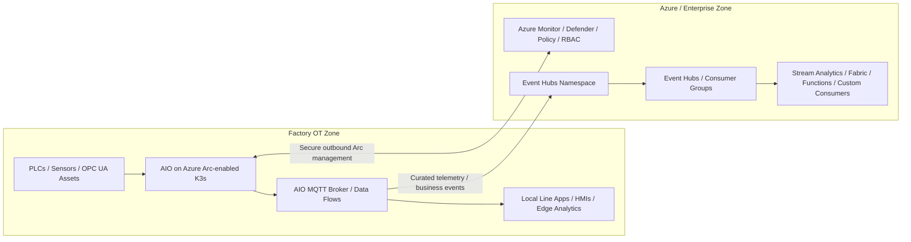
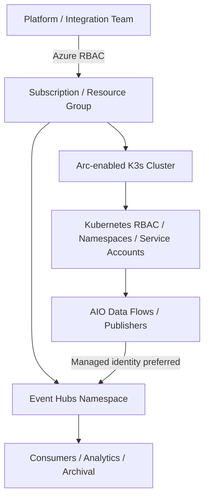
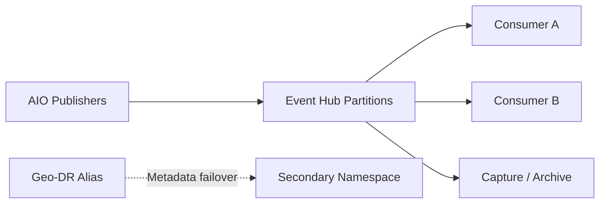
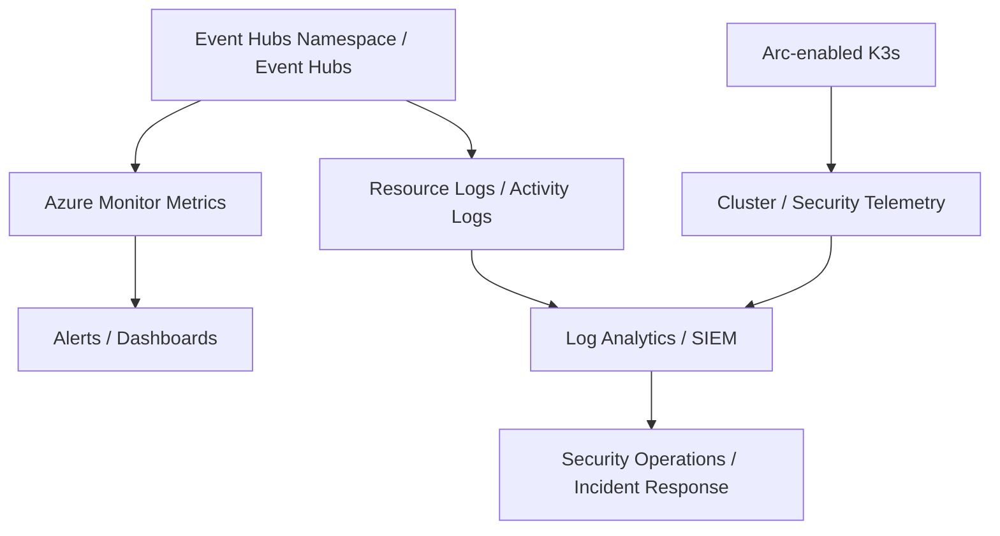

# EventHubSecurityandGovernance.md

## 1. Executive Summary

Azure IoT Operations (AIO) is a unified edge data plane that runs on Azure Arc-enabled Kubernetes clusters, includes an edge-native MQTT broker, can operate offline for up to 72 hours, and natively integrates with Azure Event Hubs in the cloud. Microsoft also documents K3s on Linux as a **general availability** deployment option for AIO, with production deployments using **secure settings**. citeturn2search30turn2search32turn2search34

For a **factory production line**, the recommended security and governance model is to keep **line-critical event handling local on the AIO/K3s cluster** and use **Azure Event Hubs** as the cloud ingestion and enterprise integration tier for telemetry, operational events, and downstream analytics. This pattern aligns with AIO’s local/edge-first operating model and avoids unnecessary dependence on cloud round trips for line operations. citeturn2search30turn2search73turn2search75

For production, Microsoft recommends deploying AIO with secure settings, enabling workload identity and custom location features on the Arc-enabled cluster, and recommends bringing your own certificate authority issuer for production scenarios. citeturn2search34turn2search30

For Event Hubs, a **minimum of Standard tier** is the practical baseline for this scenario because features like **IP firewall rules**, **virtual network controls**, and **private endpoints** are not supported in the Basic tier. If you need stronger workload isolation or **customer-managed keys (CMK)**, use **Premium** (or Dedicated if justified by scale). citeturn2search64turn2search63turn2search67turn2search53

---

## 2. Design Principles for a Factory Production Line

1. **Local first for plant operations.** The production line should continue to function safely during WAN degradation or cloud disruption. Microsoft states that AIO can operate offline for up to 72 hours, though degradation can occur during that period. citeturn2search30
2. **Use Event Hubs for cloud-scale ingestion, not machine safety loops.** Event Hubs is a native cloud service designed to stream large volumes of events with low latency, but reliability guidance still assumes you architect for transient faults, zone events, and region events. citeturn2search73turn2search53
3. **Separate control planes.** Distinguish Azure control-plane access, Kubernetes API access, and Event Hubs data-plane access so each can be governed independently with least privilege. Azure Arc and Event Hubs both integrate with Azure RBAC and Microsoft Entra identity. citeturn2search40turn2search50turn2search46
4. **Default to private connectivity and managed identity.** Event Hubs supports private endpoints, virtual network controls, IP firewall restrictions, and managed identity-based authentication. citeturn2search63turn2search60turn2search46
5. **Govern through GitOps, policy, and monitoring.** Azure Arc-enabled Kubernetes supports GitOps, Azure Policy, Azure Monitor, Defender for Containers, and Key Vault integration, which should form the governance baseline for AIO at the edge. citeturn2search40turn2search39

---

## 3. Reference Architecture

### Architecture Guidance

- Run **AIO on Azure Arc-enabled K3s** at the factory edge for local event brokering, local processing, and site autonomy. Microsoft documents K3s on Linux as a GA AIO deployment option and states that AIO natively integrates with Event Hubs in the cloud. citeturn2search32turn2search30
- Use **Event Hubs** as the cloud ingestion layer for high-volume telemetry, downstream analytics, and cross-enterprise consumers. Event Hubs namespaces act as management containers for one or more event hubs and are the unit where you configure capacity, networking, and resiliency features. citeturn2search73turn2search53
- Manage the edge cluster through **Azure Arc** to standardize inventory, GitOps deployment, monitoring, Defender for Containers, and policy enforcement. citeturn2search40turn2search39
- Treat **line-critical operational logic** as edge-local and treat **Event Hubs** as the enterprise event-ingest and replay boundary. This balances plant resiliency with enterprise-scale streaming and auditing. citeturn2search30turn2search75turn2search73

---

## 4. Security Considerations

### 4.1 Platform and Cluster Security

- The AIO/K3s cluster should be treated as an **industrial-critical platform** because it hosts local eventing and line-adjacent workloads. AIO production deployments require secure settings, and Microsoft recommends bringing your own CA issuer for production. citeturn2search34turn2search30
- Azure Arc-enabled Kubernetes provides a centralized control plane for clusters running outside Azure and supports GitOps, Azure Monitor, Azure Policy, Defender for Containers, and Key Vault-based secret access. These capabilities should be enabled as the baseline governance stack for the plant cluster. citeturn2search40turn2search39
- Use **namespace isolation** to separate AIO platform services, local line applications, observability agents, and custom publishers/consumers. This is a design recommendation based on Arc’s support for Kubernetes policy, RBAC, and workload governance. citeturn2search40turn2search39
- Prefer **GitOps** for application manifests, event-forwarding configuration, and cluster add-ons so unauthorized drift is detectable and recoverable. Azure Arc explicitly supports GitOps-based configuration management. citeturn2search40

### 4.2 Identity and Access Management

Azure Event Hubs supports **Microsoft Entra ID** and **shared access signatures (SAS)** for authorization, and Microsoft recommends using **Microsoft Entra ID when possible** because it provides stronger security and avoids storing access tokens or SAS secrets in code. citeturn2search50turn2search48

Managed identities are supported for applications accessing Event Hubs resources from Azure services, and Azure RBAC is used to grant the identity the required send/receive permissions at the namespace or higher scope. citeturn2search46turn2search50

**Prescriptive IAM recommendations:**
- Use **Microsoft Entra ID + Azure RBAC** for human and service access to Event Hubs wherever possible, and reserve SAS for controlled exceptions only. citeturn2search50turn2search46
- Scope access at the **namespace** only when necessary; otherwise scope to the smallest feasible boundary and separate producer identities from consumer identities. This is a design recommendation informed by Event Hubs namespace-level authorization and Azure RBAC support. citeturn2search50turn2search46
- Use **dedicated Kubernetes service accounts** and workload identity patterns for AIO publishers that bridge plant events to the cloud. AIO production prerequisites explicitly include workload identity on the Arc-enabled cluster. citeturn2search34
- Avoid embedding connection strings in manifests, scripts, or edge workloads. Microsoft’s guidance for managed identity exists specifically to eliminate stored credentials. citeturn2search46turn2search50

### 4.3 Network Security and Segmentation

Azure Event Hubs supports multiple network-security features including **service tags**, **IP firewall rules**, **virtual network service endpoints**, and **private endpoints**. These controls are applied at the **namespace level**. citeturn2search60turn2search63turn2search64

Private endpoints provide the strongest network isolation because traffic stays on the Microsoft backbone and the namespace is reached through a private IP in your virtual network. Microsoft notes that private endpoints are not supported in the Basic tier and that enabling private endpoints can block access from Azure services, the Azure portal, and logging/metrics unless trusted services are explicitly allowed. citeturn2search63turn2search64

IP firewall rules are also configured at the namespace level and can restrict access to only known site egress addresses or ExpressRoute-connected ranges. citeturn2search60turn2search64

**Prescriptive network recommendations:**
- Prefer **private endpoints** for production Event Hubs namespaces used by manufacturing workloads, especially when the consumer side is already inside Azure VNets. citeturn2search63turn2search60
- If private endpoints are not immediately feasible, use **IP firewall rules** to restrict the namespace to approved site egress addresses and enterprise gateways. citeturn2search64turn2search60
- Document and test any dependence on **trusted Microsoft services** because enabling private endpoints or restrictive network rules can otherwise block Azure portal access, metrics, logs, or other Azure-originated traffic. citeturn2search63turn2search64
- Use **network policies** inside K3s and explicit OT-to-edge firewall rules so only the designated AIO components can forward events from the plant to Event Hubs. This is a design recommendation informed by Arc/Kubernetes governance capabilities and Event Hubs namespace-level networking boundaries. citeturn2search40turn2search60

### 4.4 Encryption, Secrets, and Key Management

Azure Event Hubs encrypts data at rest by default by using Azure Storage Service Encryption with Microsoft-managed keys. Event Hubs also supports **customer-managed keys (CMK/BYOK)** through Azure Key Vault, but CMK is supported only for **Premium** and **Dedicated** tiers and only for **new or empty namespaces**. citeturn2search67

When you enable CMK for Event Hubs, Azure Key Vault must have **Soft Delete** and **Do Not Purge / purge protection** configured. Event Hubs uses managed identities to access the key material in Key Vault. citeturn2search67

AIO itself includes built-in security features such as **secrets management, certificate management, and secure settings**. Microsoft also recommends bringing your own issuer for production deployments. citeturn2search30turn2search34

**Prescriptive encryption recommendations:**
- Use **CMK** for Event Hubs if regulatory requirements or enterprise policy require customer-controlled key rotation and revocation. citeturn2search67
- Use **managed identities** for both Event Hubs access and Key Vault access instead of application secrets wherever possible. citeturn2search46turn2search67
- Centralize certificate and secret lifecycle management for AIO and edge publishers, and align rotations to plant maintenance windows. This is a design recommendation informed by AIO secure settings and certificate management guidance. citeturn2search30turn2search34

### 4.5 Capacity, Partitioning, and Availability Trade-offs

Event Hubs scaling is driven by **throughput units** in Standard tier or **processing units** in Premium tier, plus **partitions**. A single throughput unit provides up to **1 MB/s ingress or 1,000 events/s** and **2 MB/s egress or 4,096 events/s**, and Event Hubs can automatically scale throughput units with **Auto-inflate**. citeturn2search53

Event Hubs only guarantees ordering **within a single partition**, and Microsoft explicitly warns that using a partition key or targeting a specific partition is a trade-off that lowers availability to the partition level. If maximum uptime is more important, Microsoft recommends sending events **without specifying a partition** so the service can balance traffic across available partitions. citeturn2search75turn2search73

Event Hubs namespaces are management containers where capacity, networking, and geo-resiliency are configured. Reliability guidance highlights availability zones, region events, transient faults, and geo-disaster recovery planning as shared-responsibility design concerns. citeturn2search73turn2search55

**Prescriptive capacity/reliability recommendations:**
- Size Event Hubs by **expected ingress**, **burst profile**, **number of consumers**, and **replay/retention needs**, then enable **Auto-inflate** in Standard where variable load is expected. citeturn2search53
- Prefer sending factory events **without partition affinity** unless strict per-asset ordering is a hard requirement. Where ordering is required, isolate that workload and explicitly accept the lower availability trade-off. citeturn2search75turn2search73
- Use **Availability Zones** where supported and evaluate **Geo-disaster recovery** or geo-replication based on business continuity requirements. Microsoft notes that Geo-disaster recovery replicates **metadata only**, not event data. citeturn2search73turn2search74
- If you enable Geo-disaster recovery, remember that **Microsoft Entra RBAC assignments are not replicated** to the secondary namespace and must be recreated there. citeturn2search74

### 4.6 Data Governance, Retention, and Archival

Event Hubs can be used as the durable ingest boundary between AIO at the edge and enterprise analytics or archive services. If long-term retention or immutable downstream storage is required, Event Hubs supports **Capture** to Azure Storage or Data Lake, and Microsoft recommends **managed identity** as the preferred authentication model for Capture destinations. citeturn2search51

**Prescriptive governance recommendations for data:**
- Separate event streams by **data domain** (for example: telemetry, alarms, quality events, maintenance events, and security events) so retention, access, and consumer groups can be governed independently. This is a design recommendation informed by namespace/event hub partitioning and consumer patterns. citeturn2search73turn2search53
- Use **Capture with managed identity** when plant or regulatory requirements require independent archival of raw event streams to storage or data lake. citeturn2search51
- Minimize payload content and avoid embedding secrets or unnecessary sensitive data in event bodies. This is a design recommendation aligned to Event Hubs authorization and enterprise governance practices. citeturn2search50turn2search62

### 4.7 Monitoring, Detection, and Auditability

Azure Monitor provides metrics, logs, and alerting for Event Hubs. Microsoft documents Azure Monitor platform metrics, Azure Monitor resource logs, and Azure activity logs for Event Hubs resources, and notes that diagnostic settings can route resource logs and metrics to supported destinations. citeturn2search79turn2search82

Diagnostic logs are disabled by default and must be explicitly enabled. Azure Arc-enabled Kubernetes can also be monitored through Azure Monitor, and Defender for Containers on Arc adds runtime threat detection, vulnerability assessment, and posture management. citeturn2search79turn2search39

**Minimum monitoring baseline:**
- Enable **Azure Monitor metrics and resource logs** for Event Hubs namespaces and route them to a central monitoring destination such as Log Analytics. citeturn2search79turn2search82
- Alert on **throttling, connection/authentication failures, consumer lag, ingress/egress utilization, and namespace networking misconfiguration**. This is a design recommendation informed by Event Hubs scaling, authorization, and network-security guidance. citeturn2search53turn2search50turn2search60
- Use **Defender for Containers on Arc-enabled Kubernetes** for runtime detection and unified security posture management across the edge cluster. citeturn2search39

---

## 5. Governance Considerations

### 5.1 Resource Organization and Ownership

Azure Arc-connected clusters and Event Hubs namespaces are Azure resources and should be organized into resource groups, tagged consistently, and governed by subscription-level standards. Event Hubs namespaces are also the unit for key platform configurations such as capacity, network security, and geo-resiliency. citeturn2search40turn2search73

**Recommended ownership model:**
- **Platform team:** Arc, K3s lifecycle, AIO secure settings, policy, monitoring, and break-glass administration. citeturn2search34turn2search40
- **OT engineering:** asset onboarding, edge-side operational logic, and line-level requirements. AIO is explicitly designed for OT/IT convergence and asset-connected scenarios. citeturn2search30
- **Integration/data team:** Event Hubs namespace design, event hub creation, consumer group governance, downstream analytics, and archive patterns. Event Hubs namespaces and event hubs are the logical boundaries for this work. citeturn2search73turn2search53
- **Security team:** identity standards, private connectivity, CMK requirements, policy exceptions, and continuous monitoring. citeturn2search62turn2search67turn2search63

### 5.2 Policy Guardrails

Azure Arc-enabled Kubernetes supports Azure Policy, and the Event Hubs security baseline explicitly notes that Event Hubs maps to Microsoft Cloud Security Benchmark guidance and can be monitored through Defender for Cloud and Azure Policy. citeturn2search40turn2search62

**Recommended policy areas:**
- Require **Standard or Premium** Event Hubs tiers for factory namespaces so private networking and firewall options are available. This is a design recommendation informed by Basic-tier limitations in the networking documentation. citeturn2search63turn2search64
- Audit or require **CMK** where enterprise policy or regulation demands customer-controlled encryption. Azure provides a built-in policy reference for Event Hubs CMK usage and Microsoft documents CMK support and requirements. citeturn2search67turn2search69
- Enforce **diagnostic settings** and centralized log routing for all Event Hubs namespaces. Azure Monitor diagnostic settings are the supported mechanism for resource log collection. citeturn2search79turn2search82
- Enforce Azure Policy, container security, and approved deployment paths for Arc-enabled Kubernetes clusters running AIO. citeturn2search40turn2search39

### 5.3 Change Management and Release Strategy

Use **ring-based rollout** for plant eventing changes:
1. Lab / integration cluster. citeturn2search34turn2search40
2. One non-critical production line. citeturn2search30turn2search73
3. Wider plant adoption. citeturn2search73turn2search79
4. Multi-site standardization. citeturn2search40turn2search62

All changes to event schema, namespace networking, consumer groups, archival, and failover design should be reviewed by platform, integration, and security stakeholders because Event Hubs capacity, authorization, and network controls are configured at the namespace level and can affect all hubs in that namespace. citeturn2search73turn2search60turn2search50

### 5.4 Exception Handling

Create formal exception processes for:
- Temporary use of **SAS** when managed identity or Entra-based auth cannot yet be used. Microsoft still supports SAS but recommends Entra ID for stronger security. citeturn2search50turn2search48
- Temporary use of **public access** while private endpoints or firewall restrictions are being implemented. Event Hubs networking guidance documents both approaches and their trade-offs. citeturn2search60turn2search63turn2search64
- Exceptions to **partitioning rules** where strict event ordering is required and lower availability is accepted. Microsoft explicitly documents this trade-off. citeturn2search75turn2search73

---

## 6. Prescriptive Recommendations for an AIO + K3s Factory Design

### Recommended Production Pattern

1. Deploy **AIO on Azure Arc-enabled K3s** with **secure settings** and production prerequisites such as custom location and workload identity enabled. citeturn2search34turn2search32
2. Use **Event Hubs Standard or Premium** as the cloud ingestion boundary for line telemetry and enterprise consumers; avoid Basic for factory production because critical networking controls are unavailable there. citeturn2search63turn2search64
3. Use **Microsoft Entra ID + managed identities** as the default access model for publishers, consumers, and capture/archive workflows. citeturn2search46turn2search50turn2search51
4. Use **private endpoints** or, at minimum, **IP firewall restrictions** for the Event Hubs namespace. citeturn2search63turn2search64turn2search60
5. Enable **Azure Monitor**, **diagnostic settings**, and **Defender for Containers on Arc** for end-to-end observability and detection. citeturn2search79turn2search82turn2search39
6. If regulatory requirements demand stronger encryption control, use **Premium + CMK** and Key Vault with Soft Delete and purge protection. citeturn2search67
7. Keep **line-critical control loops local** and only forward curated operational/business events to Event Hubs. AIO’s offline capability and Event Hubs’ cloud reliability model support this separation of concerns. citeturn2search30turn2search73

### Avoid for This Scenario

- Avoid using **Event Hubs Basic** for factory production workloads that need private networking, firewall restrictions, or virtual-network-based controls. citeturn2search63turn2search64
- Avoid broad use of **shared access policies and connection strings** when managed identities or Entra-based access are possible. citeturn2search50turn2search46
- Avoid forcing all events into a single partition unless ordering is truly mandatory; Microsoft documents the resulting availability trade-off. citeturn2search75turn2search73
- Avoid assuming Geo-DR replicates payload data; Microsoft states that Geo-disaster recovery replicates **metadata only**. citeturn2search74

---

## 7. Implementation Checklist

### Security Baseline
- [ ] AIO deployed on **Arc-enabled K3s** with **secure settings** and production prerequisites met. citeturn2search34turn2search32
- [ ] Event Hubs namespace created in **Standard or Premium** tier. citeturn2search63turn2search64turn2search67
- [ ] **Microsoft Entra ID / managed identity** used for publishers and consumers wherever possible. citeturn2search46turn2search50
- [ ] **Private endpoints** or **IP firewall rules** configured for the namespace. citeturn2search63turn2search64
- [ ] **Diagnostic settings** enabled for Event Hubs logs and metrics. citeturn2search79turn2search82
- [ ] **Defender for Containers** and Arc governance stack enabled on the edge cluster. citeturn2search39turn2search40
- [ ] **Key Vault / CMK** implemented if required by policy or regulation. citeturn2search67turn2search69

### Reliability Baseline
- [ ] Throughput units / processing units sized to expected workload and **Auto-inflate** enabled if needed. citeturn2search53
- [ ] Partitioning model defined with explicit decision on **ordering vs availability** trade-offs. citeturn2search75turn2search73
- [ ] Geo-DR or geo-replication design documented, including secondary-side RBAC plan. citeturn2search74turn2search73
- [ ] Capture/archive pattern documented if replay or independent storage retention is required. citeturn2search51

### Governance Baseline
- [ ] Resource ownership, tagging, and operating model documented. citeturn2search40turn2search73
- [ ] Namespace-level network, auth, and monitoring standards published. citeturn2search60turn2search50turn2search79
- [ ] Ring-based change process defined for schema, consumer groups, and failover changes. citeturn2search34turn2search73
- [ ] Exception process documented for SAS, public access, and partition affinity. citeturn2search50turn2search64turn2search75

---

## 8. References

- [What is Azure IoT Operations?](citeturn2search30) – AIO overview, offline operation, Event Hubs integration, secure settings capability. citeturn2search30
- [Deployment overview for Azure IoT Operations](citeturn2search32) – supported environments showing K3s on Linux as GA. citeturn2search32
- [Prepare your Azure Arc-enabled Kubernetes cluster](citeturn2search31) – cluster preparation for AIO and K3s guidance. citeturn2search31
- [Deploy Azure IoT Operations to a production cluster](citeturn2search34) – secure settings, workload identity, custom location, production guidance. citeturn2search34
- [Azure Arc-enabled Kubernetes overview](citeturn2search40) – GitOps, Azure Policy, Azure Monitor, Key Vault, and hybrid Kubernetes governance. citeturn2search40
- [Defender for Containers on Arc-enabled Kubernetes overview](citeturn2search39) – runtime protection, posture management, and security telemetry for Arc-connected clusters. citeturn2search39
- [Authorize access to Azure Event Hubs](citeturn2search50) – Entra ID vs SAS authorization guidance. citeturn2search50
- [Authenticate a managed identity with Event Hubs](citeturn2search46) – managed identity and RBAC guidance. citeturn2search46
- [Network security for Azure Event Hubs](citeturn2search60) – service tags, firewall rules, service endpoints, private endpoints. citeturn2search60
- [Allow access to Event Hubs namespaces via private endpoints](citeturn2search63) – private endpoint behavior and trusted-services considerations. citeturn2search63
- [Allow access to Event Hubs from specific IP addresses or ranges](citeturn2search64) – IP firewall behavior and limitations. citeturn2search64
- [Configure customer-managed keys for Event Hubs](citeturn2search67) – CMK requirements and Key Vault integration. citeturn2search67
- [Azure Event Hubs Scalability Guide](citeturn2search53) – throughput units, processing units, partitions, and Auto-inflate. citeturn2search53
- [Reliability in Azure Event Hubs](citeturn2search73) – namespace-level resiliency, availability zones, and reliability design. citeturn2search73
- [Availability and consistency in Event Hubs](citeturn2search75) – ordering vs availability trade-offs and partition guidance. citeturn2search75
- [Geo-disaster recovery for Azure Event Hubs](citeturn2search74) – metadata-only DR replication and RBAC replication caveat. citeturn2search74
- [Authenticate modes for Event Hubs Capture using managed identities](citeturn2search51) – Capture authentication guidance. citeturn2search51
- [Monitor Azure Event Hubs](citeturn2search79) – Azure Monitor metrics, logs, and monitoring guidance. citeturn2search79
- [Diagnostic settings in Azure Monitor](citeturn2search82) – diagnostic settings for routing metrics and logs. citeturn2search82
- [Azure security baseline for Event Hubs](citeturn2search62) – Microsoft Cloud Security Benchmark mapping for Event Hubs. citeturn2search62
