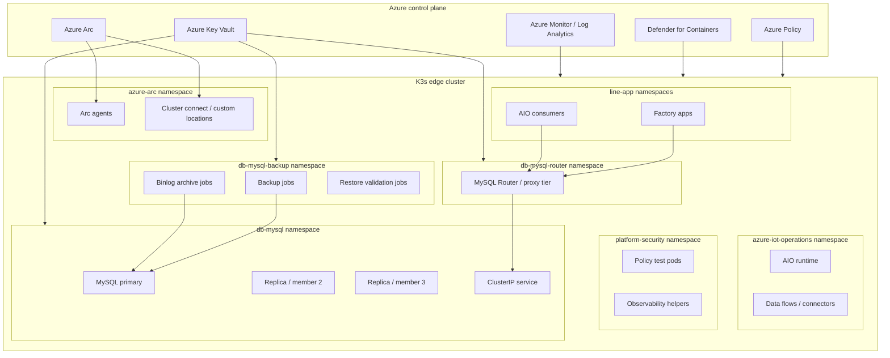
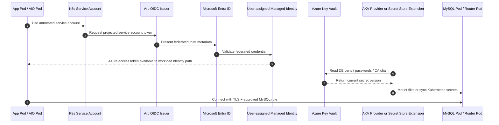
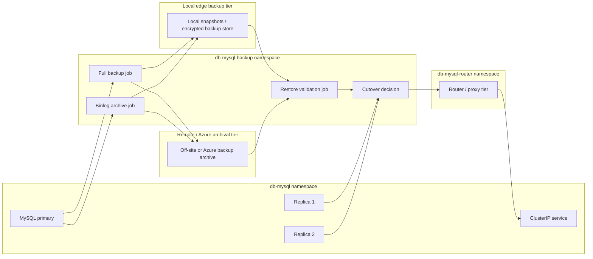

# MySQL on AIO/K3s – Diagram Pack

Use this diagram pack as **Section 3.3 – Visual architecture diagrams** in the original MySQL reference design.

## 3.3 Visual architecture diagrams

The following diagrams can be pasted directly into Markdown renderers that support **Mermaid**, and the pseudo-Visio versions can be used in Word or plain-text runbooks when Mermaid rendering is not available.

### Namespace layout diagram (Mermaid)



### Namespace layout diagram (pseudo-Visio)

```text
+----------------------------------------------------------------------------------+
|                               Azure Control Plane                                |
|  Azure Arc | Azure Policy | Defender for Containers | Key Vault | Azure Monitor |
+-------------------------------------------+--------------------------------------+
                                            |
                                            v
+----------------------------------------------------------------------------------+
|                                 K3s Edge Cluster                                 |
|                                                                                  |
|  +------------------+   +--------------------------+   +----------------------+   |
|  | azure-arc        |   | azure-iot-operations     |   | platform-security    |   |
|  | Arc agents       |   | AIO runtime / connectors |   | policy + observability|  |
|  +------------------+   +--------------------------+   +----------------------+   |
|                                                                                  |
|  +------------------------------------+   +-------------------------------+      |
|  | db-mysql                           |   | db-mysql-router               |      |
|  | MySQL primary / replicas           |<--| Router / proxy tier           |<-----+-- line-app
|  | ClusterIP service                  |   +-------------------------------+      |  namespaces
|  +------------------^-----------------+                                       |  |
|                     |                                                         |  |
|  +------------------------------------+                                       |  |
|  | db-mysql-backup                    |---------------------------------------+  |
|  | backup / binlog archive / restore  |                                          |
|  +------------------------------------+                                          |
+----------------------------------------------------------------------------------+
```

### Identity and Key Vault flow (Mermaid)



### Identity and Key Vault flow (pseudo-Visio)

```text
[App Pod / AIO Pod]
        |
        | annotated service account
        v
[Kubernetes Service Account] --> [Arc OIDC Issuer] --> [Microsoft Entra ID]
                                                          |
                                                          v
                                           [User-assigned Managed Identity]
                                                          |
                                                          v
                                                   [Azure Key Vault]
                                                          |
                                                          v
                              [AKV Provider or Secret Store Extension on cluster]
                                                          |
                                                          v
                               [MySQL Pod / Router Pod: certs / creds mounted]
                                                          |
                                                          v
                                         [TLS connection using approved MySQL role]
```

### Backup and restore flow (Mermaid)



### Backup and restore flow (pseudo-Visio)

```text
+-----------------------+      +---------------------------+      +---------------------------+
| db-mysql namespace    |      | db-mysql-router namespace |      | db-mysql-backup namespace |
| MySQL primary         |----->| Router / proxy tier       |<-----| Cutover after validation  |
| Replica 1 / Replica 2 |      +---------------------------+      | Full backup / binlog /    |
| ClusterIP service     |                                            | restore validation jobs |
+-----------+-----------+                                            +-------------+-----------+
            |                                                                      |
            v                                                                      v
+-------------------------------+                                   +-------------------------------+
| Local edge backup tier        |                                   | Remote / Azure archival tier  |
| encrypted snapshots / backups |                                   | off-site backups / binlogs    |
+---------------+---------------+                                   +---------------+---------------+
                \\                                                                 /
                 \\                                                               /
                  v                                                             v
                          +-------------------------------------------+
                          | Restore validation + router/service cutover|
                          +-------------------------------------------+
```
