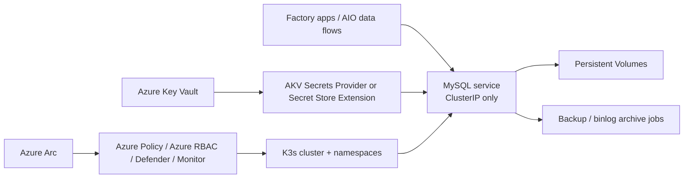
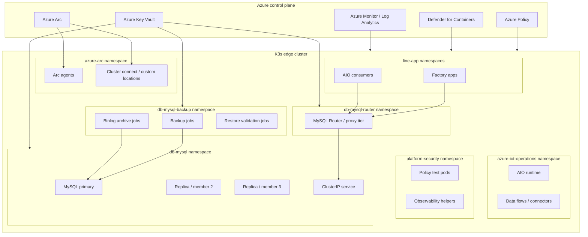
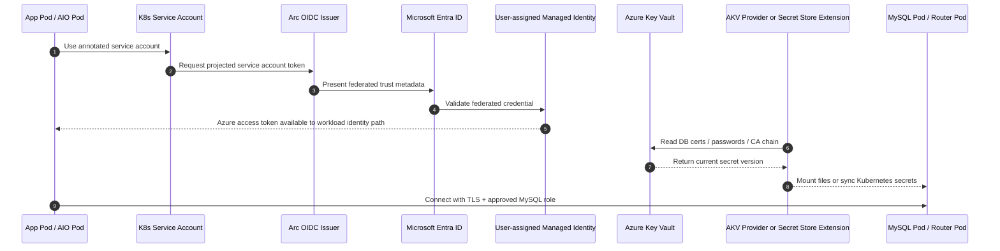
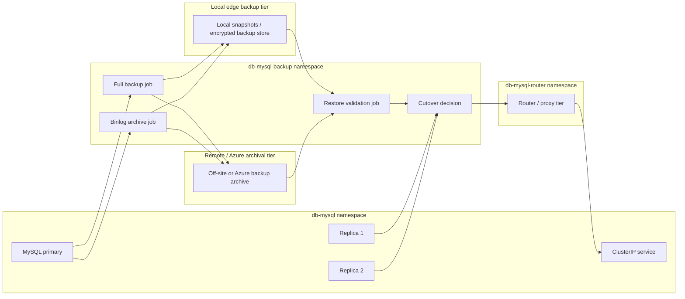

# MySQL on AIO/K3s – Secure Edge Reference Design

## 1. Purpose and scope

This reference design describes a **production-oriented MySQL deployment pattern** for an **Azure IoT Operations (AIO)** cluster running on **K3s** at a factory edge location. It assumes the cluster is **Azure Arc-enabled**, that **AIO is deployed with secure settings for production**, and that the plant requires a design that can tolerate intermittent WAN connectivity while still supporting centralized governance, identity separation, and predictable maintenance. AIO production guidance requires **custom locations** and **workload identity** on the Arc-enabled cluster and recommends configuring **your own certificate authority issuer** for production scenarios. [Microsoft Learn – Deploy Azure IoT Operations to a production cluster](https://learn.microsoft.com/en-us/azure/iot-operations/deploy-iot-ops/howto-deploy-iot-operations), [Microsoft Learn – Deploy and configure workload identity federation in Azure Arc-enabled Kubernetes](https://learn.microsoft.com/en-us/azure/azure-arc/kubernetes/workload-identity), [Microsoft Learn – Create and manage custom locations on Azure Arc-enabled Kubernetes](https://learn.microsoft.com/en-us/azure/azure-arc/kubernetes/custom-locations)

This design focuses on **namespace layout**, **Azure identity and Key Vault flow**, **certificate and secret rotation**, **network policy zones**, **backup/restore operations**, and **Azure governance mappings** for a MySQL-backed edge workload. Azure Arc makes the cluster an Azure Resource Manager resource so it can be governed by tagging, Azure RBAC, Azure Policy, Arc extensions, and Defender for Containers across multiple factory sites. [Microsoft Learn – Governance, security, and compliance baseline for Azure Arc-enabled Kubernetes](https://learn.microsoft.com/en-us/azure/cloud-adoption-framework/scenarios/hybrid/arc-enabled-kubernetes/eslz-arc-kubernetes-governance-disciplines)

## 2. Design goals

- Keep MySQL available to the production line even when the site is **semi-disconnected**. Microsoft recommends the **Azure Key Vault Secret Store extension (SSE)** for clusters outside Azure cloud where connectivity to Key Vault may not be perfect because SSE synchronizes secrets for **offline access** in the Kubernetes secret store. [Microsoft Learn – Use the Azure Key Vault Secret Store extension for offline access](https://learn.microsoft.com/en-us/azure/azure-arc/kubernetes/secret-store-extension), [Microsoft Learn – Azure Key Vault Secret Store extension configuration reference](https://learn.microsoft.com/en-us/azure/azure-arc/kubernetes/secret-store-extension-reference)
- Use **Azure Arc workload identity federation** whenever a pod needs Azure access, so credentials are not hard-coded into manifests or images. Arc workload identity uses OIDC federation between Kubernetes service accounts and Microsoft Entra identities. [Microsoft Learn – Deploy and configure workload identity federation in Azure Arc-enabled Kubernetes](https://learn.microsoft.com/en-us/azure/azure-arc/kubernetes/workload-identity), [Microsoft Learn – Workload identity federation in Azure Arc-enabled Kubernetes](https://learn.microsoft.com/en-us/azure/azure-arc/kubernetes/conceptual-workload-identity)
- Harden the K3s substrate with **secret encryption**, **audit logging**, **Pod Security**, and CIS-aligned controls because the cluster itself becomes part of the MySQL trust boundary. K3s documents enabling `secrets-encryption`, `protect-kernel-defaults`, and audit controls as part of production hardening. [K3s documentation – CIS Hardening Guide](https://docs.k3s.io/security/hardening-guide)
- Use **Azure Policy**, **Azure RBAC**, **Kubernetes RBAC**, and **Defender for Containers** to enforce configuration baselines, minimize privileged access, and centralize security visibility for hybrid/edge clusters. Azure Policy extends Gatekeeper on Arc-enabled Kubernetes, and Defender for Containers on Arc provides posture management, vulnerability assessment, and runtime threat detection. [Microsoft Learn – Understand Azure Policy for Kubernetes clusters](https://learn.microsoft.com/en-us/azure/governance/policy/concepts/policy-for-kubernetes), [Microsoft Learn – Defender for Containers on Arc-enabled Kubernetes overview](https://learn.microsoft.com/en-us/azure/defender-for-cloud/defender-for-containers-arc-overview), [Microsoft Learn – Deploy Defender for Containers on Arc-enabled Kubernetes programmatically](https://learn.microsoft.com/en-us/azure/defender-for-cloud/defender-for-containers-arc-enable-programmatically)

## 3. Architecture overview

### 3.1 Preferred deployment pattern

**Preferred topology for a multi-node factory cluster**

- **Arc-enabled K3s cluster** with AIO production deployment, cluster connect, custom locations, workload identity, Azure Policy extension, Defender for Containers extension, and either the **AKV Secrets Provider** or the **AKV Secret Store extension** depending on connectivity requirements. AIO secure production deployment uses Key Vault, user-assigned managed identities, federated identity credentials, and secret sync as part of the reference pattern. [Microsoft Learn – Deploy Azure IoT Operations to a production cluster](https://learn.microsoft.com/en-us/azure/iot-operations/deploy-iot-ops/howto-deploy-iot-operations), [Microsoft Learn – Use the Azure Key Vault Secrets Provider extension on Arc-enabled Kubernetes](https://learn.microsoft.com/en-us/azure/azure-arc/kubernetes/tutorial-akv-secrets-provider), [Microsoft Learn – Use the Azure Key Vault Secret Store extension for offline access](https://learn.microsoft.com/en-us/azure/azure-arc/kubernetes/secret-store-extension)
- **MySQL HA topology** with at least **three database instances** and a **routing layer** if the plant has multi-node capacity and the business requires automatic failover. Google’s MySQL Kubernetes tutorial documents a typical InnoDB Cluster pattern with **three database pods** plus **MySQL Router** for resilient connection routing, which is a good conceptual reference for a Kubernetes-hosted MySQL HA layout even if your operator/tooling differs. [Google Cloud tutorial – Deploy a stateful MySQL cluster on GKE (HA topology reference)](https://docs.cloud.google.com/kubernetes-engine/docs/tutorials/stateful-workloads/mysql)
- The MySQL workload is exposed **only through an internal ClusterIP service** and is protected by namespace-scoped **NetworkPolicies** plus MySQL’s **user@host** access model and **TLS-enforced transport**. MySQL’s privilege system evaluates both the user and the connecting host, and MySQL 8.4 supports `require_secure_transport=ON` to make encrypted connections mandatory. [MySQL 8.4 Reference – Access Control and Account Management](https://dev.mysql.com/doc/refman/8.4/en/access-control.html), [MySQL 8.4 Reference – Configuring MySQL to Use Encrypted Connections](https://dev.mysql.com/doc/refman/8.4/en/using-encrypted-connections.html)
- Secrets and certificates are sourced from **Azure Key Vault**. For connected sites, use the **AKV Secrets Provider** to mount secrets without persisting them by default; for semi-disconnected sites, use **SSE** so the cluster retains required secret material locally for database restart and recovery operations. Microsoft recommends not using both extensions side-by-side in the same cluster. [Microsoft Learn – Use the Azure Key Vault Secrets Provider extension on Arc-enabled Kubernetes](https://learn.microsoft.com/en-us/azure/azure-arc/kubernetes/tutorial-akv-secrets-provider), [Microsoft Learn – Use the Azure Key Vault Secret Store extension for offline access](https://learn.microsoft.com/en-us/azure/azure-arc/kubernetes/secret-store-extension)

**Fallback topology for a single-node or low-resource plant**

- Run a **single MySQL instance** with explicit downtime assumptions, stricter change control, and more frequent local backups. Microsoft’s AIO guidance distinguishes single-node and multi-node deployment patterns for edge clusters, and the HA advantages of quorum-based MySQL topologies depend on having multiple schedulable nodes. [Microsoft Learn – Prepare your Azure Arc-enabled Kubernetes cluster for Azure IoT Operations](https://learn.microsoft.com/en-us/azure/iot-operations/deploy-iot-ops/howto-prepare-cluster), [Google Cloud tutorial – Deploy a stateful MySQL cluster on GKE (HA topology reference)](https://docs.cloud.google.com/kubernetes-engine/docs/tutorials/stateful-workloads/mysql)

### 3.2 High-level component model

The MySQL service should be treated as a **dedicated line-service data plane** and not as a general shared database for unrelated workloads. Arc-enabled Kubernetes and custom locations let the platform team expose controlled Azure-facing deployment targets for approved namespaces while keeping the MySQL namespace tightly isolated. 

## 4. Prescriptive namespace layout

Use the following namespace model:

- **`azure-arc`** – Arc agents and core Arc integration components. Arc agents are installed in the `azure-arc` namespace when the cluster is connected to Azure Arc.
- **`kube-system`** – K3s core services and selected cluster-scoped extensions. [K3s documentation – CIS Hardening Guide](https://docs.k3s.io/security/hardening-guide)
- **`azure-iot-operations`** – AIO runtime namespace. [Microsoft Learn – Deploy Azure IoT Operations to a production cluster](https://learn.microsoft.com/en-us/azure/iot-operations/deploy-iot-ops/howto-deploy-iot-operations)
- **`platform-security`** – optional namespace for platform-owned helper workloads, policy test pods, or observability sidecars that should remain separate from apps and databases. Azure Policy and Defender are cluster-scoped through extensions, but namespace separation still improves operational hygiene. [Microsoft Learn – Understand Azure Policy for Kubernetes clusters](https://learn.microsoft.com/en-us/azure/governance/policy/concepts/policy-for-kubernetes), [Microsoft Learn – Defender for Containers on Arc-enabled Kubernetes overview](https://learn.microsoft.com/en-us/azure/defender-for-cloud/defender-for-containers-arc-overview)
- **`db-mysql`** – MySQL instances, internal services, configuration objects, and PVCs. Keep it database-only. [Microsoft Learn – Governance, security, and compliance baseline for Azure Arc-enabled Kubernetes](https://learn.microsoft.com/en-us/azure/cloud-adoption-framework/scenarios/hybrid/arc-enabled-kubernetes/eslz-arc-kubernetes-governance-disciplines), [Microsoft Learn – Understand Azure Policy for Kubernetes clusters](https://learn.microsoft.com/en-us/azure/governance/policy/concepts/policy-for-kubernetes)
- **`db-mysql-router`** – optional router/proxy tier if using a MySQL HA topology that benefits from a separate routing layer. MySQL HA reference patterns on Kubernetes commonly place routing functionality in its own deployment set for resilience and simpler cutover. [Google Cloud tutorial – Deploy a stateful MySQL cluster on GKE (HA topology reference)](https://docs.cloud.google.com/kubernetes-engine/docs/tutorials/stateful-workloads/mysql)
- **`db-mysql-backup`** – backup/restore jobs, binlog archive jobs, validation jobs, and export tooling. Separating it from runtime pods helps keep service accounts, RoleBindings, and egress rules tighter. [Microsoft Learn – Governance, security, and compliance baseline for Azure Arc-enabled Kubernetes](https://learn.microsoft.com/en-us/azure/cloud-adoption-framework/scenarios/hybrid/arc-enabled-kubernetes/eslz-arc-kubernetes-governance-disciplines)
- **`line-<plant-app>`** namespaces – application and integration namespaces that may connect to MySQL only through explicit NetworkPolicies and narrowly scoped MySQL roles. Custom locations map one-to-one to namespaces; use them where Azure deployment abstractions are needed, not by default for the DB namespace. [Microsoft Learn – Create and manage custom locations on Azure Arc-enabled Kubernetes](https://learn.microsoft.com/en-us/azure/azure-arc/kubernetes/custom-locations)

### 4.1 Namespace layout diagram (Mermaid)

### Namespace governance rules

1. Do **not** deploy MySQL in `default`, in `azure-iot-operations`, or in shared line namespaces. Namespace isolation is foundational for policy, RBAC, and network segmentation. [Microsoft Learn – Understand Azure Policy for Kubernetes clusters](https://learn.microsoft.com/en-us/azure/governance/policy/concepts/policy-for-kubernetes), [Microsoft Learn – Governance, security, and compliance baseline for Azure Arc-enabled Kubernetes](https://learn.microsoft.com/en-us/azure/cloud-adoption-framework/scenarios/hybrid/arc-enabled-kubernetes/eslz-arc-kubernetes-governance-disciplines)
2. Enable **custom locations** only for namespaces that need Azure-side deployment targets; custom locations are dependent on **cluster connect** and create Azure-managed RoleBindings and ClusterRoleBindings as part of the abstraction. [Microsoft Learn – Create and manage custom locations on Azure Arc-enabled Kubernetes](https://learn.microsoft.com/en-us/azure/azure-arc/kubernetes/custom-locations)
3. Apply stricter Pod Security and policy baselines to `db-mysql`, `db-mysql-router`, and `db-mysql-backup` than to application namespaces. K3s hardening guidance and Azure Policy for Kubernetes together provide the mechanism. [K3s documentation – CIS Hardening Guide](https://docs.k3s.io/security/hardening-guide), [Microsoft Learn – Understand Azure Policy for Kubernetes clusters](https://learn.microsoft.com/en-us/azure/governance/policy/concepts/policy-for-kubernetes)

## 5. Identities and Key Vault flow

### 5.1 Identity model

Use **three separate identity planes**:

1. **Azure control plane identities** – Azure admins, platform engineers, and security personnel managed with **Azure RBAC** over the Arc-connected cluster resource and related Azure resources. Arc-enabled Kubernetes supports Azure RBAC for Kubernetes authorization scenarios where supported. [Microsoft Learn – Use Azure RBAC on Azure Arc-enabled Kubernetes clusters](https://learn.microsoft.com/en-us/azure/azure-arc/kubernetes/azure-rbac), [Microsoft Learn – Identity and access overview for Azure Arc-enabled Kubernetes](https://learn.microsoft.com/en-us/azure/azure-arc/kubernetes/identity-access-overview)
2. **Kubernetes identities** – namespace-scoped **service accounts** and RoleBindings limited to MySQL pods, routing pods, backup jobs, and extension resources. Arc secure operations guidance recommends Kubernetes RBAC for nonhuman access to the API server. [Microsoft Learn – Identity and access overview for Azure Arc-enabled Kubernetes](https://learn.microsoft.com/en-us/azure/azure-arc/kubernetes/identity-access-overview)
3. **Database identities** – MySQL accounts and roles mapped to application, migration, backup, router, replication, and break-glass admin functions. MySQL identifies accounts by **user plus host** and supports roles, privilege scoping, password management, and account locking. [MySQL 8.4 Reference – Access Control and Account Management](https://dev.mysql.com/doc/refman/8.4/en/access-control.html), [MySQL 8.4 Reference – Password Management](https://dev.mysql.com/doc/refman/8.4/en/password-management.html)

### 5.2 Prescriptive Azure identity assignments

Use the following user-assigned managed identities (UAMIs):

- **`uami-aio-components`** – AIO components that need Azure access. AIO production guidance separates this from the identity used for secrets. [Microsoft Learn – Deploy Azure IoT Operations to a production cluster](https://learn.microsoft.com/en-us/azure/iot-operations/deploy-iot-ops/howto-deploy-iot-operations)
- **`uami-aio-secrets`** – AIO secure settings secret sync path. Microsoft explicitly advises using a separate identity from AIO components. [Microsoft Learn – Deploy Azure IoT Operations to a production cluster](https://learn.microsoft.com/en-us/azure/iot-operations/deploy-iot-ops/howto-deploy-iot-operations)
- **`uami-mysql-runtime`** – for MySQL-side components or helper pods that need Azure access (for example brokered backup access or secure secret retrieval workflows). Bind it through **Arc workload identity**. [Microsoft Learn – Deploy and configure workload identity federation in Azure Arc-enabled Kubernetes](https://learn.microsoft.com/en-us/azure/azure-arc/kubernetes/workload-identity), [Microsoft Learn – Workload identity federation in Azure Arc-enabled Kubernetes](https://learn.microsoft.com/en-us/azure/azure-arc/kubernetes/conceptual-workload-identity)
- **`uami-mysql-backup`** – for backup, export, and restore jobs. Keep it separate from runtime so backup tooling does not inherit general DB pod permissions. [Microsoft Learn – Deploy and configure workload identity federation in Azure Arc-enabled Kubernetes](https://learn.microsoft.com/en-us/azure/azure-arc/kubernetes/workload-identity), [Microsoft Learn – Workload identity federation in Azure Arc-enabled Kubernetes](https://learn.microsoft.com/en-us/azure/azure-arc/kubernetes/conceptual-workload-identity)

### 5.3 Key Vault consumption pattern

**Connected site pattern (preferred when WAN is reliable):**

- Install the **Azure Key Vault Secrets Provider extension** on the Arc-enabled cluster. It mounts **secrets, keys, and certificates** into pods, supports **auto rotation**, and by default does **not** persist secrets into the Kubernetes secret store. Microsoft recommends this online-only pattern for clusters that maintain reliable Key Vault connectivity and for scenarios where you want to avoid local secret copies. [Microsoft Learn – Use the Azure Key Vault Secrets Provider extension on Arc-enabled Kubernetes](https://learn.microsoft.com/en-us/azure/azure-arc/kubernetes/tutorial-akv-secrets-provider)
- Use `SecretProviderClass` objects for MySQL server certificates, CA bundles, bootstrap admin credentials, router credentials, and backup target credentials if they should remain ephemeral and file-mounted. The provider supports file mounts and optional sync to Kubernetes secrets. [Microsoft Learn – Use the Azure Key Vault Secrets Provider extension on Arc-enabled Kubernetes](https://learn.microsoft.com/en-us/azure/azure-arc/kubernetes/tutorial-akv-secrets-provider), [Microsoft Learn – Azure Key Vault Secret Store extension configuration reference](https://learn.microsoft.com/en-us/azure/azure-arc/kubernetes/secret-store-extension-reference)

**Semi-disconnected site pattern (preferred when MySQL restart must survive WAN loss):**

- Install the **Azure Key Vault Secret Store extension (SSE)** on the Arc-enabled cluster. Microsoft recommends SSE for clusters outside Azure cloud with imperfect Key Vault connectivity because it synchronizes secrets for **offline access** into the Kubernetes secret store. Microsoft also emphasizes that these synchronized secrets are critical business assets and recommends encrypting the Kubernetes secret store. [Microsoft Learn – Use the Azure Key Vault Secret Store extension for offline access](https://learn.microsoft.com/en-us/azure/azure-arc/kubernetes/secret-store-extension), [K3s documentation – CIS Hardening Guide](https://docs.k3s.io/security/hardening-guide)
- Use SSE for MySQL **TLS materials**, **bootstrap passwords**, **replication/router secrets**, and **backup credentials** that must exist locally even during a network outage. Configure the extension’s **rotation poll interval** and **jitter** according to the number of synchronized secrets and the expected rotation cadence. [Microsoft Learn – Azure Key Vault Secret Store extension configuration reference](https://learn.microsoft.com/en-us/azure/azure-arc/kubernetes/secret-store-extension-reference)

### 5.4 Identity and Key Vault flow

Arc workload identity requires OIDC issuer and workload identity features on the Arc-enabled cluster, and AIO production secure settings also rely on federated identity credentials and Key Vault-backed secret flows. [Microsoft Learn – Deploy and configure workload identity federation in Azure Arc-enabled Kubernetes](https://learn.microsoft.com/en-us/azure/azure-arc/kubernetes/workload-identity), [Microsoft Learn – Workload identity federation in Azure Arc-enabled Kubernetes](https://learn.microsoft.com/en-us/azure/azure-arc/kubernetes/conceptual-workload-identity), [Microsoft Learn – Deploy Azure IoT Operations to a production cluster](https://learn.microsoft.com/en-us/azure/iot-operations/deploy-iot-ops/howto-deploy-iot-operations)

## 6. Certificate and rotation flow

### 6.1 Certificate authority model

Use a **plant-controlled or enterprise-controlled CA/issuer** for MySQL instead of relying on the Kubernetes cluster root CA. Kubernetes documentation advises using a separate custom CA for workload trust, and AIO production guidance recommends bringing your own issuer for production. [Microsoft Learn – Deploy Azure IoT Operations to a production cluster](https://learn.microsoft.com/en-us/azure/iot-operations/deploy-iot-ops/howto-deploy-iot-operations)

Recommended certificate sets:

- **MySQL server certificate** – presented by the MySQL service/instances to clients. MySQL 8.4 documents using `ssl_ca`, `ssl_cert`, and `ssl_key` for encrypted connections. [MySQL 8.4 Reference – Configuring MySQL to Use Encrypted Connections](https://dev.mysql.com/doc/refman/8.4/en/using-encrypted-connections.html)
- **Client CA bundle** – trusted by MySQL if privileged or administrative clients use certificate validation or mTLS-style controls. MySQL’s encrypted connection model is CA-based and can be made mandatory. [MySQL 8.4 Reference – Configuring MySQL to Use Encrypted Connections](https://dev.mysql.com/doc/refman/8.4/en/using-encrypted-connections.html)
- **Internal CA chain** – distributed to application pods, routers, and backup jobs so they can validate the MySQL server identity. Kubernetes recommends explicit workload CA distribution rather than assuming trust in the cluster root CA.

### 6.2 MySQL TLS posture

Implement the following as baseline:

- Configure MySQL with **`ssl_ca`**, **`ssl_cert`**, and **`ssl_key`** and set **`require_secure_transport=ON`** so clients must use encrypted connections. MySQL 8.4 explicitly documents this as the way to require secure transport. [MySQL 8.4 Reference – Configuring MySQL to Use Encrypted Connections](https://dev.mysql.com/doc/refman/8.4/en/using-encrypted-connections.html)
- Use **host-scoped accounts** and **roles** so that application identities are valid only from the expected Kubernetes source patterns. MySQL’s privilege system evaluates **user plus host**, which aligns well with cluster-internal segmentation. [MySQL 8.4 Reference – Access Control and Account Management](https://dev.mysql.com/doc/refman/8.4/en/access-control.html), [MySQL 8.4 Reference – Account Management Statements](https://dev.mysql.com/doc/refman/8.4/en/account-management-statements.html)
- For break-glass admin or privileged automation, prefer certificate-based admin workflows where practical instead of broad password reuse. MySQL’s encrypted connection stack is based on CA, server cert, and key configuration, making a certificate-governed admin model feasible. [MySQL 8.4 Reference – Configuring MySQL to Use Encrypted Connections](https://dev.mysql.com/doc/refman/8.4/en/using-encrypted-connections.html)

### 6.3 Rotation pattern

**Recommended rotation sequence**

1. Publish a **new certificate version** or secret version in Azure Key Vault. The AKV provider supports auto rotation and the Secret Store extension exposes `rotationPollIntervalInSeconds` and related settings to govern refresh behavior. [Microsoft Learn – Use the Azure Key Vault Secrets Provider extension on Arc-enabled Kubernetes](https://learn.microsoft.com/en-us/azure/azure-arc/kubernetes/tutorial-akv-secrets-provider), [Microsoft Learn – Azure Key Vault Secret Store extension configuration reference](https://learn.microsoft.com/en-us/azure/azure-arc/kubernetes/secret-store-extension-reference)
2. Let the provider/extension **refresh the mounted or synchronized material** into `db-mysql` and `db-mysql-router`. The online CSI provider supports auto rotation, but apps may still need reload/restart behavior depending on how they consume mounted files or synced secrets. [Microsoft Learn – Use the Azure Key Vault Secrets Provider extension on Arc-enabled Kubernetes](https://learn.microsoft.com/en-us/azure/azure-arc/kubernetes/tutorial-akv-secrets-provider)
3. Perform a **controlled MySQL reload or rolling restart** during a maintenance window or using a quorum-aware operator/runbook. In an HA topology, rotate routers and replicas first, then the primary/cutover target. MySQL HA topologies on Kubernetes rely on multiple instances and routing state that must be updated coherently. [Google Cloud tutorial – Deploy a stateful MySQL cluster on GKE (HA topology reference)](https://docs.cloud.google.com/kubernetes-engine/docs/tutorials/stateful-workloads/mysql), [MySQL 8.4 Reference – Configuring MySQL to Use Encrypted Connections](https://dev.mysql.com/doc/refman/8.4/en/using-encrypted-connections.html)
4. Validate **client trust**, **replication trust**, and **backup job trust** before retiring the previous cert version. This is essential in a factory environment where a failed transport change can stop the production line. [MySQL 8.4 Reference – Configuring MySQL to Use Encrypted Connections](https://dev.mysql.com/doc/refman/8.4/en/using-encrypted-connections.html), [Google Cloud tutorial – Deploy a stateful MySQL cluster on GKE (HA topology reference)](https://docs.cloud.google.com/kubernetes-engine/docs/tutorials/stateful-workloads/mysql)

### 6.4 Rotation policy recommendations

- Rotate **server certificates** on a fixed schedule and after any incident that suggests key exposure. The technical mechanism should rely on Key Vault versioning plus controlled provider/extension refresh. [Microsoft Learn – Use the Azure Key Vault Secrets Provider extension on Arc-enabled Kubernetes](https://learn.microsoft.com/en-us/azure/azure-arc/kubernetes/tutorial-akv-secrets-provider), [Microsoft Learn – Azure Key Vault Secret Store extension configuration reference](https://learn.microsoft.com/en-us/azure/azure-arc/kubernetes/secret-store-extension-reference)
- Rotate **password-based MySQL accounts** using MySQL’s built-in password management features, including expiration, reuse restrictions, and failed-login controls, while sourcing the new material from Key Vault. MySQL 8.4 documents these password management features in detail. [MySQL 8.4 Reference – Password Management](https://dev.mysql.com/doc/refman/8.4/en/password-management.html), [MySQL 8.4 Reference – Access Control and Account Management](https://dev.mysql.com/doc/refman/8.4/en/access-control.html)
- If using SSE, ensure **K3s secret encryption** is enabled because secret copies are stored locally in the Kubernetes secret store. K3s supports secrets encryption at rest, and Microsoft recommends encrypting the cluster secret store when using SSE. [K3s documentation – CIS Hardening Guide](https://docs.k3s.io/security/hardening-guide), [Microsoft Learn – Use the Azure Key Vault Secret Store extension for offline access](https://learn.microsoft.com/en-us/azure/azure-arc/kubernetes/secret-store-extension)

## 7. Network policy zones

### 7.1 Prescriptive network zones

1. **Zone A – Arc / platform management**: `azure-arc`, Policy, Defender, cluster connect, and other Arc extensions. Arc works through secure outbound connectivity and does not require inbound firewall ports for cluster management. [Microsoft Learn – Azure Arc-enabled Kubernetes architecture](https://learn.microsoft.com/en-us/azure/azure-arc/kubernetes/architecture)
2. **Zone B – AIO runtime**: `azure-iot-operations` and approved application namespaces. These namespaces may call MySQL only through explicit NetworkPolicies and approved MySQL accounts. AIO runs as an Arc-managed production workload on the cluster. [Microsoft Learn – Deploy Azure IoT Operations to a production cluster](https://learn.microsoft.com/en-us/azure/iot-operations/deploy-iot-ops/howto-deploy-iot-operations)
3. **Zone C – MySQL data plane**: `db-mysql` namespace. Only allow inbound from approved application namespaces and `db-mysql-router`/`db-mysql-backup`; deny all other east-west traffic by default. Azure Policy for Kubernetes can help audit/enforce required policy patterns centrally. [Microsoft Learn – Understand Azure Policy for Kubernetes clusters](https://learn.microsoft.com/en-us/azure/governance/policy/concepts/policy-for-kubernetes), [Microsoft Learn – Governance, security, and compliance baseline for Azure Arc-enabled Kubernetes](https://learn.microsoft.com/en-us/azure/cloud-adoption-framework/scenarios/hybrid/arc-enabled-kubernetes/eslz-arc-kubernetes-governance-disciplines)
4. **Zone D – Router / connection mediation**: `db-mysql-router` namespace if a router tier is used. Permit inbound from approved application namespaces and outbound only to MySQL pods. HA routing patterns such as MySQL Router are designed to centralize connection routing and failover decisions. [Google Cloud tutorial – Deploy a stateful MySQL cluster on GKE (HA topology reference)](https://docs.cloud.google.com/kubernetes-engine/docs/tutorials/stateful-workloads/mysql)
5. **Zone E – Backup and restore**: `db-mysql-backup`. Permit egress only to MySQL, approved backup targets, Key Vault/Arc endpoints as needed, and monitoring endpoints. Arc/Defender/AKV extension documentation all define outbound requirements that should be included in egress design. [Microsoft Learn – Deploy Defender for Containers on Arc-enabled Kubernetes programmatically](https://learn.microsoft.com/en-us/azure/defender-for-cloud/defender-for-containers-arc-enable-programmatically), [Microsoft Learn – Use the Azure Key Vault Secrets Provider extension on Arc-enabled Kubernetes](https://learn.microsoft.com/en-us/azure/azure-arc/kubernetes/tutorial-akv-secrets-provider)
6. **Zone F – External edge/plant network**: OT networks and integration networks should not connect directly to MySQL. Any external integration should terminate in an application service namespace that then connects inward to MySQL using approved credentials and TLS. Arc governance guidance emphasizes clear security boundaries and controlled operations. [Microsoft Learn – Governance, security, and compliance baseline for Azure Arc-enabled Kubernetes](https://learn.microsoft.com/en-us/azure/cloud-adoption-framework/scenarios/hybrid/arc-enabled-kubernetes/eslz-arc-kubernetes-governance-disciplines)

### 7.2 Mandatory network controls

- **Default deny** ingress and egress in `db-mysql`, `db-mysql-router`, and `db-mysql-backup`; then create explicit allowlists only for required flows. Azure Policy for Kubernetes can apply these kinds of safeguards at scale. [Microsoft Learn – Understand Azure Policy for Kubernetes clusters](https://learn.microsoft.com/en-us/azure/governance/policy/concepts/policy-for-kubernetes)
- Expose MySQL as **ClusterIP only**. Do not publish it directly with NodePort or external ingress. MySQL’s host-based access model is valuable, but it should complement rather than replace tight cluster-internal network boundaries. [MySQL 8.4 Reference – Access Control and Account Management](https://dev.mysql.com/doc/refman/8.4/en/access-control.html), [MySQL 8.4 Reference – Configuring MySQL to Use Encrypted Connections](https://dev.mysql.com/doc/refman/8.4/en/using-encrypted-connections.html)
- Make **encrypted transport mandatory** everywhere with `require_secure_transport=ON` and certificate validation on clients wherever feasible. MySQL explicitly documents mandatory encrypted transport. [MySQL 8.4 Reference – Configuring MySQL to Use Encrypted Connections](https://dev.mysql.com/doc/refman/8.4/en/using-encrypted-connections.html)
- Validate required outbound access only for Arc, Defender, and the chosen AKV extension. Arc and Defender documentation both document outbound dependency requirements. [Microsoft Learn – Deploy Defender for Containers on Arc-enabled Kubernetes programmatically](https://learn.microsoft.com/en-us/azure/defender-for-cloud/defender-for-containers-arc-enable-programmatically)

## 8. MySQL workload design and hardening

### 8.1 Authentication and authorization

Use this MySQL baseline:

- Create separate accounts and roles for **application**, **migration**, **backup**, **router/replication**, and **break-glass admin** access. MySQL 8.4 supports roles and granular privilege assignments through account-management statements. [MySQL 8.4 Reference – Access Control and Account Management](https://dev.mysql.com/doc/refman/8.4/en/access-control.html), [MySQL 8.4 Reference – Account Management Statements](https://dev.mysql.com/doc/refman/8.4/en/account-management-statements.html)
- Use **host-scoped account definitions** so each service account is valid only from the approved cluster source patterns. MySQL’s account model uses both the user name and connecting host to determine identity and permissions. [MySQL 8.4 Reference – Access Control and Account Management](https://dev.mysql.com/doc/refman/8.4/en/access-control.html)
- Enable password-management controls for human or privileged accounts: **password expiration**, **reuse restrictions**, **verification-required changes**, **failed-login tracking**, and **temporary account locking**. MySQL 8.4 documents all of these capabilities. [MySQL 8.4 Reference – Password Management](https://dev.mysql.com/doc/refman/8.4/en/password-management.html), [MySQL 8.4 Reference – Access Control and Account Management](https://dev.mysql.com/doc/refman/8.4/en/access-control.html)
- Prefer certificate or identity-based access patterns for privileged automation where possible; keep long-lived passwords only where unavoidable and store them in Key Vault. Workload identity plus Key Vault-backed extensions reduce the need to embed secrets in pods. [Microsoft Learn – Deploy and configure workload identity federation in Azure Arc-enabled Kubernetes](https://learn.microsoft.com/en-us/azure/azure-arc/kubernetes/workload-identity), [Microsoft Learn – Use the Azure Key Vault Secrets Provider extension on Arc-enabled Kubernetes](https://learn.microsoft.com/en-us/azure/azure-arc/kubernetes/tutorial-akv-secrets-provider), [Microsoft Learn – Use the Azure Key Vault Secret Store extension for offline access](https://learn.microsoft.com/en-us/azure/azure-arc/kubernetes/secret-store-extension)

### 8.2 HA and durability

- **Preferred**: multi-instance HA topology with a routing tier if the plant requires automatic failover. Kubernetes MySQL HA reference patterns place multiple MySQL instances behind a routing layer to allow primary election and connection redirection. [Google Cloud tutorial – Deploy a stateful MySQL cluster on GKE (HA topology reference)](https://docs.cloud.google.com/kubernetes-engine/docs/tutorials/stateful-workloads/mysql)
- **Minimum acceptable**: single instance with planned maintenance windows, documented outage acceptance, and strong local backup posture when the site lacks multi-node resources. AIO guidance distinguishes multi-node and single-node patterns for edge environments. [Microsoft Learn – Prepare your Azure Arc-enabled Kubernetes cluster for Azure IoT Operations](https://learn.microsoft.com/en-us/azure/iot-operations/deploy-iot-ops/howto-prepare-cluster)
- Define RPO/RTO and whether the business can tolerate asynchronous lag or requires tighter failover semantics. The topology and backup/binlog strategy should follow that decision explicitly. MySQL Kubernetes HA patterns assume multiple instances precisely to improve resiliency and disaster tolerance. [Google Cloud tutorial – Deploy a stateful MySQL cluster on GKE (HA topology reference)](https://docs.cloud.google.com/kubernetes-engine/docs/tutorials/stateful-workloads/mysql)

### 8.3 Logging and auditing

- Capture MySQL events for **authentication failures**, **privilege changes**, **DDL changes**, and backup/replication failures, and stream them to the cluster logging pipeline. If you have **MySQL Enterprise**, use **MySQL Enterprise Audit** for richer filtering and durable audit handling. Oracle documents audit log tables, functions, and filters for the Enterprise Audit feature. [MySQL 8.4 Reference – Audit Log Reference](https://dev.mysql.com/doc/refman/8.4/en/audit-log-reference.html), [MySQL 8.4 Reference – Access Control and Account Management](https://dev.mysql.com/doc/refman/8.4/en/access-control.html)
- Correlate MySQL events with **Kubernetes audit logs**, **GitOps commits**, and **Arc/Defender alerts** for incident response. Arc secure operations guidance emphasizes monitoring control-plane changes, controlling who can deploy, and detecting emerging threats. [Microsoft Learn – Defender for Containers on Arc-enabled Kubernetes overview](https://learn.microsoft.com/en-us/azure/defender-for-cloud/defender-for-containers-arc-overview)

## 9. Backup and restore runbook

### 9.1 Backup principles

The backup strategy must cover **storage failure**, **logical corruption**, **operator error**, and **site loss**. In Kubernetes-hosted MySQL, combine **persistent-volume-level recovery options** with **engine-native backup/binlog approaches** appropriate to the chosen topology. Arc governance guidance emphasizes documented operational ownership and recovery planning for hybrid clusters. [Microsoft Learn – Governance, security, and compliance baseline for Azure Arc-enabled Kubernetes](https://learn.microsoft.com/en-us/azure/cloud-adoption-framework/scenarios/hybrid/arc-enabled-kubernetes/eslz-arc-kubernetes-governance-disciplines), [Google Cloud tutorial – Deploy a stateful MySQL cluster on GKE (HA topology reference)](https://docs.cloud.google.com/kubernetes-engine/docs/tutorials/stateful-workloads/mysql)

### 9.2 Prescriptive backup design

- **Local fast restore tier**: maintain local encrypted backups or storage snapshots on site for fast recovery during plant incidents. Edge platforms should preserve local operational autonomy during WAN disruption. [Microsoft Learn – Governance, security, and compliance baseline for Azure Arc-enabled Kubernetes](https://learn.microsoft.com/en-us/azure/cloud-adoption-framework/scenarios/hybrid/arc-enabled-kubernetes/eslz-arc-kubernetes-governance-disciplines), [Microsoft Learn – Deploy Azure IoT Operations to a production cluster](https://learn.microsoft.com/en-us/azure/iot-operations/deploy-iot-ops/howto-deploy-iot-operations)
- **Off-site or Azure archival tier**: replicate backup artifacts or binlog archives off site whenever connectivity is available. Use a dedicated backup identity and narrow egress. Workload identity and Key Vault-backed secret management make this easier without static pod credentials. [Microsoft Learn – Deploy and configure workload identity federation in Azure Arc-enabled Kubernetes](https://learn.microsoft.com/en-us/azure/azure-arc/kubernetes/workload-identity), [Microsoft Learn – Use the Azure Key Vault Secret Store extension for offline access](https://learn.microsoft.com/en-us/azure/azure-arc/kubernetes/secret-store-extension)
- **Secret availability**: if the backup job must start during a disconnected window, source its materials from **SSE** rather than the online-only provider. SSE is specifically recommended for semi-disconnected sites. [Microsoft Learn – Use the Azure Key Vault Secret Store extension for offline access](https://learn.microsoft.com/en-us/azure/azure-arc/kubernetes/secret-store-extension), [Microsoft Learn – Azure Key Vault Secret Store extension configuration reference](https://learn.microsoft.com/en-us/azure/azure-arc/kubernetes/secret-store-extension-reference)

### 9.3 Backup schedule (recommended baseline)

- **Daily full backup** or full logical/physical backup baseline appropriate to database size and site recovery needs. Stateful Kubernetes workloads need a repeatable base restore point before incremental/binlog recovery makes sense. [Google Cloud tutorial – Deploy a stateful MySQL cluster on GKE (HA topology reference)](https://docs.cloud.google.com/kubernetes-engine/docs/tutorials/stateful-workloads/mysql), [Microsoft Learn – Governance, security, and compliance baseline for Azure Arc-enabled Kubernetes](https://learn.microsoft.com/en-us/azure/cloud-adoption-framework/scenarios/hybrid/arc-enabled-kubernetes/eslz-arc-kubernetes-governance-disciplines)
- **Frequent binlog archival** if the plant cannot accept large data-loss windows. MySQL HA and disaster-tolerance patterns depend on maintaining a consistent change history between restore points. [Google Cloud tutorial – Deploy a stateful MySQL cluster on GKE (HA topology reference)](https://docs.cloud.google.com/kubernetes-engine/docs/tutorials/stateful-workloads/mysql)
- **Restore validation** at least monthly and after every significant version change, routing change, cert rotation change, or backup tooling update. Recovery trust depends on real restore tests, not just successful backup jobs. [Microsoft Learn – Governance, security, and compliance baseline for Azure Arc-enabled Kubernetes](https://learn.microsoft.com/en-us/azure/cloud-adoption-framework/scenarios/hybrid/arc-enabled-kubernetes/eslz-arc-kubernetes-governance-disciplines)

### 9.4 Restore runbook

**Runbook – standard restore**

1. **Declare incident mode** and collect current evidence: cluster events, MySQL logs, Arc alerts, Defender alerts, and backup job history. Defender for Containers on Arc provides centralized security signals and K3s supports audit logging for control-plane changes. [Microsoft Learn – Defender for Containers on Arc-enabled Kubernetes overview](https://learn.microsoft.com/en-us/azure/defender-for-cloud/defender-for-containers-arc-overview), [K3s documentation – CIS Hardening Guide](https://docs.k3s.io/security/hardening-guide)
2. **Quiesce or isolate writers** by scaling down applications that write to MySQL and tightening NetworkPolicies if corruption or compromise is suspected. Azure Policy and Kubernetes RBAC/NetworkPolicies form part of the operational control baseline. [Microsoft Learn – Understand Azure Policy for Kubernetes clusters](https://learn.microsoft.com/en-us/azure/governance/policy/concepts/policy-for-kubernetes)
3. **Choose recovery source**: latest good local snapshot/backup, latest complete off-site backup, or the correct binlog boundary for point recovery. MySQL HA/disaster-tolerance designs on Kubernetes assume explicit recovery target choices. [Google Cloud tutorial – Deploy a stateful MySQL cluster on GKE (HA topology reference)](https://docs.cloud.google.com/kubernetes-engine/docs/tutorials/stateful-workloads/mysql)
4. **Restore into a new recovery target** in `db-mysql` or a temporary `db-mysql-restore` namespace rather than overwriting the original immediately. Namespace isolation simplifies validation and rollback. [Microsoft Learn – Understand Azure Policy for Kubernetes clusters](https://learn.microsoft.com/en-us/azure/governance/policy/concepts/policy-for-kubernetes), [Microsoft Learn – Governance, security, and compliance baseline for Azure Arc-enabled Kubernetes](https://learn.microsoft.com/en-us/azure/cloud-adoption-framework/scenarios/hybrid/arc-enabled-kubernetes/eslz-arc-kubernetes-governance-disciplines)
5. **Validate integrity**: schema checks, application smoke tests, TLS trust, router connectivity, and replication membership if HA is enabled. MySQL HA patterns depend on routers and topology metadata being correct after recovery. [Google Cloud tutorial – Deploy a stateful MySQL cluster on GKE (HA topology reference)](https://docs.cloud.google.com/kubernetes-engine/docs/tutorials/stateful-workloads/mysql), [MySQL 8.4 Reference – Configuring MySQL to Use Encrypted Connections](https://dev.mysql.com/doc/refman/8.4/en/using-encrypted-connections.html)
6. **Cut over** application traffic to the restored MySQL endpoint or router tier, then re-enable normal ingress flows. ClusterIP-only service exposure and a dedicated router namespace simplify controlled cutover. [Google Cloud tutorial – Deploy a stateful MySQL cluster on GKE (HA topology reference)](https://docs.cloud.google.com/kubernetes-engine/docs/tutorials/stateful-workloads/mysql), [MySQL 8.4 Reference – Access Control and Account Management](https://dev.mysql.com/doc/refman/8.4/en/access-control.html)
7. **Review the incident** and capture achieved RPO/RTO, failed controls, extension states, and whether secret/certificate rotation played any role. Arc, Policy, and Defender centralize part of the evidence trail in Azure. [Microsoft Learn – Defender for Containers on Arc-enabled Kubernetes overview](https://learn.microsoft.com/en-us/azure/defender-for-cloud/defender-for-containers-arc-overview), [Microsoft Learn – Understand Azure Policy for Kubernetes clusters](https://learn.microsoft.com/en-us/azure/governance/policy/concepts/policy-for-kubernetes)

## 10. Azure governance mappings (Policy / RBAC / Arc / Defender)

| Governance area                       | Prescriptive mapping                                                                                                                                                                                                                                                                                                                                                                                                                                                                                                                                                                                                                                                                                                                                                                                 | Why it matters                                                                                                                                                                                                                                                                                                                                                                                                                                                                                                 |
| ------------------------------------- | ---------------------------------------------------------------------------------------------------------------------------------------------------------------------------------------------------------------------------------------------------------------------------------------------------------------------------------------------------------------------------------------------------------------------------------------------------------------------------------------------------------------------------------------------------------------------------------------------------------------------------------------------------------------------------------------------------------------------------------------------------------------------------------------------------- | -------------------------------------------------------------------------------------------------------------------------------------------------------------------------------------------------------------------------------------------------------------------------------------------------------------------------------------------------------------------------------------------------------------------------------------------------------------------------------------------------------------- |
| **Azure Arc**                         | Connect the K3s cluster to Azure Arc and use Arc extensions for Policy, Defender, Key Vault integration, and AIO lifecycle. Arc agents create secure outbound connectivity and let the cluster be managed as an Azure resource.                                                                                                                                                                                                                                                                                                                                                                                                                                                                                                                                                                      | Provides centralized governance, tagging, inventory, and extension lifecycle across multiple plant clusters. [Microsoft Learn – Governance, security, and compliance baseline for Azure Arc-enabled Kubernetes](https://learn.microsoft.com/en-us/azure/cloud-adoption-framework/scenarios/hybrid/arc-enabled-kubernetes/eslz-arc-kubernetes-governance-disciplines)                                                                                                                                           |
| **Azure RBAC / Entra**                | Use Azure RBAC for human/admin access to Arc resources and, where supported, Azure RBAC for Kubernetes authorization on Arc-enabled clusters. Arc documents Azure RBAC on Arc-enabled Kubernetes and how it integrates with Entra-backed authorization. [Microsoft Learn – Use Azure RBAC on Azure Arc-enabled Kubernetes clusters](https://learn.microsoft.com/en-us/azure/azure-arc/kubernetes/azure-rbac), [Microsoft Learn – Identity and access overview for Azure Arc-enabled Kubernetes](https://learn.microsoft.com/en-us/azure/azure-arc/kubernetes/identity-access-overview)                                                                                                                                                                                                               | Centralizes authorization and reduces per-plant drift in admin access models. [Microsoft Learn – Identity and access overview for Azure Arc-enabled Kubernetes](https://learn.microsoft.com/en-us/azure/azure-arc/kubernetes/identity-access-overview)                                                                                                                                                                                                                                                         |
| **Kubernetes RBAC**                   | Continue to use namespace-scoped Kubernetes RBAC for nonhuman access and for scenarios not covered by Azure RBAC support. Arc secure operations guidance explicitly recommends Kubernetes RBAC for workloads and service accounts. [Microsoft Learn – Use Azure RBAC on Azure Arc-enabled Kubernetes clusters](https://learn.microsoft.com/en-us/azure/azure-arc/kubernetes/azure-rbac)                                                                                                                                                                                                                                                                                                                                                                                                              | Enforces least privilege for MySQL pods, routers, and backup jobs inside the cluster. [Microsoft Learn – Governance, security, and compliance baseline for Azure Arc-enabled Kubernetes](https://learn.microsoft.com/en-us/azure/cloud-adoption-framework/scenarios/hybrid/arc-enabled-kubernetes/eslz-arc-kubernetes-governance-disciplines)                                                                                                                                                                  |
| **Azure Policy for Kubernetes**       | Install the Azure Policy extension and assign policies that audit/deny missing NetworkPolicies, privileged pods, weak security contexts, unapproved images, and noncompliant namespaces. Azure Policy extends Gatekeeper and reports compliance centrally. [Microsoft Learn – Understand Azure Policy for Kubernetes clusters](https://learn.microsoft.com/en-us/azure/governance/policy/concepts/policy-for-kubernetes)                                                                                                                                                                                                                                                                                                                                                                             | Supplies policy-as-code guardrails and compliance evidence across all factory clusters. [Microsoft Learn – Governance, security, and compliance baseline for Azure Arc-enabled Kubernetes](https://learn.microsoft.com/en-us/azure/cloud-adoption-framework/scenarios/hybrid/arc-enabled-kubernetes/eslz-arc-kubernetes-governance-disciplines), [Microsoft Learn – Understand Azure Policy for Kubernetes clusters](https://learn.microsoft.com/en-us/azure/governance/policy/concepts/policy-for-kubernetes) |
| **Microsoft Defender for Containers** | Enable Defender for Containers on Arc-enabled Kubernetes and deploy the Defender sensor extension if your organization permits the current Arc deployment model. Defender for Containers on Arc provides runtime threat detection, security posture management, and vulnerability assessment, but Microsoft’s current deployment overview still labels Arc-enabled Kubernetes support as **Preview**. [Microsoft Learn – Defender for Containers on Arc-enabled Kubernetes overview](https://learn.microsoft.com/en-us/azure/defender-for-cloud/defender-for-containers-arc-overview), [Microsoft Learn – Deploy Defender for Containers on Arc-enabled Kubernetes programmatically](https://learn.microsoft.com/en-us/azure/defender-for-cloud/defender-for-containers-arc-enable-programmatically) | Adds centralized threat detection and posture visibility for edge MySQL environments and helps correlate security findings with DB incidents. [Microsoft Learn – Defender for Containers on Arc-enabled Kubernetes overview](https://learn.microsoft.com/en-us/azure/defender-for-cloud/defender-for-containers-arc-overview)                                                                                                                                                                                  |
| **Custom locations**                  | Use custom locations only for namespaces that need Azure-managed deployment targets; do not expose `db-mysql` or `db-mysql-router` as custom locations by default. Custom locations map one-to-one to namespaces and depend on cluster connect. [Microsoft Learn – Create and manage custom locations on Azure Arc-enabled Kubernetes](https://learn.microsoft.com/en-us/azure/azure-arc/kubernetes/custom-locations)                                                                                                                                                                                                                                                                                                                                                                                | Preserves clean tenancy and avoids unnecessary Azure-side abstractions over sensitive database namespaces. [Microsoft Learn – Create and manage custom locations on Azure Arc-enabled Kubernetes](https://learn.microsoft.com/en-us/azure/azure-arc/kubernetes/custom-locations)                                                                                                                                                                                                                               |
| **Key Vault integration**             | Use the AKV Secrets Provider for connected sites and SSE for semi-disconnected sites, and do not run both side-by-side. If using SSE, enable K3s secret encryption. [Microsoft Learn – Use the Azure Key Vault Secrets Provider extension on Arc-enabled Kubernetes](https://learn.microsoft.com/en-us/azure/azure-arc/kubernetes/tutorial-akv-secrets-provider), [Microsoft Learn – Use the Azure Key Vault Secret Store extension for offline access](https://learn.microsoft.com/en-us/azure/azure-arc/kubernetes/secret-store-extension), [K3s documentation – CIS Hardening Guide](https://docs.k3s.io/security/hardening-guide)                                                                                                                                                                | Supports secure secret and certificate rotation while respecting plant connectivity realities. [Microsoft Learn – Azure Key Vault Secret Store extension configuration reference](https://learn.microsoft.com/en-us/azure/azure-arc/kubernetes/secret-store-extension-reference)                                                                                                                                                                                                                               |
| **AIO production settings**           | Keep the MySQL design aligned with AIO secure production deployment: separate identities for components and secrets, Key Vault integration, and workload identity federation. [Microsoft Learn – Deploy Azure IoT Operations to a production cluster](https://learn.microsoft.com/en-us/azure/iot-operations/deploy-iot-ops/howto-deploy-iot-operations), [Microsoft Learn – Deploy and configure workload identity federation in Azure Arc-enabled Kubernetes](https://learn.microsoft.com/en-us/azure/azure-arc/kubernetes/workload-identity)                                                                                                                                                                                                                                                      | Ensures the data layer follows the same security/governance model as the rest of the edge platform. [Microsoft Learn – Deploy Azure IoT Operations to a production cluster](https://learn.microsoft.com/en-us/azure/iot-operations/deploy-iot-ops/howto-deploy-iot-operations)                                                                                                                                                                                                                                 |

## 11. Implementation checklist

### Phase 1 – Platform readiness

- Arc-enable the K3s cluster and verify connected state.
- Enable **cluster connect**, **custom locations**, and **workload identity** on the Arc-enabled cluster. Custom locations require cluster connect, and workload identity requires OIDC issuer support. [Microsoft Learn – Create and manage custom locations on Azure Arc-enabled Kubernetes](https://learn.microsoft.com/en-us/azure/azure-arc/kubernetes/custom-locations), [Microsoft Learn – Deploy and configure workload identity federation in Azure Arc-enabled Kubernetes](https://learn.microsoft.com/en-us/azure/azure-arc/kubernetes/workload-identity)
- Harden K3s with `secrets-encryption`, `protect-kernel-defaults`, audit logging, and Pod Security settings. [K3s documentation – CIS Hardening Guide](https://docs.k3s.io/security/hardening-guide)
- Install the **Azure Policy** extension and, if approved, **Defender for Containers**. [Microsoft Learn – Understand Azure Policy for Kubernetes clusters](https://learn.microsoft.com/en-us/azure/governance/policy/concepts/policy-for-kubernetes), [Microsoft Learn – Deploy Defender for Containers on Arc-enabled Kubernetes programmatically](https://learn.microsoft.com/en-us/azure/defender-for-cloud/defender-for-containers-arc-enable-programmatically)

### Phase 2 – Secret and certificate plumbing

- Create Key Vault objects for MySQL server cert, CA chain, bootstrap/admin credentials, router or replication credentials, and backup/export credentials. [Microsoft Learn – Use the Azure Key Vault Secrets Provider extension on Arc-enabled Kubernetes](https://learn.microsoft.com/en-us/azure/azure-arc/kubernetes/tutorial-akv-secrets-provider), [Microsoft Learn – Use the Azure Key Vault Secret Store extension for offline access](https://learn.microsoft.com/en-us/azure/azure-arc/kubernetes/secret-store-extension)
- Choose either **AKV Provider** or **SSE** based on site connectivity and startup requirements. [Microsoft Learn – Use the Azure Key Vault Secrets Provider extension on Arc-enabled Kubernetes](https://learn.microsoft.com/en-us/azure/azure-arc/kubernetes/tutorial-akv-secrets-provider), [Microsoft Learn – Use the Azure Key Vault Secret Store extension for offline access](https://learn.microsoft.com/en-us/azure/azure-arc/kubernetes/secret-store-extension)
- Configure workload identity for `uami-mysql-runtime` and `uami-mysql-backup`. [Microsoft Learn – Deploy and configure workload identity federation in Azure Arc-enabled Kubernetes](https://learn.microsoft.com/en-us/azure/azure-arc/kubernetes/workload-identity), [Microsoft Learn – Workload identity federation in Azure Arc-enabled Kubernetes](https://learn.microsoft.com/en-us/azure/azure-arc/kubernetes/conceptual-workload-identity)

### Phase 3 – MySQL deployment

- Create `db-mysql`, `db-mysql-router` (if used), and `db-mysql-backup` namespaces with dedicated RBAC and NetworkPolicies. [Microsoft Learn – Understand Azure Policy for Kubernetes clusters](https://learn.microsoft.com/en-us/azure/governance/policy/concepts/policy-for-kubernetes), [Microsoft Learn – Governance, security, and compliance baseline for Azure Arc-enabled Kubernetes](https://learn.microsoft.com/en-us/azure/cloud-adoption-framework/scenarios/hybrid/arc-enabled-kubernetes/eslz-arc-kubernetes-governance-disciplines)
- Configure MySQL with `ssl_ca`, `ssl_cert`, `ssl_key`, `require_secure_transport=ON`, host-scoped accounts, and roles. [MySQL 8.4 Reference – Configuring MySQL to Use Encrypted Connections](https://dev.mysql.com/doc/refman/8.4/en/using-encrypted-connections.html), [MySQL 8.4 Reference – Access Control and Account Management](https://dev.mysql.com/doc/refman/8.4/en/access-control.html), [MySQL 8.4 Reference – Account Management Statements](https://dev.mysql.com/doc/refman/8.4/en/account-management-statements.html)
- If HA is required, deploy and validate a multi-instance topology with routing and failover behavior. [Google Cloud tutorial – Deploy a stateful MySQL cluster on GKE (HA topology reference)](https://docs.cloud.google.com/kubernetes-engine/docs/tutorials/stateful-workloads/mysql)

### Phase 4 – Operations and recovery

- Implement a local backup tier plus off-site/binlog archival as required. [Google Cloud tutorial – Deploy a stateful MySQL cluster on GKE (HA topology reference)](https://docs.cloud.google.com/kubernetes-engine/docs/tutorials/stateful-workloads/mysql), [Microsoft Learn – Governance, security, and compliance baseline for Azure Arc-enabled Kubernetes](https://learn.microsoft.com/en-us/azure/cloud-adoption-framework/scenarios/hybrid/arc-enabled-kubernetes/eslz-arc-kubernetes-governance-disciplines)
- Validate restore procedures and certificate rotation in a maintenance window. [Microsoft Learn – Use the Azure Key Vault Secrets Provider extension on Arc-enabled Kubernetes](https://learn.microsoft.com/en-us/azure/azure-arc/kubernetes/tutorial-akv-secrets-provider), [Microsoft Learn – Azure Key Vault Secret Store extension configuration reference](https://learn.microsoft.com/en-us/azure/azure-arc/kubernetes/secret-store-extension-reference)
- Run quarterly reviews of Azure RBAC, Kubernetes RBAC, and MySQL roles/accounts. Azure and Arc centralize part of that review, while MySQL still requires DB-level access review. [Microsoft Learn – Use Azure RBAC on Azure Arc-enabled Kubernetes clusters](https://learn.microsoft.com/en-us/azure/azure-arc/kubernetes/azure-rbac), [MySQL 8.4 Reference – Access Control and Account Management](https://dev.mysql.com/doc/refman/8.4/en/access-control.html), [MySQL 8.4 Reference – Password Management](https://dev.mysql.com/doc/refman/8.4/en/password-management.html)

## 12. References

- Microsoft Learn – Deploy Azure IoT Operations to a production cluster: https://learn.microsoft.com/en-us/azure/iot-operations/deploy-iot-ops/howto-deploy-iot-operations
- Microsoft Learn – Prepare your Azure Arc-enabled Kubernetes cluster for Azure IoT Operations: https://learn.microsoft.com/en-us/azure/iot-operations/deploy-iot-ops/howto-prepare-cluster
- Microsoft Learn – Deploy and configure workload identity federation in Azure Arc-enabled Kubernetes: https://learn.microsoft.com/en-us/azure/azure-arc/kubernetes/workload-identity
- Microsoft Learn – Workload identity federation in Azure Arc-enabled Kubernetes: https://learn.microsoft.com/en-us/azure/azure-arc/kubernetes/conceptual-workload-identity
- Microsoft Learn – Governance, security, and compliance baseline for Azure Arc-enabled Kubernetes: https://learn.microsoft.com/en-us/azure/cloud-adoption-framework/scenarios/hybrid/arc-enabled-kubernetes/eslz-arc-kubernetes-governance-disciplines
- Microsoft Learn – Understand Azure Policy for Kubernetes clusters: https://learn.microsoft.com/en-us/azure/governance/policy/concepts/policy-for-kubernetes
- Microsoft Learn – Use Azure RBAC on Azure Arc-enabled Kubernetes clusters: https://learn.microsoft.com/en-us/azure/azure-arc/kubernetes/azure-rbac
- Microsoft Learn – Identity and access overview for Azure Arc-enabled Kubernetes: https://learn.microsoft.com/en-us/azure/azure-arc/kubernetes/identity-access-overview
- Microsoft Learn – Create and manage custom locations on Azure Arc-enabled Kubernetes: https://learn.microsoft.com/en-us/azure/azure-arc/kubernetes/custom-locations
- Microsoft Learn – Use the Azure Key Vault Secrets Provider extension on Arc-enabled Kubernetes: https://learn.microsoft.com/en-us/azure/azure-arc/kubernetes/tutorial-akv-secrets-provider
- Microsoft Learn – Use the Azure Key Vault Secret Store extension for offline access: https://learn.microsoft.com/en-us/azure/azure-arc/kubernetes/secret-store-extension
- Microsoft Learn – Azure Key Vault Secret Store extension configuration reference: https://learn.microsoft.com/en-us/azure/azure-arc/kubernetes/secret-store-extension-reference
- Microsoft Learn – Defender for Containers on Arc-enabled Kubernetes overview: https://learn.microsoft.com/en-us/azure/defender-for-cloud/defender-for-containers-arc-overview
- Microsoft Learn – Deploy Defender for Containers on Arc-enabled Kubernetes programmatically: https://learn.microsoft.com/en-us/azure/defender-for-cloud/defender-for-containers-arc-enable-programmatically
- K3s documentation – CIS Hardening Guide: https://docs.k3s.io/security/hardening-guide
- MySQL 8.4 Reference – Configuring MySQL to Use Encrypted Connections: https://dev.mysql.com/doc/refman/8.4/en/using-encrypted-connections.html
- MySQL 8.4 Reference – Access Control and Account Management: https://dev.mysql.com/doc/refman/8.4/en/access-control.html
- MySQL 8.4 Reference – Password Management: https://dev.mysql.com/doc/refman/8.4/en/password-management.html
- MySQL 8.4 Reference – Account Management Statements: https://dev.mysql.com/doc/refman/8.4/en/account-management-statements.html
- MySQL 8.4 Reference – Audit Log Reference: https://dev.mysql.com/doc/refman/8.4/en/audit-log-reference.html
- Google Cloud tutorial – Deploy a stateful MySQL cluster on GKE (HA topology reference): https://docs.cloud.google.com/kubernetes-engine/docs/tutorials/stateful-workloads/mysql
