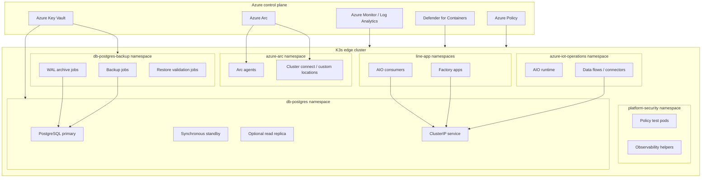
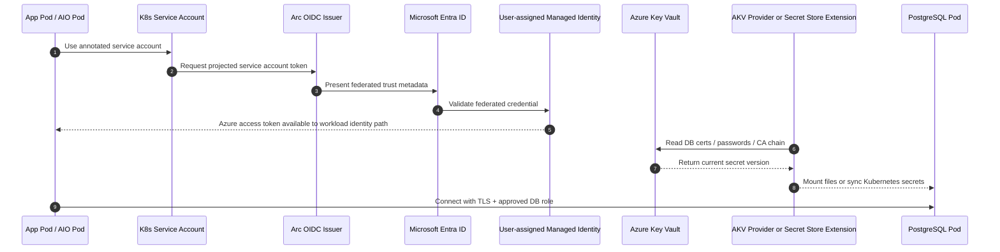
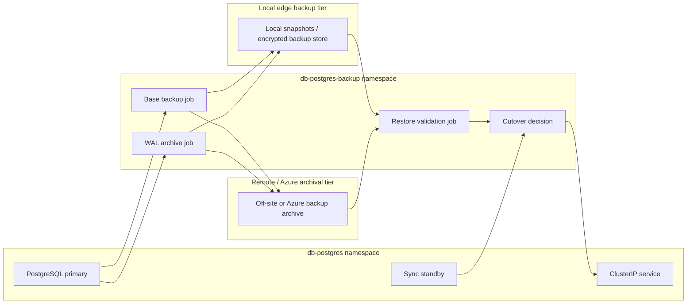

# PostgreSQL on AIO/K3s – Diagram Pack

Use this diagram pack as **Section 3.3 – Visual architecture diagrams** in the original PostgreSQL reference design.

## 3.3 Visual architecture diagrams

The following diagrams can be pasted directly into Markdown renderers that support **Mermaid**, and the pseudo-Visio versions can be used in Word or plain-text runbooks when Mermaid rendering is not available.

### Namespace layout diagram (Mermaid)



### Namespace layout diagram (pseudo-Visio)

```text
+----------------------------------------------------------------------------------+
|                               Azure Control Plane                                |
|  Azure Arc | Azure Policy | Defender for Containers | Key Vault | Azure Monitor |
+-------------------------------------------+--------------------------------------+
                                            |
                                            v
+----------------------------------------------------------------------------------+
|                                 K3s Edge Cluster                                 |
|                                                                                  |
|  +------------------+   +--------------------------+   +----------------------+   |
|  | azure-arc        |   | azure-iot-operations     |   | platform-security    |   |
|  | Arc agents       |   | AIO runtime / connectors |   | policy + observability|  |
|  +------------------+   +--------------------------+   +----------------------+   |
|                                                                                  |
|  +------------------------------------+   +-----------------------------------+   |
|  | db-postgres                        |   | db-postgres-backup                |   |
|  | PostgreSQL primary                 |<--| backup jobs / WAL archive / test  |   |
|  | sync standby / optional replica    |   +-----------------------------------+   |
|  | ClusterIP service                  |                                       |   |
|  +------------------^-----------------+                                       |   |
|                     |                                                         |   |
|      +--------------+------------------------------+                          |   |
|      | line-app namespaces / AIO consumers         |--------------------------+   |
|      | approved app namespaces only                |                              |
|      +---------------------------------------------+                              |
+----------------------------------------------------------------------------------+
```

### Identity and Key Vault flow (Mermaid)



### Identity and Key Vault flow (pseudo-Visio)

```text
[App Pod / AIO Pod]
        |
        | annotated service account
        v
[Kubernetes Service Account] --> [Arc OIDC Issuer] --> [Microsoft Entra ID]
                                                          |
                                                          v
                                           [User-assigned Managed Identity]
                                                          |
                                                          v
                                                   [Azure Key Vault]
                                                          |
                                                          v
                              [AKV Provider or Secret Store Extension on cluster]
                                                          |
                                                          v
                                            [PostgreSQL Pod: certs / creds mounted]
                                                          |
                                                          v
                                         [TLS connection using approved DB role]
```

### Backup and restore flow (Mermaid)



### Backup and restore flow (pseudo-Visio)

```text
+------------------------+        +----------------------------------+
| db-postgres namespace  |        | db-postgres-backup namespace     |
| PostgreSQL primary     |------->| Base backup job                  |
| Sync standby           |------->| WAL archive job                  |
| ClusterIP service      |        | Restore validation job           |
+-----------+------------+        +----------------+-----------------+
            |                                      |
            v                                      v
+-------------------------------+      +-------------------------------+
| Local edge backup tier        |      | Remote / Azure archival tier  |
| encrypted snapshots / backups |      | off-site backups / WAL archive|
+---------------+---------------+      +---------------+---------------+
                \\                                 /
                 \\                               /
                  v                             v
                 +----------------------------------+
                 | Restore validation + cutover     |
                 | validate DB, then repoint service|
                 +----------------------------------+
```
