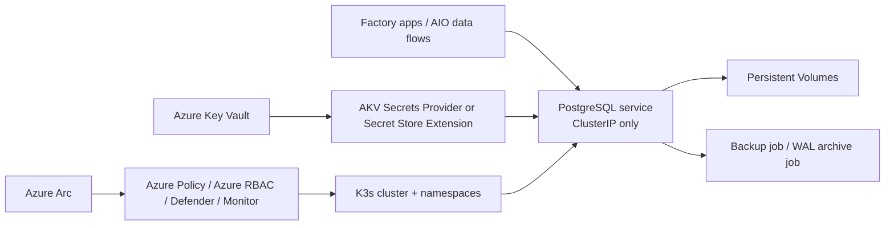
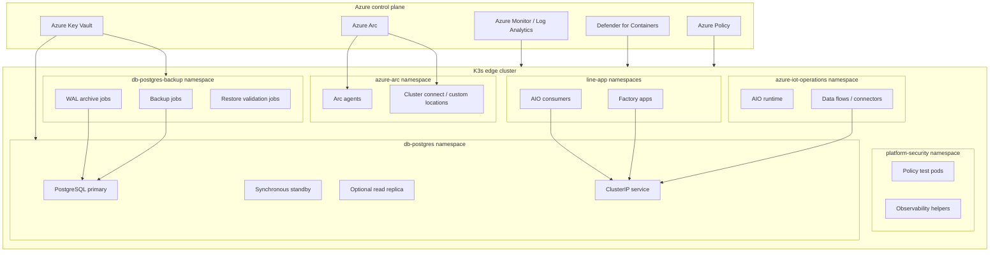
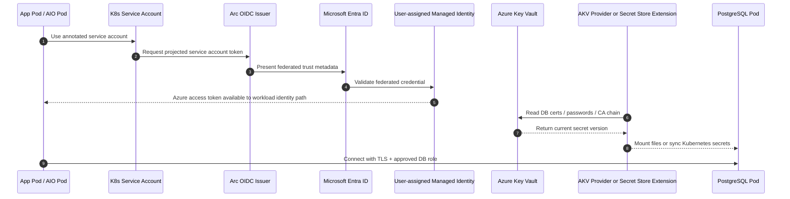
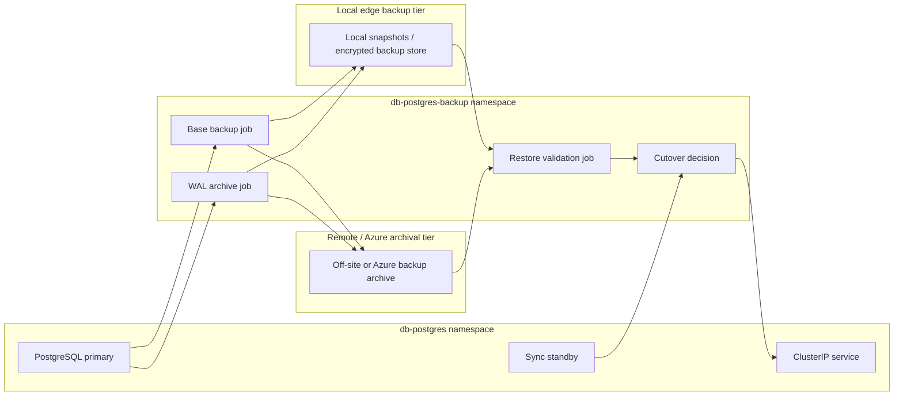

# PostgreSQL on AIO/K3s – Secure Edge Reference Design

## 1. Purpose and scope

This reference design describes a **production-oriented PostgreSQL deployment pattern** for an **Azure IoT Operations (AIO)** cluster running on **K3s** at a factory edge location. It assumes the Kubernetes cluster is **Azure Arc-enabled**, that **AIO is deployed with secure settings for production**, and that the plant requires an architecture that balances **availability**, **controlled offline operation**, **certificate/secret rotation**, and **centralized governance from Azure**. AIO production guidance requires an Arc-enabled cluster with **custom locations** and **workload identity** enabled, and recommends configuring **your own certificate authority issuer** for production deployments. [Microsoft Learn – Deploy Azure IoT Operations to a production cluster](https://learn.microsoft.com/en-us/azure/iot-operations/deploy-iot-ops/howto-deploy-iot-operations), [Microsoft Learn – Deploy and configure workload identity federation in Azure Arc-enabled Kubernetes](https://learn.microsoft.com/en-us/azure/azure-arc/kubernetes/workload-identity), [Microsoft Learn – Create and manage custom locations on Azure Arc-enabled Kubernetes](https://learn.microsoft.com/en-us/azure/azure-arc/kubernetes/custom-locations)

This design is prescriptive rather than generic: it identifies the **preferred namespace layout**, **identity and Key Vault patterns**, **certificate rotation flow**, **network zones**, **backup/restore runbook**, and **Azure governance mappings** that should be implemented first in a regulated or high-availability factory environment. Azure Arc enables the cluster to appear as an Azure resource so it can be governed with resource groups, tags, Azure Policy, Azure RBAC, Defender for Containers, and Arc extensions. [Microsoft Learn – Governance, security, and compliance baseline for Azure Arc-enabled Kubernetes](https://learn.microsoft.com/en-us/azure/cloud-adoption-framework/scenarios/hybrid/arc-enabled-kubernetes/eslz-arc-kubernetes-governance-disciplines)

## 2. Design goals

- Keep the **production line resilient** when WAN connectivity is intermittent or unavailable. For edge clusters outside Azure cloud, Microsoft recommends the **Azure Key Vault Secret Store extension (SSE)** when perfect connectivity to Key Vault cannot be assumed, because it supports **offline access** by synchronizing secrets into the Kubernetes secret store. [Microsoft Learn – Use the Azure Key Vault Secret Store extension for offline access](https://learn.microsoft.com/en-us/azure/azure-arc/kubernetes/secret-store-extension), [Microsoft Learn – Azure Key Vault Secret Store extension configuration reference](https://learn.microsoft.com/en-us/azure/azure-arc/kubernetes/secret-store-extension-reference)
- Use **workload identity federation** wherever pods need Azure resources, so long-lived credentials are not embedded in manifests or stored in application containers. Azure Arc workload identity uses OIDC federation with Microsoft Entra to let workloads obtain Azure tokens without storing secrets or certificates in pods. [Microsoft Learn – Deploy and configure workload identity federation in Azure Arc-enabled Kubernetes](https://learn.microsoft.com/en-us/azure/azure-arc/kubernetes/workload-identity), [Microsoft Learn – Workload identity federation in Azure Arc-enabled Kubernetes](https://learn.microsoft.com/en-us/azure/azure-arc/kubernetes/conceptual-workload-identity)
- Treat the K3s cluster as part of the PostgreSQL trust boundary and harden it accordingly: K3s documents enabling **`protect-kernel-defaults`**, **`secrets-encryption`**, **Pod Security Admission**, and **API server audit logging** as part of a CIS-aligned hardening posture. [K3s documentation – CIS Hardening Guide](https://docs.k3s.io/security/hardening-guide)
- Restrict who can change the cluster or database through **Azure RBAC**, **Kubernetes RBAC**, **GitOps**, and **NetworkPolicies**, while using **Azure Policy** and **Defender for Containers** to centralize compliance and threat visibility. Azure Policy for Kubernetes extends Gatekeeper for centralized enforcement, and Defender for Containers on Arc-enabled Kubernetes provides runtime threat detection, posture management, and vulnerability assessment from Azure. [Microsoft Learn – Understand Azure Policy for Kubernetes clusters](https://learn.microsoft.com/en-us/azure/governance/policy/concepts/policy-for-kubernetes), [Microsoft Learn – Defender for Containers on Arc-enabled Kubernetes overview](https://learn.microsoft.com/en-us/azure/defender-for-cloud/defender-for-containers-arc-overview), [Microsoft Learn – Deploy Defender for Containers on Arc-enabled Kubernetes programmatically](https://learn.microsoft.com/en-us/azure/defender-for-cloud/defender-for-containers-arc-enable-programmatically)

## 3. Architecture overview

### 3.1 Preferred deployment pattern

**Preferred topology for a multi-node factory cluster**

- **Arc-enabled K3s cluster** with AIO deployed in production mode and the following Azure features enabled: **cluster connect**, **custom locations**, **workload identity**, **Azure Policy extension**, **Defender for Containers extension**, and either the **AKV Secrets Provider extension** (online-only) or the **AKV Secret Store extension** (offline/semi-disconnected). AIO production deployment explicitly uses Arc, custom locations, workload identity, Key Vault, and user-assigned managed identities. [Microsoft Learn – Deploy Azure IoT Operations to a production cluster](https://learn.microsoft.com/en-us/azure/iot-operations/deploy-iot-ops/howto-deploy-iot-operations), [Microsoft Learn – Create and manage custom locations on Azure Arc-enabled Kubernetes](https://learn.microsoft.com/en-us/azure/azure-arc/kubernetes/custom-locations), [Microsoft Learn – Use the Azure Key Vault Secret Store extension for offline access](https://learn.microsoft.com/en-us/azure/azure-arc/kubernetes/secret-store-extension)
- A **PostgreSQL HA workload** deployed as a **primary + synchronous standby + optional read-only standby** if the plant has at least three schedulable nodes and storage that supports persistent volumes. CloudNativePG documents PostgreSQL primary/standby architecture, native streaming replication, synchronous replication options, built-in TLS, and point-in-time recovery capabilities for Kubernetes environments. [CloudNativePG – PostgreSQL Operator for Kubernetes](https://cloudnative-pg.io/)
- The PostgreSQL workload is exposed **only through an internal ClusterIP service** and is reachable only from approved namespaces and service accounts via **NetworkPolicies** and PostgreSQL host-based auth rules. PostgreSQL uses `listen_addresses` to limit network listeners and `pg_hba.conf` to restrict which user/database/source combinations may connect. [PostgreSQL documentation – Connection settings / `listen_addresses`](https://www.postgresql.org/docs/current/runtime-config-connection.html), [PostgreSQL documentation – `pg_hba.conf`](https://www.postgresql.org/docs/current/auth-pg-hba-conf.html)
- Database credentials, TLS materials, and backup target credentials are sourced from **Azure Key Vault**. For connected sites, prefer the **AKV Secrets Provider** to mount secrets directly into pods; for semi-disconnected sites, prefer the **Secret Store extension** so the database can still start if Key Vault is temporarily unreachable. Microsoft explicitly recommends the online provider when persistent local copies are not desired and recommends SSE for clusters where connectivity may not be perfect; Microsoft also advises **not** running both side by side on the same cluster. [Microsoft Learn – Use the Azure Key Vault Secrets Provider extension on Arc-enabled Kubernetes](https://learn.microsoft.com/en-us/azure/azure-arc/kubernetes/tutorial-akv-secrets-provider), [Microsoft Learn – Use the Azure Key Vault Secret Store extension for offline access](https://learn.microsoft.com/en-us/azure/azure-arc/kubernetes/secret-store-extension)

**Fallback topology for a single-node or low-resource plant**

- Run a **single PostgreSQL instance** with well-defined maintenance windows, frequent local backups, and an explicitly accepted outage model. K3s and AIO support edge scenarios on resource-constrained systems, but the HA benefits of synchronous replication require multi-node capacity. Microsoft’s AIO cluster preparation guidance distinguishes between single-node and multi-node/fault-tolerant deployments. [Microsoft Learn – Prepare your Azure Arc-enabled Kubernetes cluster for Azure IoT Operations](https://learn.microsoft.com/en-us/azure/iot-operations/deploy-iot-ops/howto-prepare-cluster)

### 3.2 High-level component model

The database is intentionally **not** treated as a general shared service for every workload on the cluster. Instead, it is a **line-of-business stateful workload** with a narrow trust boundary, a dedicated namespace, dedicated service accounts, and separate operational runbooks. Arc-enabled Kubernetes makes the cluster an Azure resource so governance and extension lifecycle can be managed centrally, while custom locations create Azure-scoped deployment abstractions over namespaces. citeturn2search67turn2search89turn2search90

## 4. Prescriptive namespace layout

Use the following namespace model:

- **`azure-arc`** – Arc agents and control-plane integration. Arc agents are deployed to the `azure-arc` namespace when a cluster is connected to Azure Arc. citeturn2search72
- **`kube-system`** – K3s system components and selected cluster-scoped extensions that install there. [K3s documentation – CIS Hardening Guide](https://docs.k3s.io/security/hardening-guide)
- **`azure-iot-operations`** – AIO runtime components. Microsoft’s AIO production deployment creates and manages the AIO instance and related components on the Arc-enabled cluster. [Microsoft Learn – Deploy Azure IoT Operations to a production cluster](https://learn.microsoft.com/en-us/azure/iot-operations/deploy-iot-ops/howto-deploy-iot-operations)
- **`platform-security`** – optional namespace for policy test workloads, admission policy validation, or shared platform observability helpers; keep it platform-admin only. Azure Policy and Defender for Containers operate cluster-wide through Arc extensions, but separating platform-owned helper workloads reduces accidental coupling with application namespaces. [Microsoft Learn – Understand Azure Policy for Kubernetes clusters](https://learn.microsoft.com/en-us/azure/governance/policy/concepts/policy-for-kubernetes), [Microsoft Learn – Defender for Containers on Arc-enabled Kubernetes overview](https://learn.microsoft.com/en-us/azure/defender-for-cloud/defender-for-containers-arc-overview)
- **`db-postgres`** – PostgreSQL pods, services, config maps, service accounts, and PVCs. This namespace should be **dedicated** to the database and **not reused** by applications. Namespace isolation is a key control for NetworkPolicies, Pod Security, and RoleBindings. [Microsoft Learn – Understand Azure Policy for Kubernetes clusters](https://learn.microsoft.com/en-us/azure/governance/policy/concepts/policy-for-kubernetes), [Microsoft Learn – Governance, security, and compliance baseline for Azure Arc-enabled Kubernetes](https://learn.microsoft.com/en-us/azure/cloud-adoption-framework/scenarios/hybrid/arc-enabled-kubernetes/eslz-arc-kubernetes-governance-disciplines)
- **`db-postgres-backup`** – backup/restore jobs, WAL shipping agents, and restore validation jobs. Separate it from the runtime namespace to simplify least-privilege grants and reduce the blast radius of backup tooling. K3s and Arc guidance emphasize using RBAC and strong operational controls for workloads and day-2 operations. [K3s documentation – CIS Hardening Guide](https://docs.k3s.io/security/hardening-guide)
- **`line-<plant-app>`** namespaces – application or AIO connector namespaces that are permitted to reach PostgreSQL through explicit NetworkPolicies and database roles only. Custom locations map **one-to-one** to namespaces; use custom locations only where an Azure-facing deployment target abstraction is needed, not for the database namespace itself. [Microsoft Learn – Create and manage custom locations on Azure Arc-enabled Kubernetes](https://learn.microsoft.com/en-us/azure/azure-arc/kubernetes/custom-locations)

### 4.1 Namespace layout diagram (Mermaid)

### Namespace governance rules

1. Do **not** deploy PostgreSQL into `default`, `azure-iot-operations`, or shared app namespaces. Namespace scoping is the first line of defense for RBAC, policy, and network segregation in Arc-enabled Kubernetes. [Microsoft Learn – Understand Azure Policy for Kubernetes clusters](https://learn.microsoft.com/en-us/azure/governance/policy/concepts/policy-for-kubernetes), [Microsoft Learn – Governance, security, and compliance baseline for Azure Arc-enabled Kubernetes](https://learn.microsoft.com/en-us/azure/cloud-adoption-framework/scenarios/hybrid/arc-enabled-kubernetes/eslz-arc-kubernetes-governance-disciplines)
2. Enable **cluster connect** and **custom locations** only where they are needed for Azure-side management. Custom locations depend on cluster connect and map Azure deployment scopes to namespaces; that makes namespace hygiene important. [Microsoft Learn – Create and manage custom locations on Azure Arc-enabled Kubernetes](https://learn.microsoft.com/en-us/azure/azure-arc/kubernetes/custom-locations), [Microsoft Learn – Identity and access overview for Azure Arc-enabled Kubernetes](https://learn.microsoft.com/en-us/azure/azure-arc/kubernetes/identity-access-overview)
3. Apply **Pod Security Admission** and policy guardrails per namespace, with stricter settings for `db-postgres` and `db-postgres-backup` than for application namespaces. K3s supports Pod Security hardening controls as part of its CIS guidance, and Azure Policy can audit/deny Kubernetes resource configurations centrally. [K3s documentation – CIS Hardening Guide](https://docs.k3s.io/security/hardening-guide), [Microsoft Learn – Understand Azure Policy for Kubernetes clusters](https://learn.microsoft.com/en-us/azure/governance/policy/concepts/policy-for-kubernetes)

## 5. Identities and Key Vault flow

### 5.1 Identity model

Use **three separate identity planes**:

1. **Azure control plane identities** – Azure administrators, platform operators, and security operators granted access through **Azure RBAC** at subscription/resource-group/cluster scopes. Azure Arc-enabled Kubernetes supports Azure RBAC for cluster authorization and can also be paired with cluster connect. [Microsoft Learn – Use Azure RBAC on Azure Arc-enabled Kubernetes clusters](https://learn.microsoft.com/en-us/azure/azure-arc/kubernetes/azure-rbac), [Microsoft Learn – Identity and access overview for Azure Arc-enabled Kubernetes](https://learn.microsoft.com/en-us/azure/azure-arc/kubernetes/identity-access-overview)
2. **Kubernetes identities** – namespace-scoped **service accounts** with Kubernetes RBAC grants limited to the exact secrets, config, jobs, and pods they need. Arc security guidance recommends Kubernetes RBAC for nonhuman API access and Azure RBAC and/or Entra-backed auth for human access. [Microsoft Learn – Identity and access overview for Azure Arc-enabled Kubernetes](https://learn.microsoft.com/en-us/azure/azure-arc/kubernetes/identity-access-overview)
3. **Database identities** – PostgreSQL roles for application access, migrations, backup, replication, and break-glass admin. PostgreSQL stores DB credentials independently and supports strong host/user/database matching with `pg_hba.conf`. [PostgreSQL documentation – `pg_hba.conf`](https://www.postgresql.org/docs/current/auth-pg-hba-conf.html), [PostgreSQL documentation – Password authentication / SCRAM](https://www.postgresql.org/docs/current/auth-password.html)

### 5.2 Prescriptive Azure identity assignments

Use the following user-assigned managed identities (UAMIs):

- **`uami-aio-components`** – for AIO components that need Azure access. AIO production guidance creates/uses a user-assigned managed identity for AIO components and separately for secrets. [Microsoft Learn – Deploy Azure IoT Operations to a production cluster](https://learn.microsoft.com/en-us/azure/iot-operations/deploy-iot-ops/howto-deploy-iot-operations)
- **`uami-aio-secrets`** – for AIO secret sync to Key Vault. Microsoft explicitly says not to reuse the same managed identity for AIO components and secrets. [Microsoft Learn – Deploy Azure IoT Operations to a production cluster](https://learn.microsoft.com/en-us/azure/iot-operations/deploy-iot-ops/howto-deploy-iot-operations)
- **`uami-pg-runtime`** – for the PostgreSQL workload or sidecars that need Azure access (for example to fetch backup credentials or write backups to Azure storage endpoints through a brokered mechanism). Configure this via **Arc workload identity federation** rather than embedding secrets. [Microsoft Learn – Deploy and configure workload identity federation in Azure Arc-enabled Kubernetes](https://learn.microsoft.com/en-us/azure/azure-arc/kubernetes/workload-identity), [Microsoft Learn – Workload identity federation in Azure Arc-enabled Kubernetes](https://learn.microsoft.com/en-us/azure/azure-arc/kubernetes/conceptual-workload-identity)
- **`uami-pg-backup`** – dedicated identity for backup/restore jobs and archive jobs. Separation of duties reduces blast radius and simplifies audit trails. Arc workload identity supports individual managed identities bound to specific service accounts and pod labels. [Microsoft Learn – Deploy and configure workload identity federation in Azure Arc-enabled Kubernetes](https://learn.microsoft.com/en-us/azure/azure-arc/kubernetes/workload-identity), [Microsoft Learn – Workload identity federation in Azure Arc-enabled Kubernetes](https://learn.microsoft.com/en-us/azure/azure-arc/kubernetes/conceptual-workload-identity)

### 5.3 Key Vault consumption pattern

**Connected site pattern (preferred when WAN is reliable):**

- Install the **Azure Key Vault Secrets Provider extension** on the Arc-enabled cluster. It mounts **secrets, keys, and certificates** into pods through the CSI interface, supports **auto rotation**, and by default **does not store secrets persistently** in the Kubernetes secret store. Microsoft recommends this online-only pattern when you want to avoid local secret copies and the cluster has reliable connectivity to Key Vault. [Microsoft Learn – Use the Azure Key Vault Secrets Provider extension on Arc-enabled Kubernetes](https://learn.microsoft.com/en-us/azure/azure-arc/kubernetes/tutorial-akv-secrets-provider)
- Use `SecretProviderClass` resources in `db-postgres` for the PostgreSQL server certificate, CA bundle, application credentials, and backup target credentials if they are short-lived or must not persist in etcd. The provider supports mounted files and optional Kubernetes secret sync. [Microsoft Learn – Use the Azure Key Vault Secrets Provider extension on Arc-enabled Kubernetes](https://learn.microsoft.com/en-us/azure/azure-arc/kubernetes/tutorial-akv-secrets-provider), [Microsoft Learn – Azure Key Vault Secret Store extension configuration reference](https://learn.microsoft.com/en-us/azure/azure-arc/kubernetes/secret-store-extension-reference)

**Semi-disconnected site pattern (preferred when database startup must survive WAN loss):**

- Install the **Azure Key Vault Secret Store extension (SSE)** on the Arc-enabled cluster. SSE is recommended for clusters outside Azure where connectivity to Key Vault may not be perfect, because it synchronizes secrets from Key Vault into the cluster secret store for **offline access**. Microsoft explicitly notes that synchronized secrets are critical business assets and recommends encrypting the Kubernetes secret store for extra protection. [Microsoft Learn – Use the Azure Key Vault Secret Store extension for offline access](https://learn.microsoft.com/en-us/azure/azure-arc/kubernetes/secret-store-extension), [K3s documentation – CIS Hardening Guide](https://docs.k3s.io/security/hardening-guide)
- Use SSE for the PostgreSQL **server keypair**, **trusted CA chain**, **application password material**, and **backup credentials** that must be available even if Key Vault is temporarily unreachable during pod scheduling or restart. Configure **rotation poll interval** and **jitter** centrally in the extension if many secrets are synchronized to avoid rate limits and thundering-herd effects. [Microsoft Learn – Azure Key Vault Secret Store extension configuration reference](https://learn.microsoft.com/en-us/azure/azure-arc/kubernetes/secret-store-extension-reference)

### 5.4 Identity and Key Vault flow

Arc workload identity requires the cluster’s **OIDC issuer** and **workload identity feature** to be enabled, and it projects a signed service account token that Microsoft Entra can trust via a federated credential. AIO production deployment also uses federated identity credentials and secret sync as part of its secure settings pattern. [Microsoft Learn – Deploy and configure workload identity federation in Azure Arc-enabled Kubernetes](https://learn.microsoft.com/en-us/azure/azure-arc/kubernetes/workload-identity), [Microsoft Learn – Workload identity federation in Azure Arc-enabled Kubernetes](https://learn.microsoft.com/en-us/azure/azure-arc/kubernetes/conceptual-workload-identity), [Microsoft Learn – Deploy Azure IoT Operations to a production cluster](https://learn.microsoft.com/en-us/azure/iot-operations/deploy-iot-ops/howto-deploy-iot-operations)

## 6. Certificate and rotation flow

### 6.1 Certificate authority model

Use a **plant-controlled or enterprise-controlled CA/issuer** for PostgreSQL TLS instead of relying on the Kubernetes cluster root CA. Kubernetes documentation warns that workload certificates should not assume validation against the cluster root CA, and AIO production guidance recommends bringing your own issuer for production deployments. [Microsoft Learn – Deploy Azure IoT Operations to a production cluster](https://learn.microsoft.com/en-us/azure/iot-operations/deploy-iot-ops/howto-deploy-iot-operations)

Recommended certificate sets:

- **PostgreSQL server certificate** – presented by the DB service/pods to clients. [PostgreSQL documentation – Connection settings / `listen_addresses`](https://www.postgresql.org/docs/current/runtime-config-connection.html)
- **Client CA bundle** – trusted by PostgreSQL if you enforce client certificate authentication for admin or backup endpoints. PostgreSQL supports certificate-based authentication through `pg_hba.conf`. [PostgreSQL documentation – `pg_hba.conf`](https://www.postgresql.org/docs/current/auth-pg-hba-conf.html), [PostgreSQL documentation – Password authentication / SCRAM](https://www.postgresql.org/docs/current/auth-password.html)
- **Internal CA chain** – made available to application pods and backup jobs so they can validate the server certificate. Kubernetes recommends distributing custom CA bundles to workloads explicitly rather than relying on the cluster root CA. citeturn1search31

### 6.2 PostgreSQL TLS posture

Implement the following as baseline:

- Require **TLS for all TCP client connections** to PostgreSQL and use `hostssl` rules in `pg_hba.conf` for network access. PostgreSQL distinguishes between `host`, `hostssl`, and `hostnossl` connection types, allowing SSL-only access policies. [PostgreSQL documentation – `pg_hba.conf`](https://www.postgresql.org/docs/current/auth-pg-hba-conf.html)
- Use **`scram-sha-256`** for password-based authentication and avoid MD5. PostgreSQL documents SCRAM as the most secure password method currently provided and documents MD5 as deprecated. [PostgreSQL documentation – Password authentication / SCRAM](https://www.postgresql.org/docs/current/auth-password.html)
- Restrict `listen_addresses` to only the service IPs/interfaces the workload truly needs rather than `*` or `0.0.0.0`. PostgreSQL documentation explicitly describes `listen_addresses` as an attack-surface control in addition to authentication. [PostgreSQL documentation – Connection settings / `listen_addresses`](https://www.postgresql.org/docs/current/runtime-config-connection.html)

### 6.3 Rotation pattern

**Recommended rotation sequence**

1. Issue a **new certificate version** in Azure Key Vault under the same logical object name or synchronized secret mapping. The AKV provider and SSE both support rotation behaviors; the online provider supports auto rotation and SSE exposes `rotationPollIntervalInSeconds` for periodic sync. [Microsoft Learn – Use the Azure Key Vault Secrets Provider extension on Arc-enabled Kubernetes](https://learn.microsoft.com/en-us/azure/azure-arc/kubernetes/tutorial-akv-secrets-provider), [Microsoft Learn – Azure Key Vault Secret Store extension configuration reference](https://learn.microsoft.com/en-us/azure/azure-arc/kubernetes/secret-store-extension-reference)
2. Allow the provider/extension to **refresh the mounted or synchronized material** into the `db-postgres` namespace. For online CSI-mounted secrets, file contents can update automatically; for synced Kubernetes secrets, consumers may need reload/restart logic depending on how the application consumes the file or secret. Microsoft documents these secret rotation and reload considerations for the CSI provider. [Microsoft Learn – Use the Azure Key Vault Secrets Provider extension on Arc-enabled Kubernetes](https://learn.microsoft.com/en-us/azure/azure-arc/kubernetes/tutorial-akv-secrets-provider)
3. Trigger a **controlled PostgreSQL configuration reload or rolling restart** using the platform runbook after validating the new certificate chain. PostgreSQL documents `pg_reload_conf()` / SIGHUP-based config reload behavior for `pg_hba.conf`, and operationally a rolling restart may still be required for some TLS key/cert changes depending on how the workload is packaged. [PostgreSQL documentation – `pg_hba.conf`](https://www.postgresql.org/docs/current/auth-pg-hba-conf.html), [CloudNativePG – PostgreSQL Operator for Kubernetes](https://cloudnative-pg.io/)
4. Validate **client trust**, **replication trust**, and **backup job trust** before deprecating the previous cert version. This is especially important in factories where a failed cert rotation can stop the line. PostgreSQL TLS and HA guidance for Kubernetes emphasize ensuring both server-side and replication-side trust paths are correct. [CloudNativePG – PostgreSQL Operator for Kubernetes](https://cloudnative-pg.io/)

### 6.4 Rotation policy recommendations

- Rotate **server certificates** on a fixed schedule (for example 90–180 days) and force an **out-of-band rotation** after plant maintenance incidents or suspected key exposure. The exact cadence is an enterprise policy decision, but the technical pattern should rely on Key Vault versioning plus extension/provider refresh. [Microsoft Learn – Use the Azure Key Vault Secrets Provider extension on Arc-enabled Kubernetes](https://learn.microsoft.com/en-us/azure/azure-arc/kubernetes/tutorial-akv-secrets-provider), [Microsoft Learn – Azure Key Vault Secret Store extension configuration reference](https://learn.microsoft.com/en-us/azure/azure-arc/kubernetes/secret-store-extension-reference)
- Rotate **database passwords** by moving applications toward **federated identity where possible**, and for remaining passwords, store them in Key Vault and roll them using staged dual-cutover runbooks. PostgreSQL’s SCRAM password model is preferred for remaining password-based access. [PostgreSQL documentation – Password authentication / SCRAM](https://www.postgresql.org/docs/current/auth-password.html), [Microsoft Learn – Deploy and configure workload identity federation in Azure Arc-enabled Kubernetes](https://learn.microsoft.com/en-us/azure/azure-arc/kubernetes/workload-identity)
- If using SSE, ensure **K3s secret encryption** is enabled because synchronized secrets are stored in the Kubernetes secret store. K3s explicitly supports secrets encryption at rest, and Microsoft recommends encrypting the cluster secret store when SSE is used. [K3s documentation – CIS Hardening Guide](https://docs.k3s.io/security/hardening-guide), [Microsoft Learn – Use the Azure Key Vault Secret Store extension for offline access](https://learn.microsoft.com/en-us/azure/azure-arc/kubernetes/secret-store-extension)

## 7. Network policy zones

### 7.1 Prescriptive network zones

Define the following logical zones:

1. **Zone A – Arc / platform management**: `azure-arc`, Azure Policy, Defender, Monitor, custom locations, and cluster connect agents. Arc operates through outbound connections and does not require inbound firewall ports for cluster management or cluster connect. citeturn2search72turn2search76turn2search77
2. **Zone B – AIO runtime**: `azure-iot-operations` and approved line application namespaces. These namespaces may call PostgreSQL only on the PostgreSQL service port and only from explicitly allowed service accounts. AIO is deployed as an Arc-managed production workload on the cluster. [Microsoft Learn – Deploy Azure IoT Operations to a production cluster](https://learn.microsoft.com/en-us/azure/iot-operations/deploy-iot-ops/howto-deploy-iot-operations)
3. **Zone C – PostgreSQL data plane**: `db-postgres` namespace. Only allow inbound from approved application namespaces and from `db-postgres-backup`; deny all other east-west traffic by default through NetworkPolicies. Azure Policy for Kubernetes can centrally audit or enforce required NetworkPolicy patterns. [Microsoft Learn – Understand Azure Policy for Kubernetes clusters](https://learn.microsoft.com/en-us/azure/governance/policy/concepts/policy-for-kubernetes), [Microsoft Learn – Governance, security, and compliance baseline for Azure Arc-enabled Kubernetes](https://learn.microsoft.com/en-us/azure/cloud-adoption-framework/scenarios/hybrid/arc-enabled-kubernetes/eslz-arc-kubernetes-governance-disciplines)
4. **Zone D – Backup and restore**: `db-postgres-backup` namespace. Permit egress only to PostgreSQL, approved object storage targets or local backup targets, Key Vault/Arc endpoints as needed, and monitoring endpoints. Arc and Defender documentation emphasize validating outbound requirements for extensions and sensors. [Microsoft Learn – Deploy Defender for Containers on Arc-enabled Kubernetes programmatically](https://learn.microsoft.com/en-us/azure/defender-for-cloud/defender-for-containers-arc-enable-programmatically), [Microsoft Learn – Use the Azure Key Vault Secrets Provider extension on Arc-enabled Kubernetes](https://learn.microsoft.com/en-us/azure/azure-arc/kubernetes/tutorial-akv-secrets-provider)
5. **Zone E – External edge/plant network**: PLC/OT networks and site integration networks should never connect directly to PostgreSQL unless there is a formally approved integration service that terminates the connection in an application namespace. Keep the DB behind Kubernetes services and application mediation. Arc governance guidance recommends clear security boundary and access design for hybrid clusters. [Microsoft Learn – Governance, security, and compliance baseline for Azure Arc-enabled Kubernetes](https://learn.microsoft.com/en-us/azure/cloud-adoption-framework/scenarios/hybrid/arc-enabled-kubernetes/eslz-arc-kubernetes-governance-disciplines)

### 7.2 Mandatory network controls

- **Default deny** ingress and egress in `db-postgres` and `db-postgres-backup`. Implement allowlists only for required flows. Azure Policy can apply admission-based safeguards at scale to enforce such cluster component policies. [Microsoft Learn – Understand Azure Policy for Kubernetes clusters](https://learn.microsoft.com/en-us/azure/governance/policy/concepts/policy-for-kubernetes)
- Expose PostgreSQL as **ClusterIP only**. Do not publish it through NodePort, LoadBalancer, or ingress controllers. PostgreSQL already provides its own authentication boundary; there is no reason to widen the reachable surface at the edge. PostgreSQL’s `listen_addresses` should also stay narrow. [PostgreSQL documentation – Connection settings / `listen_addresses`](https://www.postgresql.org/docs/current/runtime-config-connection.html), [PostgreSQL documentation – `pg_hba.conf`](https://www.postgresql.org/docs/current/auth-pg-hba-conf.html)
- Require **TLS** end to end on all PostgreSQL traffic, including replication and admin paths. PostgreSQL supports SSL/TLS and certificate-authenticated client access; this is a natural fit for admin and backup controls. [PostgreSQL documentation – `pg_hba.conf`](https://www.postgresql.org/docs/current/auth-pg-hba-conf.html)
- Validate outbound access only for required Azure endpoints for Arc, Defender, and the AKV extension you choose. Arc agents work through outbound connectivity, and Defender on Arc requires outbound access to Defender endpoints. [Microsoft Learn – Deploy Defender for Containers on Arc-enabled Kubernetes programmatically](https://learn.microsoft.com/en-us/azure/defender-for-cloud/defender-for-containers-arc-enable-programmatically)

## 8. PostgreSQL workload design and hardening

### 8.1 Authentication and authorization

Use this PostgreSQL baseline:

- `password_encryption = 'scram-sha-256'` and `pg_hba.conf` rules using **`scram-sha-256`** or **certificate auth** for admins. PostgreSQL documents SCRAM as the preferred password authentication method and explains how `pg_hba.conf` determines authentication. [PostgreSQL documentation – Password authentication / SCRAM](https://www.postgresql.org/docs/current/auth-password.html), [PostgreSQL documentation – `pg_hba.conf`](https://www.postgresql.org/docs/current/auth-pg-hba-conf.html)
- Separate roles for **application**, **migration**, **backup**, **replication**, and **break-glass DBA** access. PostgreSQL role/password controls are independent from OS accounts and should be scoped narrowly by schema/database. [PostgreSQL documentation – Password authentication / SCRAM](https://www.postgresql.org/docs/current/auth-password.html), [PostgreSQL documentation – `pg_hba.conf`](https://www.postgresql.org/docs/current/auth-pg-hba-conf.html)
- Prefer **client certificate auth** for break-glass admin connections and for privileged automation where practical. PostgreSQL supports certificate authentication methods directly in `pg_hba.conf`. [PostgreSQL documentation – `pg_hba.conf`](https://www.postgresql.org/docs/current/auth-pg-hba-conf.html), [PostgreSQL documentation – Password authentication / SCRAM](https://www.postgresql.org/docs/current/auth-password.html)
- Keep `pg_hba.conf` entries narrow and ordered intentionally because PostgreSQL uses the **first matching rule** with no fall-through. [PostgreSQL documentation – `pg_hba.conf`](https://www.postgresql.org/docs/current/auth-pg-hba-conf.html)

### 8.2 HA and durability

- **Preferred**: primary + synchronous standby + optional read-only standby on separate nodes with anti-affinity if the plant has the capacity. Kubernetes-native PostgreSQL patterns such as CloudNativePG support primary/standby architecture, synchronous replication, rolling updates, and native PITR. [CloudNativePG – PostgreSQL Operator for Kubernetes](https://cloudnative-pg.io/)
- **Minimum acceptable**: single instance with documented maintenance windows and frequent local backup checkpoints when the site lacks multi-node fault tolerance. AIO preparation guidance distinguishes multi-node fault-tolerant scenarios from single-node ones. [Microsoft Learn – Prepare your Azure Arc-enabled Kubernetes cluster for Azure IoT Operations](https://learn.microsoft.com/en-us/azure/iot-operations/deploy-iot-ops/howto-prepare-cluster)
- Define whether the production line requires **zero/near-zero data loss**. If yes, use synchronous replication and test failover behavior; if no, accept asynchronous lag and document the RPO. CloudNativePG documents tuning synchronous replication to pursue zero-data-loss replica behavior. [CloudNativePG – PostgreSQL Operator for Kubernetes](https://cloudnative-pg.io/)

### 8.3 Logging and auditing

- Enable PostgreSQL logging for **authentication failures**, **DDL changes**, **role changes**, and **long-running queries** and stream those logs into the cluster log pipeline. CloudNativePG documents JSON/stdout logging patterns suitable for Kubernetes, and K3s documents API server audit logging for cluster-side change visibility. [CloudNativePG – PostgreSQL Operator for Kubernetes](https://cloudnative-pg.io/), [K3s documentation – CIS Hardening Guide](https://docs.k3s.io/security/hardening-guide)
- Correlate database events with **Kubernetes audit logs**, **GitOps commits**, and **Arc/Defender alerts** for incident response. Arc secure operations guidance specifically emphasizes monitoring control-plane changes and maintaining strong operational controls. [Microsoft Learn – Defender for Containers on Arc-enabled Kubernetes overview](https://learn.microsoft.com/en-us/azure/defender-for-cloud/defender-for-containers-arc-overview)

## 9. Backup and restore runbook

### 9.1 Backup principles

The backup strategy must cover **storage failure**, **logical corruption**, **operator error**, and **site loss**. PostgreSQL’s native strengths are **WAL-based recovery** and **point-in-time recovery (PITR)**, while Kubernetes adds the option for **volume snapshots**. CloudNativePG documents PITR and continuous backup patterns for Kubernetes-based PostgreSQL. [CloudNativePG – PostgreSQL Operator for Kubernetes](https://cloudnative-pg.io/)

### 9.2 Prescriptive backup design

- **Local fast restore tier**: keep local encrypted backups or volume snapshots on site for rapid recovery during production incidents. This minimizes dependency on WAN recovery paths. Edge architecture guidance from Arc and AIO emphasizes planning for local operational autonomy. [Microsoft Learn – Governance, security, and compliance baseline for Azure Arc-enabled Kubernetes](https://learn.microsoft.com/en-us/azure/cloud-adoption-framework/scenarios/hybrid/arc-enabled-kubernetes/eslz-arc-kubernetes-governance-disciplines), [Microsoft Learn – Deploy Azure IoT Operations to a production cluster](https://learn.microsoft.com/en-us/azure/iot-operations/deploy-iot-ops/howto-deploy-iot-operations)
- **Off-site or Azure archival tier**: archive WAL / backup sets off site when connectivity exists. Use a dedicated backup identity and tightly controlled network egress. Arc workload identity and Key Vault integration allow this without storing static credentials in jobs. [Microsoft Learn – Deploy and configure workload identity federation in Azure Arc-enabled Kubernetes](https://learn.microsoft.com/en-us/azure/azure-arc/kubernetes/workload-identity), [Microsoft Learn – Use the Azure Key Vault Secret Store extension for offline access](https://learn.microsoft.com/en-us/azure/azure-arc/kubernetes/secret-store-extension)
- **Secret handling**: if the backup job needs credentials at startup during disconnected periods, source them through **SSE** rather than the online-only provider. SSE is specifically intended to support offline access scenarios. [Microsoft Learn – Use the Azure Key Vault Secret Store extension for offline access](https://learn.microsoft.com/en-us/azure/azure-arc/kubernetes/secret-store-extension), [Microsoft Learn – Azure Key Vault Secret Store extension configuration reference](https://learn.microsoft.com/en-us/azure/azure-arc/kubernetes/secret-store-extension-reference)

### Backup and restore flow (Mermaid)

### 9.3 Backup schedule (recommended baseline)

- **Full base backup** at least daily for the production database, adjusted to plant data volume and retention requirements. PITR-capable PostgreSQL on Kubernetes relies on a sound base-backup cadence plus WAL continuity. [CloudNativePG – PostgreSQL Operator for Kubernetes](https://cloudnative-pg.io/)
- **Continuous WAL archiving** for any workload where data loss beyond a few minutes is unacceptable. PITR depends on WAL continuity. [CloudNativePG – PostgreSQL Operator for Kubernetes](https://cloudnative-pg.io/)
- **Restore validation** at least monthly and after every major DB version upgrade, certificate rotation change, or backup tooling change. Recovery is only trustworthy if it is tested. Arc secure operations guidance emphasizes incident preparedness and operational discipline. [Microsoft Learn – Governance, security, and compliance baseline for Azure Arc-enabled Kubernetes](https://learn.microsoft.com/en-us/azure/cloud-adoption-framework/scenarios/hybrid/arc-enabled-kubernetes/eslz-arc-kubernetes-governance-disciplines)

### 9.4 Restore runbook

**Runbook – standard restore**

1. **Declare incident mode** and capture the current failure state (cluster events, DB logs, Arc alerts, Defender alerts). Defender for Containers on Arc centralizes runtime/security alerts; Kubernetes audit logging and PostgreSQL logs support timeline reconstruction. [Microsoft Learn – Defender for Containers on Arc-enabled Kubernetes overview](https://learn.microsoft.com/en-us/azure/defender-for-cloud/defender-for-containers-arc-overview), [K3s documentation – CIS Hardening Guide](https://docs.k3s.io/security/hardening-guide)
2. **Isolate the failing workload** by scaling down applications that write to the DB and by restricting inbound traffic through NetworkPolicies if corruption or compromise is suspected. Azure Policy and Kubernetes RBAC/NetworkPolicies are part of the operational control set for Arc-enabled clusters. [Microsoft Learn – Understand Azure Policy for Kubernetes clusters](https://learn.microsoft.com/en-us/azure/governance/policy/concepts/policy-for-kubernetes)
3. **Select recovery point**: latest good local snapshot, latest valid base backup + WAL, or last off-site backup. PostgreSQL PITR supports timestamp-based recovery when WAL is available. [CloudNativePG – PostgreSQL Operator for Kubernetes](https://cloudnative-pg.io/)
4. **Restore into a new recovery target** in `db-postgres` or a temporary `db-postgres-restore` namespace rather than overwriting the original immediately. Namespace isolation and RBAC make validation safer before cutover. [Microsoft Learn – Understand Azure Policy for Kubernetes clusters](https://learn.microsoft.com/en-us/azure/governance/policy/concepts/policy-for-kubernetes), [Microsoft Learn – Governance, security, and compliance baseline for Azure Arc-enabled Kubernetes](https://learn.microsoft.com/en-us/azure/cloud-adoption-framework/scenarios/hybrid/arc-enabled-kubernetes/eslz-arc-kubernetes-governance-disciplines)
5. **Validate integrity**: schema checks, row-count checks, application smoke tests, certificate trust, and replication state if HA is enabled. PostgreSQL HA/PITR tooling for Kubernetes expects validation as part of the lifecycle. [CloudNativePG – PostgreSQL Operator for Kubernetes](https://cloudnative-pg.io/)
6. **Cut over** the PostgreSQL service endpoint to the recovered primary, re-enable approved application ingress, and re-open normal schedules. ClusterIP-only service patterns make controlled cutover simpler inside the cluster. [PostgreSQL documentation – Connection settings / `listen_addresses`](https://www.postgresql.org/docs/current/runtime-config-connection.html), [PostgreSQL documentation – `pg_hba.conf`](https://www.postgresql.org/docs/current/auth-pg-hba-conf.html)
7. **Post-incident review**: document RPO/RTO achieved, failed controls, extension/agent states, and whether certificate or secret rotation contributed to the incident. Arc, Policy, and Defender centralize some of this evidence in Azure. [Microsoft Learn – Defender for Containers on Arc-enabled Kubernetes overview](https://learn.microsoft.com/en-us/azure/defender-for-cloud/defender-for-containers-arc-overview), [Microsoft Learn – Understand Azure Policy for Kubernetes clusters](https://learn.microsoft.com/en-us/azure/governance/policy/concepts/policy-for-kubernetes)

## 10. Azure governance mappings (Policy / RBAC / Arc / Defender)

| Governance area                       | Prescriptive mapping                                                                                                                                                                                                                                                                                                                                                                                                                                                                                                                     | Why it matters                                                                                                                                                        |
| ------------------------------------- | ---------------------------------------------------------------------------------------------------------------------------------------------------------------------------------------------------------------------------------------------------------------------------------------------------------------------------------------------------------------------------------------------------------------------------------------------------------------------------------------------------------------------------------------- | --------------------------------------------------------------------------------------------------------------------------------------------------------------------- |
| **Azure Arc**                         | Connect the K3s cluster to Azure Arc so it becomes an Azure resource, enable cluster connect, and use Arc extensions for Policy, Defender, Key Vault integration, and AIO operations. Arc agents establish secure **outbound** connectivity to Azure and enable centralized lifecycle management. citeturn2search67turn2search72turn2search76                                                                                                                                                                                       | Provides a single control plane for governance, inventory, extension lifecycle, tagging, and management across factory clusters. [Microsoft Learn – Governance, security, and compliance baseline for Azure Arc-enabled Kubernetes](https://learn.microsoft.com/en-us/azure/cloud-adoption-framework/scenarios/hybrid/arc-enabled-kubernetes/eslz-arc-kubernetes-governance-disciplines)   |
| **Azure RBAC / Entra**                | Use Azure RBAC for human/admin access to the Arc resource and, where supported, for Kubernetes authorization on Arc-enabled Kubernetes. Pair with Conditional Access / approved admin workflows as required by enterprise policy. Azure RBAC on Arc-enabled Kubernetes lets you control who can read, write, and delete Kubernetes objects through Azure role assignments. [Microsoft Learn – Use Azure RBAC on Azure Arc-enabled Kubernetes clusters](https://learn.microsoft.com/en-us/azure/azure-arc/kubernetes/azure-rbac), [Microsoft Learn – Identity and access overview for Azure Arc-enabled Kubernetes](https://learn.microsoft.com/en-us/azure/azure-arc/kubernetes/identity-access-overview)                                                                                                                            | Centralizes authorization and auditability for platform operators and reduces drift between plants. [Microsoft Learn – Identity and access overview for Azure Arc-enabled Kubernetes](https://learn.microsoft.com/en-us/azure/azure-arc/kubernetes/identity-access-overview)                                |
| **Kubernetes RBAC**                   | Continue to use namespace-scoped Kubernetes RBAC for service accounts and for any scenarios not covered by Azure RBAC support. Arc secure operations guidance specifically recommends Kubernetes RBAC for nonhuman API access. [Microsoft Learn – Use Azure RBAC on Azure Arc-enabled Kubernetes clusters](https://learn.microsoft.com/en-us/azure/azure-arc/kubernetes/azure-rbac)                                                                                                                                                                                                                                                                        | Enforces least privilege inside the cluster for DB pods, backup jobs, and app workloads. [Microsoft Learn – Governance, security, and compliance baseline for Azure Arc-enabled Kubernetes](https://learn.microsoft.com/en-us/azure/cloud-adoption-framework/scenarios/hybrid/arc-enabled-kubernetes/eslz-arc-kubernetes-governance-disciplines)                                           |
| **Azure Policy for Kubernetes**       | Install the Azure Policy extension on the Arc-enabled cluster and assign policies that audit/deny missing NetworkPolicies, privileged pods, weak security contexts, unapproved images, and other baseline controls. Azure Policy for Kubernetes extends Gatekeeper and reports compliance centrally. [Microsoft Learn – Understand Azure Policy for Kubernetes clusters](https://learn.microsoft.com/en-us/azure/governance/policy/concepts/policy-for-kubernetes)                                                                                                                                                                                                  | Supplies policy-as-code guardrails across many edge clusters and supports compliance reporting. [Microsoft Learn – Governance, security, and compliance baseline for Azure Arc-enabled Kubernetes](https://learn.microsoft.com/en-us/azure/cloud-adoption-framework/scenarios/hybrid/arc-enabled-kubernetes/eslz-arc-kubernetes-governance-disciplines), [Microsoft Learn – Understand Azure Policy for Kubernetes clusters](https://learn.microsoft.com/en-us/azure/governance/policy/concepts/policy-for-kubernetes)                                    |
| **Microsoft Defender for Containers** | Enable Defender for Containers for Arc-enabled Kubernetes and deploy the Defender sensor extension if your organization allows the current Arc deployment model. Defender for Containers on Arc provides runtime threat detection, posture management, and vulnerability assessment for Kubernetes outside Azure. Microsoft’s current deployment overview still identifies Arc-enabled Kubernetes support as **Preview**, so validate enterprise policy before mandating it everywhere. [Microsoft Learn – Defender for Containers on Arc-enabled Kubernetes overview](https://learn.microsoft.com/en-us/azure/defender-for-cloud/defender-for-containers-arc-overview), [Microsoft Learn – Deploy Defender for Containers on Arc-enabled Kubernetes programmatically](https://learn.microsoft.com/en-us/azure/defender-for-cloud/defender-for-containers-arc-enable-programmatically) | Adds centralized threat detection and posture visibility for plant clusters and helps correlate security alerts with DB incidents. [Microsoft Learn – Defender for Containers on Arc-enabled Kubernetes overview](https://learn.microsoft.com/en-us/azure/defender-for-cloud/defender-for-containers-arc-overview) |
| **Custom locations**                  | Use custom locations only for namespaces that need Azure-facing deployment targets; do **not** expose the PostgreSQL namespace as a custom location unless a specific Azure resource provider requires it. Custom locations map **one-to-one** to namespaces and depend on cluster connect. [Microsoft Learn – Create and manage custom locations on Azure Arc-enabled Kubernetes](https://learn.microsoft.com/en-us/azure/azure-arc/kubernetes/custom-locations)                                                                                                                                                                                                           | Preserves clear tenancy and prevents accidental overexposure of the DB namespace to Azure-side deployment workflows. citeturn2search89turn2search90               |
| **Key Vault integration**             | Use the AKV Secrets Provider for connected sites and the Secret Store extension for semi-disconnected sites; do not run both side-by-side on the same cluster. For SSE, enable K3s secret encryption. [Microsoft Learn – Use the Azure Key Vault Secrets Provider extension on Arc-enabled Kubernetes](https://learn.microsoft.com/en-us/azure/azure-arc/kubernetes/tutorial-akv-secrets-provider), [Microsoft Learn – Use the Azure Key Vault Secret Store extension for offline access](https://learn.microsoft.com/en-us/azure/azure-arc/kubernetes/secret-store-extension), [K3s documentation – CIS Hardening Guide](https://docs.k3s.io/security/hardening-guide)                                                                                                                                                                                                                                                                                    | Provides a controlled, supportable pattern for certificate and credential rotation at the edge. [Microsoft Learn – Azure Key Vault Secret Store extension configuration reference](https://learn.microsoft.com/en-us/azure/azure-arc/kubernetes/secret-store-extension-reference)                                    |
| **AIO production settings**           | Deploy AIO using the production secure settings path with separate identities for components and secrets, Key Vault, and workload identity federation. [Microsoft Learn – Deploy Azure IoT Operations to a production cluster](https://learn.microsoft.com/en-us/azure/iot-operations/deploy-iot-ops/howto-deploy-iot-operations)                                                                                                                                                                                                                                                                                                                                                              | Keeps the database design aligned with the rest of the edge platform’s security model. [Microsoft Learn – Deploy Azure IoT Operations to a production cluster](https://learn.microsoft.com/en-us/azure/iot-operations/deploy-iot-ops/howto-deploy-iot-operations), [Microsoft Learn – Deploy and configure workload identity federation in Azure Arc-enabled Kubernetes](https://learn.microsoft.com/en-us/azure/azure-arc/kubernetes/workload-identity)                                             |

## 11. Implementation checklist

### Phase 1 – Platform readiness

- Arc-enable the K3s cluster and verify it is in **Connected** state. citeturn2search75turn2search67
- Enable **cluster connect**, **custom locations**, and **workload identity** on the Arc-enabled cluster. Custom locations require cluster connect; workload identity requires OIDC issuer support. [Microsoft Learn – Create and manage custom locations on Azure Arc-enabled Kubernetes](https://learn.microsoft.com/en-us/azure/azure-arc/kubernetes/custom-locations), [Microsoft Learn – Deploy and configure workload identity federation in Azure Arc-enabled Kubernetes](https://learn.microsoft.com/en-us/azure/azure-arc/kubernetes/workload-identity)
- Harden K3s with **`secrets-encryption`**, **`protect-kernel-defaults`**, audit logging, and Pod Security settings. [K3s documentation – CIS Hardening Guide](https://docs.k3s.io/security/hardening-guide)
- Install **Azure Policy** and, if approved, **Defender for Containers** extensions. [Microsoft Learn – Understand Azure Policy for Kubernetes clusters](https://learn.microsoft.com/en-us/azure/governance/policy/concepts/policy-for-kubernetes), [Microsoft Learn – Deploy Defender for Containers on Arc-enabled Kubernetes programmatically](https://learn.microsoft.com/en-us/azure/defender-for-cloud/defender-for-containers-arc-enable-programmatically)

### Phase 2 – Secret and certificate plumbing

- Create separate Key Vault objects for PostgreSQL server cert, CA chain, app credentials, backup credentials, and admin break-glass materials. [Microsoft Learn – Use the Azure Key Vault Secrets Provider extension on Arc-enabled Kubernetes](https://learn.microsoft.com/en-us/azure/azure-arc/kubernetes/tutorial-akv-secrets-provider), [Microsoft Learn – Use the Azure Key Vault Secret Store extension for offline access](https://learn.microsoft.com/en-us/azure/azure-arc/kubernetes/secret-store-extension)
- Choose **AKV Provider** or **SSE** based on site connectivity requirements; do not run both together. [Microsoft Learn – Use the Azure Key Vault Secrets Provider extension on Arc-enabled Kubernetes](https://learn.microsoft.com/en-us/azure/azure-arc/kubernetes/tutorial-akv-secrets-provider), [Microsoft Learn – Use the Azure Key Vault Secret Store extension for offline access](https://learn.microsoft.com/en-us/azure/azure-arc/kubernetes/secret-store-extension)
- Configure **workload identity** for `uami-pg-runtime` and `uami-pg-backup`. [Microsoft Learn – Deploy and configure workload identity federation in Azure Arc-enabled Kubernetes](https://learn.microsoft.com/en-us/azure/azure-arc/kubernetes/workload-identity), [Microsoft Learn – Workload identity federation in Azure Arc-enabled Kubernetes](https://learn.microsoft.com/en-us/azure/azure-arc/kubernetes/conceptual-workload-identity)

### Phase 3 – PostgreSQL deployment

- Create `db-postgres` and `db-postgres-backup` namespaces with namespace-specific RBAC and NetworkPolicies. [Microsoft Learn – Understand Azure Policy for Kubernetes clusters](https://learn.microsoft.com/en-us/azure/governance/policy/concepts/policy-for-kubernetes), [Microsoft Learn – Governance, security, and compliance baseline for Azure Arc-enabled Kubernetes](https://learn.microsoft.com/en-us/azure/cloud-adoption-framework/scenarios/hybrid/arc-enabled-kubernetes/eslz-arc-kubernetes-governance-disciplines)
- Deploy PostgreSQL with TLS, SCRAM, narrow `listen_addresses`, and explicit `pg_hba.conf` allow rules. [PostgreSQL documentation – Password authentication / SCRAM](https://www.postgresql.org/docs/current/auth-password.html), [PostgreSQL documentation – Connection settings / `listen_addresses`](https://www.postgresql.org/docs/current/runtime-config-connection.html), [PostgreSQL documentation – `pg_hba.conf`](https://www.postgresql.org/docs/current/auth-pg-hba-conf.html)
- If multi-node, enable synchronous replication and test failover. [CloudNativePG – PostgreSQL Operator for Kubernetes](https://cloudnative-pg.io/)

### Phase 4 – Operations and recovery

- Implement base backup + WAL archiving and validate restore. [CloudNativePG – PostgreSQL Operator for Kubernetes](https://cloudnative-pg.io/)
- Test certificate rotation and Key Vault secret refresh. [Microsoft Learn – Use the Azure Key Vault Secrets Provider extension on Arc-enabled Kubernetes](https://learn.microsoft.com/en-us/azure/azure-arc/kubernetes/tutorial-akv-secrets-provider), [Microsoft Learn – Azure Key Vault Secret Store extension configuration reference](https://learn.microsoft.com/en-us/azure/azure-arc/kubernetes/secret-store-extension-reference)
- Run quarterly access review for Azure RBAC, Kubernetes RBAC, and PostgreSQL roles. Arc and Azure RBAC support centralized review, while PostgreSQL roles remain DB-scoped. [Microsoft Learn – Use Azure RBAC on Azure Arc-enabled Kubernetes clusters](https://learn.microsoft.com/en-us/azure/azure-arc/kubernetes/azure-rbac), [PostgreSQL documentation – Password authentication / SCRAM](https://www.postgresql.org/docs/current/auth-password.html)

## 12. References

- Microsoft Learn – Deploy Azure IoT Operations to a production cluster: https://learn.microsoft.com/en-us/azure/iot-operations/deploy-iot-ops/howto-deploy-iot-operations
- Microsoft Learn – Prepare your Azure Arc-enabled Kubernetes cluster for Azure IoT Operations: https://learn.microsoft.com/en-us/azure/iot-operations/deploy-iot-ops/howto-prepare-cluster
- Microsoft Learn – Deploy and configure workload identity federation in Azure Arc-enabled Kubernetes: https://learn.microsoft.com/en-us/azure/azure-arc/kubernetes/workload-identity
- Microsoft Learn – Workload identity federation in Azure Arc-enabled Kubernetes: https://learn.microsoft.com/en-us/azure/azure-arc/kubernetes/conceptual-workload-identity
- Microsoft Learn – Azure security baseline for Azure Arc-enabled Kubernetes: https://learn.microsoft.com/en-us/security/benchmark/azure/baselines/azure-arc-enabled-kubernetes-security-baseline
- Microsoft Learn – Governance, security, and compliance baseline for Azure Arc-enabled Kubernetes: https://learn.microsoft.com/en-us/azure/cloud-adoption-framework/scenarios/hybrid/arc-enabled-kubernetes/eslz-arc-kubernetes-governance-disciplines
- Microsoft Learn – Understand Azure Policy for Kubernetes clusters: https://learn.microsoft.com/en-us/azure/governance/policy/concepts/policy-for-kubernetes
- Microsoft Learn – Use Azure RBAC on Azure Arc-enabled Kubernetes clusters: https://learn.microsoft.com/en-us/azure/azure-arc/kubernetes/azure-rbac
- Microsoft Learn – Identity and access overview for Azure Arc-enabled Kubernetes: https://learn.microsoft.com/en-us/azure/azure-arc/kubernetes/identity-access-overview
- Microsoft Learn – Create and manage custom locations on Azure Arc-enabled Kubernetes: https://learn.microsoft.com/en-us/azure/azure-arc/kubernetes/custom-locations
- Microsoft Learn – Use the Azure Key Vault Secrets Provider extension on Arc-enabled Kubernetes: https://learn.microsoft.com/en-us/azure/azure-arc/kubernetes/tutorial-akv-secrets-provider
- Microsoft Learn – Use the Azure Key Vault Secret Store extension for offline access: https://learn.microsoft.com/en-us/azure/azure-arc/kubernetes/secret-store-extension
- Microsoft Learn – Azure Key Vault Secret Store extension configuration reference: https://learn.microsoft.com/en-us/azure/azure-arc/kubernetes/secret-store-extension-reference
- Microsoft Learn – Defender for Containers on Arc-enabled Kubernetes overview: https://learn.microsoft.com/en-us/azure/defender-for-cloud/defender-for-containers-arc-overview
- Microsoft Learn – Deploy Defender for Containers on Arc-enabled Kubernetes programmatically: https://learn.microsoft.com/en-us/azure/defender-for-cloud/defender-for-containers-arc-enable-programmatically
- K3s documentation – CIS Hardening Guide: https://docs.k3s.io/security/hardening-guide
- PostgreSQL documentation – `pg_hba.conf`: https://www.postgresql.org/docs/current/auth-pg-hba-conf.html
- PostgreSQL documentation – Password authentication / SCRAM: https://www.postgresql.org/docs/current/auth-password.html
- PostgreSQL documentation – Connection settings / `listen_addresses`: https://www.postgresql.org/docs/current/runtime-config-connection.html
- CloudNativePG – PostgreSQL Operator for Kubernetes: https://cloudnative-pg.io/
