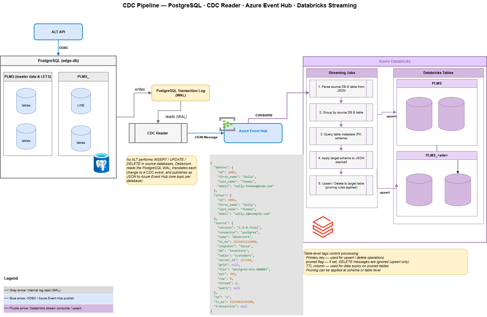
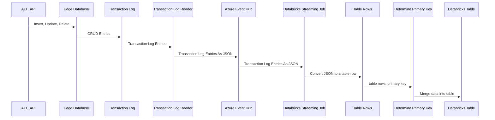
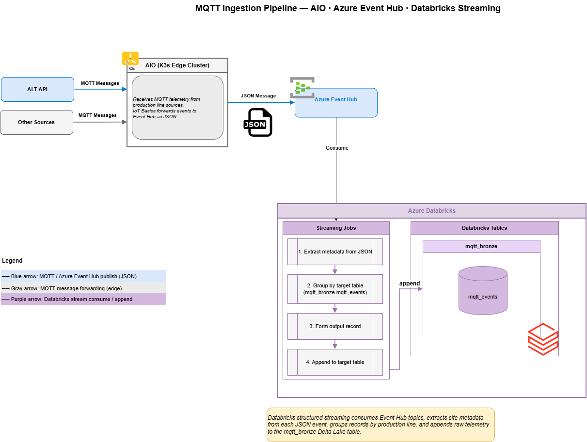
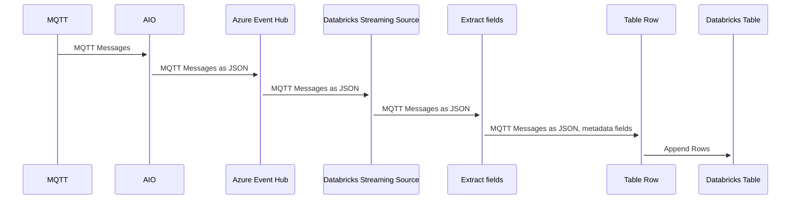
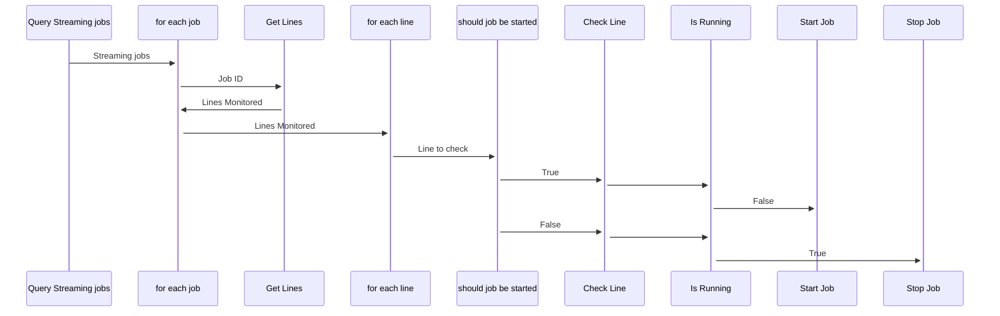
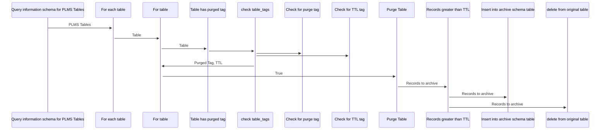

# Data Design

## Topics

Each line will have two dedicated Azure Event Hub topics: one for MQTT and one for edge database replication.  Lines can share CDC 
lines or MQTT topics, but data must be segregated by message type (CDC or MQTT).

## Databricks Jobs

Due to a maximum number of concurrent jobs (1000) and other resource limits in Databricks, each CDC and MQTT streaming job will read more than
one line's data at once.  All streaming jobs will use job compute and each job cluster will have a defined minimum (1) and max 
nubmer of workers to read the assigned topics.  

All jobs will run as a service principal user (in accordance with best practices).  They will also be deployed using Databricks Asset Bundles (now called Declarative Automation Bundles).

## Tags

Tags will be utilized to provide additional information such as:
- The primary key of the table (used for merges)
- Whether the table has a purge process removing data from it on the edge.
- A time to live value for the data on the edge (if purged).
- Whether the table should be included in the archive process.

Jobs will be tagged with the following information:
- What lines do they monitor (each line will be attached to a topic)
- An indicator if the job is streaming (used by controller job).

## Edge Database 

The edge database will have a limited number of clients and contain the minimal amount of data to keep access as fast as possible.  
For reporting, users should use the Databricks tables with will have a near real time copy of the edge database data.

For the edge database, we have chosen Postgresql.  Features include:
1. A better query optimizer than MySQL
2. Good ANSI SQL support
3. Stored procedures (if needed)
4. Widely used and well documented
5. Mature CDC implementation (https://debezium.io/documentation/reference/3.4/)
6. A CDC implementation that can forward to Azure Event Hubs out of the box (https://debezium.io/documentation/reference/3.4/operations/debezium-server.html#_azure_event_hubs)

Since the critical data is all in the edge database (PLMS operational data and PLMS_\<site\> in process part processing) all the entries will be able to keep processing regardless of Azure connectivity.  

This assumes:
1. ALT API does not use any MSSQL only features
2. There is no need for stored procedures (even though PostgreSQL does support them)

## Databricks

The Databricks data will be synced to the edge database with close to near real time latency (depending on network traffic and latency) to allow:
1. Operational dashboards to utilize the data without impacting the edge database
2. Future curated reporting tables to be bult on top of near real time data instead of daily snapshots 
3. Machine learning or any operation that may need to utilize a large amount of data (planned storage will be 90 days) 

## Edge to Databricks Synch



To provide a low latency way to extract data that doesn't depend on watermark queries, the system will utilize a change data capture process.
As the edge database processes inserts, deletes, and updates the edge database will populate the transaction log. The sync process will 
utilize debezium to read the transaction log entries and translate them into JSON.  Once the data is in JSON format the events will
be sent to an Azure Event Hub topic.  Once sent, the process will move on to the next entry.  If access to Azure is interrupted, the changes
will queue up locally until it is reestablished.  Once that happens, all changes will be sent to the topic to be processed by databricks.  Each schema in the edge database will have it's own CDC monitor.  

The jobs that read CDC information will have the following paramters:
1. topics to monitor
2. Target catalog
3. broker URL secret name

Once the data is in the topic, it will be read by a Databricks process that will:
- Determine the target table and group records by the table they will be getting sent to (each message will have source schema and source table)
- Look up the schema (needed to convert the JSON data to a record to insert), primary key, and if the table is purged.
  These values will be set via table level tags and looked up by querying the information_schema.table_tags table.  
- If the table is purged filter out delete entries
- Apply the table schema to the JSON data
- Insert new records/Update existing records 

The data will be considered silver (ready to use).



## MQTT Data



MQTT Data for each line will be stored in it's own table under the mqtt_bronze schema.  It's considered bronze due to it being unprocessed MQTT events.

Each MQTT job will have the following parameters:
1. Topics to monitor
2. Target Catalog
3. Target schema (defaults to mqtt_data)
4. Broker URL secret name

MQTT events will be forwarded from AIO into Azure Event Hub (in JSON format).  A Databricks job will read the events from the topic.  
First, it'll extract a set of fields from the JSON (message type, timestamp, machine) if they exist.  Next it will append to 
the mqtt_bronze.\<site>_mqtt_events.



## Controller Job

Note: Due to there not being a clearly defined signal of when a line is up or down at this time, this job will be placeholder logic.

A controller job will run on a 10 minute interval schedule When triggered, the job will:
- Query the Databricks jobs API endpoint and find all the streaming jobs (tagged with the 'streaming' tag)
- For each job:
   - Check the line hours for all the lines the job monitors (a comma delimited list under the 'lines' tag)
   - If it's 30 minutes or less before the start any of the lines it's monitoring, trigger the streaming job
   - If the job is running and it's past the end time for all the lines it is monitoring, terminate the job.  

The job will have the following parameters:
1. Secret name for the service principal client id
2. Secret name for the service principal OAuth secret



## One time loads


There will be several one time loads that will be needed:
1. Histrocial data (data from 0-90 days in the large on-prem database)
2. Edge database (in process parts, master data) 
3. Archived data (data in the offline archive databases) if needed

For 1: We will use Azure Data Factory to load the contents of the tables SQL Server database into parquet files in a dedicated 
storage container.  Once there, a dedicated process will ingest the parquet files and create the tables.

For 2: The edge database will need to be loaded with the data that is specific to the line.  The data will be pulled from Databricks.

For 3 (if needed): Depends on archive size, data will be loaded into a specific storage container.  Once in, data can be queried
inside of databricks using sql.

## Purge process

To keep the data in the edge database small, there will be a purge process with two facets:
1. Purge PLMS non-part data
2. PLMS part data (PLMS_\<site\> schemas)

Ideally, the purge will run during a time when the line is down.  Due to this not being easily defined, placeholder logic for this will be in the purge process but not enabled.

### Non-parts Data Purge process


For non-part data, each table will have a TTL defined.  When the purge process runs, the process will query databricks
for the table TTL, the column that determines the TTL, and primary key column.  The process will query the edge database
table for all the potential deletes.  For each delete candidate the process will check if the value is in Databricks.  if it 
exists, the edge database record is deleted.



### Part Data Purge process


For part data tables (PLMS_\<site\> schema), the process will query all items that are in complete status and are above the TTL value.
for each record, the process will verify that it exists in Databricks, then delete the local copy.

```mermaid
sequenceDiagram
    Query information schema for PLMS site schema Tables for line->>+For each table: PLMS Tables
    For each table->>+For table: Table
    For table->>+Table has purged tag: Table
    Table has purged tag->>+check table_tags: 
    check table_tags->>+Check for purge tag:
    check table_tags->>+Check for TTL tag:
    check table_tags->>+For table:Purged Tag, TTL
    For table ->>+Purge Table: True
    Purge Table ->>+Records greater than TTL that are complete: Records to archive
    Records greater than TTL that are complete ->>+Insert into archive schema table: Records to archive
    Records greater than TTL that are complete ->>+delete from original table: Records to archive
    ```

If the connection to Azure is not available, both purge processes will not run.  

## Visualization

There will three tools for visualizing data:
- AIO cluster hosted ALT UI
- Azure Log Analytics/Grafana (ALT-API stats only)
- Power BI (Dashboards based on Databricks data)
  - Two dashboards :TBD

## Data Access


### ALT API

ALT API instances on the AIO cluster will not have direct access to the historical data in Databricks due to its current architecture.  However, it's possible for an ALT-API instance to be set up to query the Databricks instance.

### storage

We will be utilizing ADLS Gen2 storage accounts to store the 'warm data' (data in Databricks).  Databricks access to storage accounts
is done via a managed identity known as a 'Access Connector for Databricks'.  Once this created, the connector is given the 'Storage Blob Data Contributor' role.  When granted, Databricks uses this managed identity to access the storage account.  Inside Databricks, a credential object is created that maps to the Access Connector.  The next step is to create an external location.  This is a storage account URL, which gets associated with the credential created in the previous step.  Once established, Databricks will be able access the storage URL on behalf of users, functioning as the access proxy.  Via this mechanism Databricks can enforce all data access ACLs.  

Once the external location is established (container@storage account/directory) a catalog will be created using the external location as
the default storage location for table.  Once created, the lower schemas are created (PLMS, PLMS_<site>), then the tables.  This setup takes advantage of Databricks managed tables, which enables using features such as Predictive optimization.  

```mermaid
sequenceDiagram
    Read/Write->>+Table: Request (as user)
    Table->>+Databricks: Request (as user)
    Databricks->>+ACLS: Request (as user)
    ACLS->>+Databricks: Allow/Deny
    Databricks->>+Allowed: Request (as user)
    Allowed->>+Private Storage Endpoint: Request (Using Access Connector)
    Private Storage Endpoint->>+Files: Request (Using Access Connector)
    
```

### Serverless Compute

The data will be accessible via two methods: Databricks Jobs and Databricks serverless warehouses.  Note: using serverless compute 
with private endpoints requires configuration in the Databricks account console, see 
https://learn.microsoft.com/en-us/azure/databricks/security/network/serverless-network-security/serverless-private-link

Serverless compute will spin up resources quickly as needed to handle incoming queries and will shut down after a set amount of idle time.  External applications that need to query data will connect to connect to a Databricks endpoint using the 
appropriate drivers.  Note: serverless warehouses can take 5-10 seconds to spin up, timeouts may need to be adjusted.  Power BI will 
also be connected to show near real time dashboards.


### Archiving Data (data older than 90 days, short term)

Since the existing JSON archive process is tied to the on prem database, the Databricks side will have it's own archiving.

For each table in the PLMS_\<site\> schemas:
- Select all records from the table that are greater than 90 days old
- Insert the records in the corresponding table in the PLMS_\<site\>_archive schema
- Delete the records that were inserted into the archive table from the source table.

for the tables in the PLMS schema that need to be archived (tagged with the 'archive' tag):
- Select all records from the table that are greater than 100 days old
- Insert the records in the coorsponding table in the PLMS_archive schema
- Delete the records that were inserted into the archive table from the source table.


### Archiving Data (data older than 100 days, long term)

The current ADF process will need to be adapted to extract it's data from the Databricks instance.

Once data is older than 100 days, it will be moved to a cold tier and stored in JSON format.  

Recommendations: 
1. Once data is bundled into the final JSON format, have a table that contains paths references with a minimal number of columns to make
   searching simpler without incurring unnecessary warm up costs.
2. Run the process in Databricks environment to utilize parallel compute.  


### Seeding the Edge Databases

Using the exported schema from the SQL server database, All the PLMS tables will be created in the edge database.  For the site and line the 
appropriate PLMS_\<site\> tables will be populated.

Each edge database will need to be seeded with:
1. A copy of all the tables in the PLMS Database (with some historical data)
2. Any tables from the PLMS_\<site\> schema that store the part related data for the line.

### Updating Control Data on the Edge Database

The K3s cluster will not have access to original SQL Server database, updates to configuration will be done via the ALT API instance running 
in the k3s cluster.  All updates will flow to Databricks via the CDC process.

### Loading Archived Data

Depending on the data size, a solution such as Azure Data Box may be used.  Once in the storage account the data can be loaded into it's own
catalog to allow the new archive process to be developed.

## Service Principals, Groups, and Authentication

### Service Principals

We will be using two service principals:
- The 'run as' principal for the jobs
- The principal that Power BI will use access Databricks

### Service Principals Authentication

For both service principals, we will need OAuth secrets created.  

### Groups

We will need at least two groups:
- Owner for the target schemas and tables
- Read only group for users to access the data

